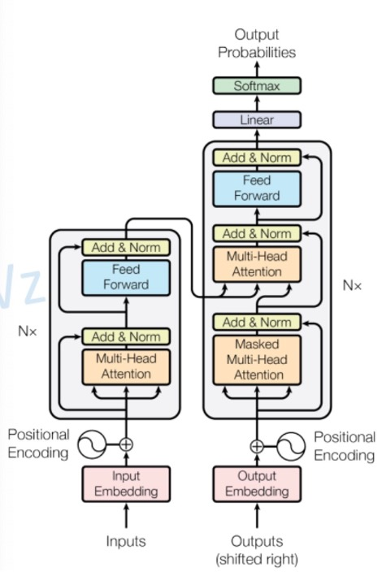

# 机器学习

## 分类

1) 监督学习 (Supervised Learning)
机器学习有标记 (Label) 的数据，通常用于分类和回归任务。

2) 无监督学习 (Unsupervised Learning)
机器通过聚类学习 (Clustering) 来发现数据中的模式，机器自己学习数据应该的标记 (Label)。

3) 自监督学习 (Self-Supervised Learning)
通过生成一些新的数据来进行训练。例如，对文本进行掩码 (masked)，或对图像进行旋转调整等。

4) 半监督学习 (Semi-Supervised Learning)
利用大量未标记的数据和少量标记的数据共同训练模型。

## Attention 注意力机制
Attention允许模型在生成输出时，动态地聚焦于输入序列的不同部分。

### Attention Mechanism
- 目标词的上下文表示等于目标词及其上下文词的值向量的加权和。
- Contextual representation of target word = 
	weighted sum of value vectors of context words and target word
$$
A(Q, K, V) = \text{softmax} \left( \frac{QK^T}{\sqrt{d_k}} \right) V
$$
where:
- \(Q\) is the query matrix,
- \(K\) is the key matrix,
- \(V\) is the value matrix,
- \(d_k\) is the dimension of query and key vectors.
------
- `方法:`
先计算Q和K的相似度，求的一个相似度权重，再去和V进行加权。
这样子会注意到Q和K相似的地方。
- `举个例子:`
比方说，我要讲中文翻译成英文，Q就是我已经翻译好的中文，K就是所有的英文单词，我会去看Q和K的相似度，利用这个相似度和V加权。生成一个关于上下文的向量Attention Value。
- `特点:`
对于像RNN，LSTM这种序列模型，下一个隐藏层的输出依赖上一个隐藏层的输出，使得在长文本里序列模型难以抓住文本前面的信息。
- `优点:`1）速度快（并行计算） 2）效果好（抓重点）
- `缺点:`在进行Sequence to Sequence时，Attention机制的Encoder部分，每一步计算仍依赖于上一步的计算结果。
-----

### Self-Attention 自注意力机制
- Self-Attention让模型在处理某一部分信息时同时考虑到序列中的其他部分，关注输入序列元素之间的关系。(序列自己和自己进行相似度对比)

- `特点:`
1) 捕捉长距离的依赖：
在一个长句子中，句首的词语可能会影响句尾的理解和翻译。
2) 并行化处理：
和RNN和LSTM不同，串行的对序列进行处理。Self-Attention允许对整个序列的所有元素进行同时计算，这大大增加了模型的计算效率。
3) 灵活性：
Self-Attention机制提供了一种非常灵活的方式来捕获序列内的信息，模型可以自动学习到序列中哪些部分是更重要的。

-----

### Transformer 变形金刚

- `原始的Transformer：`Encoder和Decoder的Block数量都为6 
- `Positional Encoding 位置编码: `Trigonometric Function 三角函数
和BERT的位置编码Position Embeddings不一样，BERT的位置编码是可训练的。
Transformer的位置编码是固定的，在训练过程中固定。
- Input Embeddings通过线性转化Linear层转化为Query，Key和Value

------
#### Scaled Dot-Product Attention

- 这个图就是底下那个 A(Q,K,V)的公式，MatMul为Matrix Multiplication，即矩阵乘法

------

#### Multi-Head Attention 多头注意机制