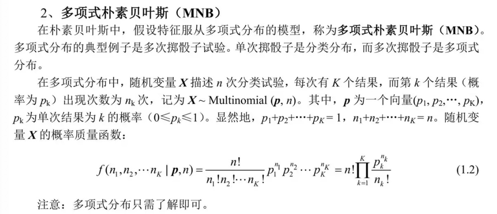

# 机器学习

## 机器学习分类

1) 监督学习 (Supervised Learning)
机器学习有标记 (Label) 的数据，通常用于分类和回归任务。

2) 无监督学习 (Unsupervised Learning)
机器通过聚类学习 (Clustering) 来发现数据中的模式，机器自己学习数据应该的标记 (Label)。

3) 自监督学习 (Self-Supervised Learning)
通过生成一些新的数据来进行训练。例如，对文本进行掩码 (masked)，或对图像进行旋转调整等。

4) 半监督学习 (Semi-Supervised Learning)
利用大量未标记的数据和少量标记的数据共同训练模型。

## 评估指标（Metrics）

1. **Recall（查全率）** = TP / (TP + FN)
2. **Precision（查准率）** = TP / (TP + FP)
3. **F1 Score** = 2 * P * R / (P + R)  
   - F1分数是查全率和查准率的调和平均（Harmonic Mean）

## 泛化误差（Generalization Error）
泛化误差 = 偏差（Bias）+ 方差（Variance）+ 噪声（Noise）

## 贝叶斯公式
- P(θ|X) = P(X|θ) P(θ) / P(X)  
后验概率 = 似然函数 * 先验概率 / 边际概率

### 统计学派别：
1. **频率学派**：极大似然估计（有偏估计），选择构成数据几率最大的参数P(X|θ)
2. **贝叶斯学派**：极大后验证估计（无偏估计）P(θ|X)，选择该数据最有可能的参数
3. **经验风险最小化（ERM，Empirical Risk Minimization）**：利用损失函数拟合模型  
   - ERM引入L1正则化对应Laplace分布，L2正则化对应高斯分布

### 对数技巧（Log Trick）
1. 将连乘转换为连加
2. 是一种单调变换（Monotonic Transformation），不改变原有的单调性
----

## 判别模型与生成模型
1. **判别模型（Discriminative Model）**：P(Y|X) 条件概率分布
2. **生成模型（Generative Model）**：P(X, Y) 整体分布

---
1. **参数模型**：模型的参数固定（如神经网络、Logistic回归）
2. **非参数模型**：模型的参数不固定（如K-Means、核密度估计KDE）
   - **核密度估计（KDE）**：用于估计数据的概率密度函数
---

## 激活函数（Activation Functions）

### 1. Sigmoid 函数
- 用于二分类问题
- 值域为0到1
```math
\sigma(z) = \frac{1}{1 + e^{-z}}
```

### 2. 双曲线正切函数 Hyperbolic Tangent Function
```math
\tanh(x) = \frac{e^x - e^{-x}}{e^x + e^{-x}}
```
解决了Sigmoid函数非0为中心输出的问题，但仍未解决梯度消失，幂运算的问题
（值域为-1到1）

### 3. ReLu函数 Rectified Linear Unit
```math
f(x) = \max(0, x) 
```
- 当 x > 0 时，y = x 
- 当 x \leq 0 时，y = 0

## Newton-Raphson（IRLS） 牛顿法

除了梯度下降法，Newton-Raphson 是一种二阶导数迭代 `θ` 的方法。它的特点包括：

1. **不需要学习率**：与梯度下降法（Gradient Descent）不同，Newton-Raphson 不需要设置学习率。
2. **更少的迭代次数**：相比于梯度下降法，它所需的迭代次数较少。
3. **计算复杂度**：
   - 假设 `n` 是特征（features）的数量，Newton-Raphson 方法的计算代价更高，因为它需要计算二阶导数。
   - Newton-Raphson 复杂度为 `O(n^3)`，主要因为它需要计算 Hessian 矩阵（即二阶偏导数矩阵），而梯度下降法的复杂度为 `O(n)`，因此在特征数量少的情况下可以考虑使用 Newton-Raphson。
4. **Hessian 矩阵**：这是二阶偏导数矩阵，在每次迭代中不仅需要计算一阶导数（梯度），还需要计算 Hessian 矩阵并对其求逆。
    - **Hessian 矩阵**：在牛顿法中，每次迭代不仅需要计算一阶导数，还需要计算 Hessian 矩阵（函数的二阶导数矩阵），并且还需要对这个矩阵进行求逆。
    - **假设有 `n` 个特征（变量）**: Hessian 矩阵是一个 `n × n` 的矩阵，计算 Hessian 的时间复杂度为 `O(n^2)`，而求逆的复杂度为 `O(n^3)`。因此，整体复杂度为 `O(n^3)`，尤其在高维情况下，计算代价较高。
5. **基本原理**
    

6. **例子**
    

## 为什么需要进行梯度下降？
为了计算出最优的参数，然而不是所有模型的参数都有闭解(closed-formed solution)，所以说要进行梯度下降。

- 闭解意味着可以通过有限的基本运算（如加、减、乘、除、指数、对数、三角函数等）来精确地表示解。即，它能够通过一个明确的数学表达式直接写出来。
- 开解（或称为数值解）是指解无法用简单的数学公式表示，但仍然可以通过数值方法或者迭代方法逐步逼近解。虽然没有明确的解析公式，但可以通过算法得出近似的解。
- 并不代表无解

## 如何避免陷入局部最优：
1) 用SGD和Mini-Batch的方法，可以让梯度有随机性，梯度的方向不是精确的全局梯度，因此可以帮助模型跳出局部最优。
2) 添加噪声
3) 添加动量
4) 等…

## Batch Size
- BGD 每个Epoch梯度为整体数据的一个平均梯度，所以更加平滑一点，所需计算资源较大，尤其是数据量比较大的时候，需要更小的epoch到达最优。
- Mini-BGD 介于 BGD 和 SGD之间。
- SGD每个Epoch梯度为数据的一个样本，所需计算资源会小一点，但是需要更多的epoch到达最优。

## 朴素贝叶斯 Naive Bayes
https://zhuanlan.zhihu.com/p/518118474
```math
\arg\max_{c_n} p(c_n | f_1 \dots f_m) = \prod_{i=1}^{m} p(f_i | c_n) p(c_n)
```
- 朴素贝叶斯假设特征都是`相互独立`的。
- `优点：`
    1) 如果独立性假设符合，它是最好的模型
    2) 训练迅速，鲁棒性好，方差低
- `缺点：`
    1) 独立性假设很少符合
    2) 准确率较低相比于其他方法
    3) 对未见过的实例需要进行平滑化smoothing
--- 
1) 类别朴素贝叶斯 Categorical Naive Bayes (CNB)
- 服从类别分布。
- 通常用于处理离散特征，特别适用于那些特征为类别数据的情形。


2) 多项式朴素贝叶斯 Multinomial Naive Bayes (MNB)
- 服从多项式分布


3) 高斯朴素贝叶斯 Gaussian Naive Bayes (GNB)


## K近邻（K-Nearest Neighbors, KNN）

- KNN是一种非参数方法（Non-parameter Method），因此不需要训练。

### 优点：
1. 简单有效
2. 不需要训练
3. 如果有无限多的数据，这是最好的方法

### 缺点：
1. 需要选择参数k的大小
2. 难以处理类别不平衡的数据
3. 输出较慢（因为需要进行大量的距离计算）

---

## Logistic Regression（对数几率回归）

Logistic Regression 是一种二分类的线性模型。

- 不用`y - \hat{y}`作为损失函数的原因是它不是凸函数。
- Logistic Regression 的代价函数/损失函数为**二进制交叉熵损失函数**（Binary Cross-Entropy Loss）。

### 优点：
1. 简单易懂
2. 可解释性强（输出可以解释为概率）

### 缺点：
1. 线性模型（假设数据线性可分）
2. 特征空间较大时，效果不如深度学习模型
3. 多分类问题需要使用多个LR模型
4. 特征需要进行统一规格化处理

Logistic Regression 将特征进行线性组合后，再映射为一个概率值。

### 模型假设：
- 线性模型假设：`p(y | x)`服从`Normal(x^T w, σ)`，即服从正态分布。
- Logistic Regression 假设：`p(y | x)`服从`Bernoulli(Logistic(x^T w))`，即伯努利分布。


## Tokenization 与 Byte Pair Encoding (BPE) 对比

### Tokenization VS. Byte Pair Encoding (BPE)
- 传统的词表示方法无法很好地处理未知或罕见的词汇。
- 传统的词tokenization方法不利于模型学习词缀之间的关系。
    - 例如，模型学到的“old”、“older”和“oldest”之间的关系，无法泛化到“smart”、“smarter”和“smartest”。

### Byte Pair Encoding (BPE)
**BPE（字节对）编码**或**二元编码**是一种简单的数据压缩形式，其中最常见的一对连续字节数据被替换为该数据中不存在的字节。使用时，需要一个替换表来重建原始数据。OpenAI 的 GPT-2 与 Facebook 的 RoBERTa 均采用此方法构建 subword 向量。

- **优点**：
    - 可以有效地平衡词汇表大小和步数（编码句子所需的token数量）。
- **缺点**：
    - 基于贪婪和确定的符号替换，不能提供带概率的多个分片结果。

## Attention 注意力机制
Attention允许模型在生成输出时，动态地聚焦于输入序列的不同部分。

### Attention Mechanism
- 目标词的上下文表示等于目标词及其上下文词的值向量的加权和。
- Contextual representation of target word = 
	weighted sum of value vectors of context words and target word
$$
A(Q, K, V) = \text{softmax} \left( \frac{QK^T}{\sqrt{d_k}} \right) V
$$
where:
- \(Q\) is the query matrix,
- \(K\) is the key matrix,
- \(V\) is the value matrix,
- \(d_k\) is the dimension of query and key vectors.

- `方法:`
先计算Q和K的相似度，求的一个相似度权重，再去和V进行加权。
这样子会注意到Q和K相似的地方。
- `举个例子:`
比方说，我要讲中文翻译成英文，Q就是我已经翻译好的中文，K就是所有的英文单词，我会去看Q和K的相似度，利用这个相似度和V加权。生成一个关于上下文的向量Attention Value。
- `特点:`
对于像RNN，LSTM这种序列模型，下一个隐藏层的输出依赖上一个隐藏层的输出，使得在长文本里序列模型难以抓住文本前面的信息。
- `优点:`1）速度快（并行计算） 2）效果好（抓重点）
- `缺点:`在进行Sequence to Sequence时，Attention机制的Encoder部分，每一步计算仍依赖于上一步的计算结果。

## Self-Attention 自注意力机制
- Self-Attention让模型在处理某一部分信息时同时考虑到序列中的其他部分，关注输入序列元素之间的关系。(序列自己和自己进行相似度对比)

- `特点:`
    1) 捕捉长距离的依赖：
    在一个长句子中，句首的词语可能会影响句尾的理解和翻译。
    2) 并行化处理：
    和RNN和LSTM不同，串行的对序列进行处理。Self-Attention允许对整个序列的所有元素进行同时计算，这大大增加了模型的计算效率。
    3) 灵活性：
    Self-Attention机制提供了一种非常灵活的方式来捕获序列内的信息，模型可以自动学习到序列中哪些部分是更重要的。


## Transformer 变形金刚

- `原始的Transformer：`Encoder和Decoder的Block数量都为6 
- `Positional Encoding 位置编码: `Trigonometric Function 三角函数
和BERT的位置编码Position Embeddings不一样，BERT的位置编码是可训练的。
Transformer的位置编码是固定的，在训练过程中固定。
- Input Embeddings通过线性转化Linear层转化为Query，Key和Value
- GPT 是 Decoder Only
- BERT 是 Encoder Only

### Transfomer训练过程：
对于训练过程，我们是将原始输入和正确答案一同输入的，训练过程采用Teacher Forcing，而对于正确答案输入是采用了Mask操作，就是为了不让模型看到当前词之后的信息，这是可以并行进行的。

------
#### Scaled Dot-Product Attention

- 这个图就是底下那个 A(Q,K,V)的公式，MatMul为Matrix Multiplication，即矩阵乘法

------

#### Multi-Head Attention 多头注意机制
- 得到多组特征，多头数量为8
- 可以理解为CNN不同Kernel提取的特征图，那这里就是提取的不同语意，然后经过拼接，然后最后通过一个全连接层。
- Self-Attention 只使用了一组QKV的权重，而Multi-Head Attention 用了多组权重
    
    - h代表多头的头数

- Add&Norm
    - LayerNorm(X+Multi-HeadAttention(X))
    - LayerNorm(X+FeedForward(X))
    - Add为残差结构：为了减少训练过程中，梯度消失或者梯度爆炸的影响。
    - Norm为Layer Norm
----
### Decoder (Masked Multi-Head Attention 掩码注意力机制)
 - Mask 表示掩码，它对某些值进行掩盖，使其在参数更新时不产生效果。

---- 

#### Normalization 归一化的作用（优化模型拟合过程）
1) 数据不同维度可能了量级差距比较大，大量级维度对模型会降低梯度的效率，归一化加快模型学习速度。特征处于相同的量级时，模型的参数更新更加均衡和稳定。
- 例如，“身高”维度可能是150-180cm，“金钱”维度可能是0-100亿，那我一开始“金钱”维度对于损失函数的影响就比较大

2) 减少模型过拟合:
归一化主要是通过优化和训练过程的稳定性来间接减缓过拟合

#### Normalization类型：
1) Batch Norm （CNN，Linear）
2) Layer Norm（RNN）
3) Instance Norm
4) Group Norm

### Batch Norm:
Batch Normalization 我们会对同一批次的所有样本的同一特征计算均值和方差。但对于文本问题，不同的句子序列大小不一样，所以序列输入无法用 Batch Norm。

### Layer Norm:
Transformer 用的是 LayerNorm，对于同一样本的所有特征计算均值和方差。
- 例子：
    ```
    有一个句子：[[1, 2, 3], [4, 5, 6]]
    其中 `[1, 2, 3]` 为一个词的词向量。  
    1，2，3，4，5，6 的均值为 3.5，标准差为 1.7078，规范化后为：
    [[-1.4638, -0.8783, -0.2928], [0.2928, 0.8783, 1.4638]]
    ```

### Batch Normalization：
- 它去除了不同特征之间的大小关系，但是保留了不同样本间的大小关系，所以在 **CV** 领域用得多。

### Layer Normalization：
- 它去除了不同样本间的大小关系，但是保留了一个样本内不同特征之间的大小关系，所以在 **NLP** 领域用得多。
--
### ELMO与GPT对比
- ELMO
    - 使用`两对LSTM`网络：一个正向输出，一个反向输出。
- GPT
    - 使用`单向的Encoder`。

---
## BERT（Bidirectional Encoder Representations from Transformers）
采用的是一个双向的Encoder-Only模型，以便更好地理解语言的上下文含义。

### BERT 结构
- BERT-BASE 12层Transformer Encoder，隐藏层的维度为768，12个注意力多头
- BERT-LARGE 24层 Transformer Encoder，隐藏层的维度为1024，16个注意力多头

### Bert是如何进行训练的？
- `语料`为Wikipedia+BookCorpus 
1) Masked Language Model (MLM) 
	随机选择15%的 token 进行掩码处理，即这部分 token 会被替换成一个特殊的 [MASK] token。
	类似CROW
2) Next Sentence Prediction (NSP)
	模型接收一对句子作为输入，这对句子有一半的机会是连续的，一半的机会是随机从语料库中选择的。
	模型必须预测第二个句子是否是第一个句子的逻辑后续。

### BERT的分词方法

BERT使用的分词方法为**WordPiece**，这是**BPE（Byte-Pair Encoding）**的一种变种。

### tokenizer的输出：
1. **Token ID**：
    - `[CLS]`: 101
    - `[PAD]`: 0
    - `[SEP]`: 102
2. **Attention Mask**：
    - 特殊 token `[CLS]` 和文本 token 对应的位置为 1
    - `[PAD]` 对应的位置为 0

### 特殊Tokens
- `[CLS] + 句子内容 + [SEP]`
    - `[CLS]`：表示整个输入序列的聚合信息
    - `[SEP]`：表示句子结束符号，用于分隔不同的句子

### BERT的输入（经过tokenizer之后）：
1. **Token Embedding（词嵌入）**：
    - 编码了 token 的语义信息和上下文信息。
2. **Segment Embedding**：
    - 用于区分输入数据中的不同部分（如不同的句子）。在NSP（Next Sentence Prediction）训练任务中区分句子。
    - 同一个句子的 token 拥有相同的 Segment Embedding。
3. **Position Embedding（位置嵌入）**：
    - 为序列中的每个位置学习一个嵌入向量，这使得模型能够捕捉 token 之间的顺序关系。
    - 和Transformer中固定的位置编码不同，BERT的Position Embedding是可训练的。


### 词嵌入（Word Embeddings）
- 词汇表大小为28996，嵌入维度为768（简化版）
- BERT-Base的词汇表大小为30522
- 位置嵌入（Positional Embedding）：最大序列长度为512，嵌入维度为768
- Segment Embedding：也称为 token_type_embedding

### BERT的输出：
1. **维度**：768（BERT-BASE）
2. **pooler_output**：
    - `[CLS]`标记的输出经过一个附加的全连接层和一个激活函数（通常是Tanh）处理后的结果。
    - **Shape**: `(batch_size, 768)`
3. **last_hidden_state**：
    - 为每个输入标记提供的向量表示（即每个 token 的嵌入）。
    - **Shape**: `(batch_size, token数量, 768)`
4. **hidden_states**（可选输出，需配置参数）：
    - 每个输入标记的13层向量表示（第0层为词嵌入，后面12层为Transformer的encoder层）。
    - **Shape**: `(batch_size, token数量, 768)`
5. **attentions**（可选输出，需配置参数）：
    - **Shape**: `(batch_size, 多头数量12, token数量, token数量)`

要启用hidden_states和attentions，可以使用以下代码：
```python
BertModel.from_pretrained(model_name, output_hidden_states=True, output_attentions=True)
```

## 计算BERT-BASE的参数数量

## #BERT-BASE的定义：
- 隐藏层维度（hidden_size）：768
- 注意力头数（num_heads）：12
- 最大序列长度（max_sequence_length）：512
- 每个头的维度：768 / 12 = 64

### 步骤解析：

#### 1. 输入的Token ID
BERT接收一个一维向量，维度为`512 × 1`，即最大序列长度512的Token ID。

#### 2. 嵌入转换
对于BERT-BASE，词汇表大小（vocab_size）是30522，隐藏层维度是768。因此，词嵌入矩阵的维度为：
- **词嵌入矩阵的参数数量** = `vocab_size × hidden_size` = 30522 × 768 = **23,408,256个参数**

除此之外，还有**位置嵌入**和**类型嵌入**：
- **位置嵌入矩阵的维度**：512 × 768 = **393,216个参数**
- **类型嵌入矩阵的维度**：2 × 768 = **1,536个参数**

#### 3. 转换为Q, K, V矩阵
BERT将输入的`(512 × 768)`维度的矩阵转换为三个矩阵：Q、K、V，分别计算：
- Q = XW_Q, K = XW_K, V = XW_V，W_Q, W_K, W_V为权重矩阵

每个头的维度为64，总共有12个头，因此：
- 每个头的Q、K、V矩阵的权重维度为：`768 × 64`，共12个头。
- 因此，Q、K、V矩阵的参数数量为：`3 × (768 × 64) × 12` = **147,456个参数**（每个头的Q, K, V共用）

#### 4. QK^T 和乘上V
注意力机制的计算为：


- QK^T = `(512 × 64) × (64 × 512)` = `512 × 512`
- 然后QK^T与V矩阵相乘：`(512 × 512) × (512 × 64)` = `512 × 64`

#### 5. 多头注意力
将12个头的结果concat起来，得到的矩阵为`512 × 768`，总参数数不变。

#### 6. 线性层
这个`512 × 768`的矩阵再通过一个线性层，权重矩阵的维度为`768 × 768`，因此：
- **线性层的参数数量** = `768 × 768` = **589,824个参数**

#### 7. Feed-Forward Network
在每一层之后，矩阵还会经过一个Feed-forward Network（前馈神经网络）。每个前馈网络先将输入转化为3072维，再转回768维：
- **Feed-forward网络的参数数量** = `768 × 3072` + `3072 × 768` = **4,722,432个参数**

#### 8. 总共12层
BERT-BASE有12层Encoder，每一层都包含多头自注意力机制和前馈网络，因此：
- **注意力部分的总参数数量** = `12 × (147,456 + 589,824 + 4,722,432)` = **65,104,512个参数**

#### 9. 总参数数
加上词嵌入、位置嵌入和类型嵌入的参数，总的参数数量为：
- **总参数数** = 23,408,256（词嵌入） + 393,216（位置嵌入） + 1,536（类型嵌入） + 65,104,512（多层Encoder） = **88,907,520个参数**

BERT-BASE模型的总参数数量为 **约88M**。
