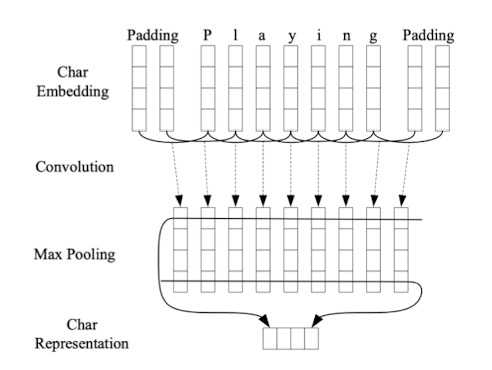

## Natural Language Processing

## Transformer

- 详细看 [Machine_Learning.Transformer](Machine%20Learning.md#变形金刚-transformer)

Transformer 的结构包括一个编码器（Encoder）和解码器（Decoder），并可以有三种变体：
1. **单独编码器**结构。
2. **单独解码器**结构（如 GPT）。
3. **编码器和解码器都有**的完整结构。

GPT 就采用了**单独解码器**的结构。  
Transformer 的核心是**Attention**机制，它和其他 NLP 模型（如 RNN、LSTM 等）不同。传统的这些 NLP 模型在处理长序列时，由于信息传递的限制，前面的信息容易丢失。而 **Attention** 模型能够同时关注序列的不同位置，从而更好地解决长序列依赖问题，使模型表现提升。

参考资料：[Transformer 详解](https://zhuanlan.zhihu.com/p/607423406)


## 微调（Fine-tuning）

**微调**是指在一个已经预训练好的模型上进行少量任务特定的数据训练，使其适应特定任务。微调通常可以大幅提高模型在特定任务上的表现。

参考讨论：[什么是微调？](https://www.zhihu.com/question/298203515/answer/3355179300)


## Attention机制

**QKV**（Query, Key, Value）是 Attention 机制的核心思想。通过将输入映射为 Q（查询）、K（键）和 V（值），计算出注意力权重，从而捕捉输入的不同部分之间的相关性。

## BERT

BERT 是一个预训练模型，返回的是根据上下文推测的某个词的语义。  
BERT 的网络结构类似于 Transformer 的**编码器（Encoder）**部分，而 GPT 类似于 Transformer 的**解码器（Decoder）**部分。

**结构差异**：  
- BERT 使用 **Multi-Head-Attention**，而 GPT 使用的是 **Masked Multi-Head-Attention**。

更多内容参考：[BERT 模型解析](https://zhuanlan.zhihu.com/p/607605399)


## T5

T5（Text-to-Text Transfer Transformer）模型的核心思想是将**所有 NLP 任务都转化为 Text-to-Text**（文本到文本）的生成任务。无论是翻译、问答还是文本分类，T5 都将输入转换为文本，输出同样是文本。

更多内容参考：[T5 模型详解](https://zhuanlan.zhihu.com/p/88438851)

## 1. 预处理

## 2. N-grams
N-grams 由链式法则简化 $P(w^t, w^t-1, …w^1)$，用单词前面的信息，推测下个单词的信息。如果遇到从未见过的实例比较麻烦，需要用平滑 Smoothing。

- **Unigram**: $P(w)$
- **Bigram**: $P(w^t| w^t-1)$
- **Trigram**: $P(w^t| w^t-1, w^t-2)$

## 3. 隐马尔可夫 Hidden Markov Model (HMM)

`两个假设：`
1) 输出假设：观察事件（word）仅取决于隐藏状态 (tag)
2) 马尔可夫假设：现在状态 (tag) 仅取决于之前的状态	


## 4. 序列模型

### 4.1 循环神经网络 Recurrent Neural Networks (RNN)


- 对于输入的长度可变，所以对于处理语言文本很有效果。
- `训练方法：`通过时间反向传播 Backpropagation Through Time（BPTT）
	- 先用模型把输出全部计算，然后反向传播。
	- 不过这里的“反向”不仅仅是通过网络层，还包括时间步之间的反向。
	- 当计算Loss和Ws的偏导数时，不仅要考虑到这个hidden layer也要考虑到下一个的。
	- 上一个隐藏层的梯度，依赖于下一个隐藏层的梯度。
	
- `特征：`
    1) 中间层一般用h表示，表示为隐藏层Hidden State
    2) RNN重点是每个单元的参数是共享的。
    3) 输出层可以更改为Softmax，输出每个单词的概率
    4) 每个输出的Loss是加在一起的
- `缺点：`
    梯度消失问题 Vanishing Gradients

## 4.2 长短记忆网络 Long Short-Term Memory (LSTM)
- `一个记忆单元Memory Cell包括:`
    - 遗忘门Forget Gate
    - 输入门Input Gate
    - 输出门Output Gate

- `优点:`
    1) 有能力去记录长序列的信息 
    2) 像Feed Forward 神经网络：很灵活Flexible（可用于不同的任务）
- `缺点:`
    1) 计算复杂，缓慢 
    2) 实际运用还是很难去记录远的依赖 Long-range Dependency

### LSTM 公式

```math
f_t = \sigma(W_f \cdot [h_{t-1}, x_t] + b_f)\\

i_t = \sigma(W_i \cdot [h_{t-1}, x_t] + b_i)\\

o_t = \sigma(W_o \cdot [h_{t-1}, x_t] + b_o)\\

\tilde{C}_t = \tanh(W_C \cdot [h_{t-1}, x_t] + b_C\\

C_t = f_t \circ C_{t-1} + i_t \circ \tilde{C}_t\\

h_t = o_t \circ \tanh(C_t)\\
```
`公式:`
- 第一个公式为遗忘门
- 第二，第四，第五个公式为输入门
- 第三和最后一个公式为输出门。

`解释:`
- 门向量Gating Vector: 对于其他向量进行Pair-wise Multiplying 向量点积 也就是哈达玛积，h代表隐藏层，C代表细胞状态 Cell State （或叫做Memory Cell)：记录着重点信息

- 连接 Concatenate: $A \oplus B$ 矩阵相互连接
- 哈达玛积 Hadamard Product:  $A \circ B$ 也叫向量点乘 Element-wise product，也就是矩阵元素两两相乘

`门控:`
1) 遗忘门 Forget Gate:
    - 控制记忆细胞C^t-1需要去遗忘的信息，得出来是一个权重f^t
2) 输入门 Input Gate:
    - 往记忆细胞输入新的信息，形成C^t
3) 输出门 Output Gate:
    - 计算新的隐藏层

## 4.3 门控循环单元 Gated Recurrent Unit (GRU)

- Simplified variant with only 2 gates and no memory cell
- 更新门（update gate）和 重置门（reset gate）


## 5. 分布语义 Distributional Semantics
- **词义 Word Sense**：一个词的一个语义
- 如果有多个词义 Word Sense，就是**一词多义 Polysemous**

### 1) 分布式语义学 Distributional Semantics
词的意思取决于它的：
1. 文档情景 document context
2. 窗口 Word window

> "You shall know a word by the company it keeps."

 - 词频-逆文档频率 TF-IDF (Term Frequency- Inverse Document Frequency)
计算某个词语在某个文档中的重要程度（参数为单词，和该单词所在的文档）

    - $TF$ = 该单词出现的频率 / 该文档的总次数
    - $IDF$ = log( 总文档数 / 出现该单词的文档数 )

    $$TF-IDF(t, d) = TF(t, d) × IDF(t)$$

- 点互信息 PMI (Pointwise Mutual Information)
    $$PMI(x, y) = log( P(x, y) / (P(x) × P(y)) )$$

- 词向量 Word2Vec 
    - e.g. Skip-Gram, CBOW
    - You shall know a word by the company it keeps.
    - 猜测一个单词根据语境
    - Skip-Gram:
        - 给定一个单词，猜测它周围的单词
        - Predict surrounding words of target word
        - Fake Task预测它周围的单词
        - 实际的task为获取中间的Hidden Layer作为代表
    - CBOW 
        - 用周围的词，猜测该单词
        - Predict target word using surrounding words 

## 6. 情景语义 Contextual Semantics 

- RNN: One direction 
    - Only captures context to the left
- ELMO: 双向，即BiLSTM
    
    
    
    - EMLo 用字母嵌入，生成单词嵌入。（所以可以接受所有的词，包括没见过的词）
    - ELMo的最终每个词的向量，为双向LSTM隐藏层拼接后，再和词向量进行特定加权，形成最终的词向量。(这些权重s0,s1,s2根据任务的不同，可以进行微调）
    - Lower layer representation = captures syntax 
	(语法分析，实体识别)
    - Higher layer representation = captures semantics
	(情感分析，文本蕴含)

## 7. BERT
采用的是一个双向的Encoder-Only模型，以便更好地理解语言的上下文含义。

### BERT 结构
- BERT-BASE 12层Transformer Encoder，隐藏层的维度为768，12个注意力多头
- BERT-LARGE 24层 Transformer Encoder，隐藏层的维度为1024，16个注意力多头

### Bert是如何进行训练的？
- `语料`为Wikipedia+BookCorpus 
1) Masked Language Model (MLM) 
	随机选择15%的 token 进行掩码处理，即这部分 token 会被替换成一个特殊的 [MASK] token。
	类似CROW
2) Next Sentence Prediction (NSP)
	模型接收一对句子作为输入，这对句子有一半的机会是连续的，一半的机会是随机从语料库中选择的。
	模型必须预测第二个句子是否是第一个句子的逻辑后续。

### BERT的分词方法

BERT使用的分词方法为**WordPiece**，这是**BPE（Byte-Pair Encoding**的一种变种。

### Tokenization 与 Byte Pair Encoding (BPE)

#### Tokenization VS. Byte Pair Encoding (BPE) 对比
- 传统的词表示方法无法很好地处理未知或罕见的词汇。
- 传统的词tokenization方法不利于模型学习词缀之间的关系。
    - 例如，模型学到的“old”、“older”和“oldest”之间的关系，无法泛化到“smart”、“smarter”和“smartest”。

#### Byte Pair Encoding (BPE)
**BPE（字节对）编码**或**二元编码**是一种简单的数据压缩形式，其中最常见的一对连续字节数据被替换为该数据中不存在的字节。使用时，需要一个替换表来重建原始数据。OpenAI 的 GPT-2 与 Facebook 的 RoBERTa 均采用此方法构建 subword 向量。

- **优点**：
    - 可以有效地平衡词汇表大小和步数（编码句子所需的token数量）。
- **缺点**：
    - 基于贪婪和确定的符号替换，不能提供带概率的多个分片结果。


### tokenizer的输出：
1. **Token ID**：
    - `[CLS]`: 101
    - `[PAD]`: 0
    - `[SEP]`: 102
2. **Attention Mask**：
    - 特殊 token `[CLS]` 和文本 token 对应的位置为 1
    - `[PAD]` 对应的位置为 0

### 特殊Tokens
- `[CLS] + 句子内容 + [SEP]`
    - `[CLS]`：表示整个输入序列的聚合信息
    - `[SEP]`：表示句子结束符号，用于分隔不同的句子

### BERT的输入（经过tokenizer之后）：
1. **Token Embedding（词嵌入）**：
    - 编码了 token 的语义信息和上下文信息。
2. **Segment Embedding**：
    - 用于区分输入数据中的不同部分（如不同的句子）。在NSP（Next Sentence Prediction）训练任务中区分句子。
    - 同一个句子的 token 拥有相同的 Segment Embedding。
3. **Position Embedding（位置嵌入）**：
    - 为序列中的每个位置学习一个嵌入向量，这使得模型能够捕捉 token 之间的顺序关系。
    - 和Transformer中固定的位置编码不同，BERT的Position Embedding是可训练的。


### 词嵌入（Word Embeddings）
- 词汇表大小为28996，嵌入维度为768（简化版）
- BERT-Base的词汇表大小为30522
- 位置嵌入（Positional Embedding）：最大序列长度为512，嵌入维度为768
- Segment Embedding：也称为 token_type_embedding

### BERT的输出：
1. **维度**：768（BERT-BASE）
2. **pooler_output**：
    - `[CLS]`标记的输出经过一个附加的全连接层和一个激活函数（通常是Tanh）处理后的结果。
    - **Shape**: `(batch_size, 768)`
3. **last_hidden_state**：
    - 为每个输入标记提供的向量表示（即每个 token 的嵌入）。
    - **Shape**: `(batch_size, token数量, 768)`
4. **hidden_states**（可选输出，需配置参数）：
    - 每个输入标记的13层向量表示（第0层为词嵌入，后面12层为Transformer的encoder层）。
    - **Shape**: `(batch_size, token数量, 768)`
5. **attentions**（可选输出，需配置参数）：
    - **Shape**: `(batch_size, 多头数量12, token数量, token数量)`

要启用hidden_states和attentions，可以使用以下代码：
```python
BertModel.from_pretrained(model_name, output_hidden_states=True, output_attentions=True)
```

## 计算BERT-BASE的参数数量

### BERT-BASE的定义：
- 隐藏层维度（hidden_size）：768
- 注意力头数（num_heads）：12
- 最大序列长度（max_sequence_length）：512
- 每个头的维度：768 / 12 = 64

### 步骤解析：

#### 1. 输入的Token ID
BERT接收一个一维向量，维度为`512 × 1`，即最大序列长度512的Token ID。

#### 2. 嵌入转换
对于BERT-BASE，词汇表大小（vocab_size）是30522，隐藏层维度是768。因此，词嵌入矩阵的维度为：
- **词嵌入矩阵的参数数量** = `vocab_size × hidden_size` = 30522 × 768 = **23,408,256个参数**

除此之外，还有**位置嵌入**和**类型嵌入**：
- **位置嵌入矩阵的维度**：512 × 768 = **393,216个参数**
- **类型嵌入矩阵的维度**：2 × 768 = **1,536个参数**

#### 3. 转换 $Q, K, V$ 矩阵
BERT将输入的`(512 × 768)`维度的矩阵转换为三个矩阵：$Q$、$K$、$V$，分别计算：
- $Q = XW_Q, K = XW_K, V = XW_V, W_Q, W_K, W_V$为权重矩阵

每个头的维度为64，总共有12个头，因此：
- 每个头的$Q、K、V$矩阵的权重维度为：`768 × 64`，共12个头。
- 因此，$Q、K、V$矩阵的参数数量为：`3 × (768 × 64) × 12` = **147,456个参数**（每个头的Q, K, V共用）

#### 4. $QK^T$ 和乘上 $V$
注意力机制的计算为：
$$
A(Q, K, V) = \text{softmax} \left( \frac{QK^T}{\sqrt{d_k}} \right) V
$$
- $QK^T$ = `(512 × 64) × (64 × 512)` = `512 × 512`
- 然后 $QK^T$ 与 $V$ 矩阵相乘：`(512 × 512) × (512 × 64)` = `512 × 64`

#### 5. 多头注意力
将12个头的结果concat起来，得到的矩阵为`512 × 768`，总参数数不变。

#### 6. 线性层
这个`512 × 768`的矩阵再通过一个线性层，权重矩阵的维度为`768 × 768`，因此：
- **线性层的参数数量** = `768 × 768` = **589,824个参数**

#### 7. Feed-Forward Network
在每一层之后，矩阵还会经过一个Feed-forward Network（前馈神经网络）。每个前馈网络先将输入转化为3072维，再转回768维：
- **Feed-forward网络的参数数量** = `768 × 3072` + `3072 × 768` = **4,722,432个参数**

#### 8. 总共12层
BERT-BASE有12层Encoder，每一层都包含多头自注意力机制和前馈网络，因此：
- **注意力部分的总参数数量** = `12 × (147,456 + 589,824 + 4,722,432)` = **65,104,512个参数**

#### 9. 总参数数
加上词嵌入、位置嵌入和类型嵌入的参数，总的参数数量为：
- **总参数数** = 23,408,256（词嵌入） + 393,216（位置嵌入） + 1,536（类型嵌入） + 65,104,512（多层Encoder） = **88,907,520个参数**

BERT-BASE模型的总参数数量为 **约88M**。

## 6) 机器翻译
$$argmax(y) : p(x|y) P(y)$$

- **x**: 源语 (source language)
- **y**: 目标语 (target language)

- **p(x|y)**: 翻译模型，反映真实性 (Fidelity)
- **p(y)**: 语言模型，反映流畅性 (Fluency)


## NLP 预训练的各种模式

### 1. 自回归语言模型（Auto-Regressive Language Model）
根据之前的词预测下一个词，即通过学习上下文生成文本。

**典型模型**：GPT 系列（OpenAI GPT, GPT-2, GPT-3）

**训练目标**：最大化在给定前面词的情况下，下一个词出现的概率。

**优点**：适合生成任务（如对话生成、文本生成）。

**缺点**：由于是单向的，不能有效捕捉双向上下文信息，尤其在需要理解整体句子的任务中会有一定局限性。

### 2. 自编码语言模型（Auto-Encoding Language Model）
通过学习捕捉输入文本的双向上下文信息。恢复被遮盖或替换的部分（即掩码语言模型，Masked Language Model）。

**典型模型**：BERT

**训练目标**：随机遮蔽输入文本中的一部分词，模型的任务是根据剩余的上下文预测这些被遮蔽的词。

**优点**：能够有效捕捉到全局信息，适合自然语言理解任务，如问答、文本分类。

**缺点**：不擅长文本生成，因为它无法生成完整的句子。

### 3. 序列到序列（Seq2Seq）模型
结合了自回归和自编码的优点，使用编码器-解码器架构。编码器将输入文本转化为一个隐向量，解码器则基于隐向量生成输出文本。

**典型模型**：T5（Text-to-Text Transfer Transformer）、BART（Bidirectional and Auto-Regressive Transformers）

**训练目标**：
- **T5**：将所有 NLP 任务（如翻译、摘要、问答等）转化为文本到文本的生成任务。
- **BART**：使用自编码器掩码部分输入，并通过自回归解码器进行生成。

**优点**：适用于多种任务，兼顾理解和生成能力。

**缺点**：模型复杂度较高，训练和推理时间相对更长。

### 4. 生成对抗网络（Generative Adversarial Networks, GAN）模型
GAN 模型主要用于文本生成，通常涉及生成器和判别器两个网络。生成器负责生成文本，而判别器负责判定生成的文本是否真实，双方相互竞争、相互优化。

**典型模型**：TextGAN, SeqGAN

**训练目标**：生成器生成接近真实语料的文本，判别器评估生成的文本与真实文本的相似性。

**优点**：适用于文本生成任务，能够生成更加多样化的文本。

**缺点**：训练不稳定，容易发生模式崩溃（mode collapse），难以生成长文本。

### 5. 双向自回归模型（Bidirectional Auto-Regressive Model）
结合了自回归和自编码的优势，通过双向的上下文信息来生成文本。既可以利用前后文进行理解，也可以用来生成文本。

**典型模型**：XLNet

**训练目标**：通过生成多个不同的词序列顺序（Permutation Language Modeling），捕捉双向上下文信息，避免了 BERT 中的掩码机制和 GPT 中的单向性问题。

**优点**：兼顾语言理解和生成任务，适用于更复杂的 NLP 任务。

**缺点**：训练复杂度较高，对计算资源要求较大。

### 6. 对比学习模型（Contrastive Learning Models）
对比学习是一种自监督学习方法，利用相似和不同的样本对比来进行预训练。通常不依赖显式标签，通过设计任务生成正样本和负样本对，来学习有意义的表示。

**典型模型**：SimCSE, InfoBERT

**训练目标**：通过引入噪声和对比机制，使模型学习到更鲁棒的表示。

**优点**：对缺乏大量标注数据的任务非常有效，适合表示学习任务。

**缺点**：依赖高质量的对比对生成方式，可能存在难以找到好的对比策略的问题。

### 7. 跨模态预训练模型（Multimodal Pretraining Models）
跨模态模型不仅在文本上进行预训练，还结合其他模态（如图像、视频、音频等）信息进行多模态任务的训练。应用包括图像生成描述、视频字幕生成等。

**典型模型**：CLIP, DALL·E

**训练目标**：通过图文对齐或跨模态对齐任务，学习到不同模态之间的关联。

**优点**：适用于多模态任务，能够结合文本和其他模态信息，增强模型的感知能力。

**缺点**：模型复杂度更高，依赖更多类型的数据。


## 排列语言建模 Permutation Language Modeling

- BERT 预训练的两个问题：
    1) 上下游任务不一致：BERT用掩码语言模型（Masked Language Model, MLM时，上游掩码训练时会是用<Mask>对词汇进行替换，但是下游模型实际应用时，并没有这些<Mask>。前者带有人为添加的噪声，而后者则使用干净数据。前者的本质是构造一个去噪模型，而后者旨在完成分类等其他NLP任务。
    2) 忽略了被遮掩词汇之间的关系：在同一个句子多个掩码词时，在每次训练中仅关注单个被遮掩的词，而忽略了遮掩词之间的潜在依赖关系。

- XLNet旨在解决以上两个问题:
    - 核心在于通过不同的词序列顺序来预测每个词。动态生成不同序列的排列。
	- XLNet不再使用掩码，但是通过打乱语序，学习上下文。
	- $X = [x1, x2, x3, x4]$ 生成 $[x2, x4, x1, x3], [x3, x1, x4, x2], [x1, x3, x2, x4]$

