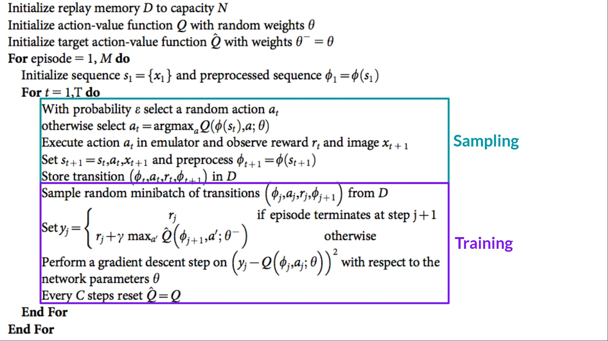

# 强化学习 Reinforcement Learning

强化学习是我最喜欢的，但也是相比于CV, NLP最难理解的。POMDP就先不看了，这个笔记主要看MDP。

- 大部分参考 COMP90051 AI Planning & Autonomy：https://gibberblot.github.io/rl-notes/index.html#
- 小部分参考 Hugging Face RL Course: https://huggingface.co/learn/deep-rl-course/unit0/introduction
- 还有一些参考知乎和CSDN等的Blogs。
- 我没怎么看 Sutton and Barto 的经典RL的书。

## 目录 Table of Contents
- [基础 Foundations](#基础-foundations)
- [分类 Classification](#分类-classification)
- [算法 Algorithms](#算法-algorithms)
    - [Value Iteration](#1-value-iteration-值迭代)
    - [Multi-armed Bandit](#2-multi-armed-bandit-algorithm-mab-多臂老虎机)
    - [Monte-Carlo Reinforcement Learning](#3-monte-carlo-reinforcement-learning-更新-q-function)
    - [Temporal Difference Methods](#4-temporal-difference-td-methods)
        - [Q-Learning](#)
        - [SARSA](#)
    - [Monte-Carlo Tree Search](#5-monte-carlo-tree-search-mcts)
    - [Q-Function Approximation](#6-q-function-approximation-更新-q-function)
        - [Deep Q-Learning](#deep-q-learning)
    - [Reward Shaping](#7-reward-shaping)
    - [Policy Iteration](#6-policy-iteration-直接更新policy)
    - [Policy Gradient](#7-policy-gradient)
        - [REINFORCE](#reinforce)
        - [Actor Critic](#actor-critic)
    - [Backward Induction (MinMax)](#backward-induction-minmax)


## 基础 Foundations
1) **Markov Decision Process (MDP)**

    A **Markov Decision Process** (MDP) is a  **fully observable**, **probabilistic** state model. The most common formulation of MDPs is a **Discounted-Reward Markov Decision
    Process**. A discount-reward MDP  is a tuple $(S, s_0, A, P, r, \gamma)$ containing:
    -   a state space $S$;
    -   initial state $s_0 \in S$;
    -   actions $A(s) \subseteq A$ applicable in each state $s \in S$ that our agent can execute;
    -   **transition probabilities** $P_a(s' \mid s)$ for $s \in S$ and
        $a \in A(s)$;
    -   **rewards** $r(s,a,s')$ positive or negative of transitioning from
        state $s$ to state $s'$ using action $a$; and
    -   a **discount factor** $0 \leq \gamma < 1$.
    - `为什么discount factor要小于1？` 
        - 避免在同一个state获得reward，陷入Loop死循环

---
2) **Value Function - V(s)**
指的是 Bellman Equation。它是给定一个状态 State，从该状态开始采取最优策略后所能获得的最大期望回报 (Reward)。

    - Bellman Equation有两层：
        - 遍历该state的所有action，然后对这些action的可能到达的state进行相加（你会看到连加符号下面是所有state，是因为 $P_a(s' \mid s)$ 一般来说很多都是0。 

$$
V(s) = \max_{a \in A(s)} \sum_{s' \in S} P_a(s' \mid s)\ [r(s,a,s') + \gamma\  V(s')]
$$

$$
V(s) = \overbrace{\max_{a \in A(s)}}^{\text{best action from $s$}} \overbrace{\underbrace{\sum_{s' \in S}}_{\text{for every state}} P_a(s' \mid s) [\underbrace{r(s,a,s')}_{\text{immediate reward}} + \underbrace{\gamma}_{\text{discount factor}} \cdot  \underbrace{V(s')}_{\text{value of } s'}]}^{\text{expected reward of executing action $a$ in state $s$}}
$$

- $V(s)$：状态 $s$ 的价值函数
- $\max$：表示在所有可能的动作 $a$ 中选择一个使得价值最大的动作
- $a \in A(s)$：在状态 $s$ 中可以采取的动作集合 $A(s)$
- $\sum_{s' \in S}$：表示对所有可能的下一个状态 $s'$ 求和
- $P_a(s' \mid s)$：在状态 $s$ 下采取动作 $a$ 转移到状态 $s'$ 的概率
- $r(s, a, s')$：从状态 $s$ 采取动作 $a$ 转移到状态 $s'$ 所获得的即时回报
- $\gamma$：折扣因子，表示未来回报的衰减系数，取值范围为 $[0, 1]$
- $V(s')$：下一个状态 $s'$ 的价值

----
3) **Q Function - Q(s, a)**
表示在给定状态 s 和动作 a 的情况下，从状态 s 开始执行动作 a，并随后按照最优策略行动后，能够获得的最大期望回报。

$$
Q(s,a) = \sum_{s' \in S} P_a(s' \mid s)\ [r(s,a,s') + \gamma\  V(s') ]
$$

- $Q(s, a)$：在状态 $s$ 下采取动作 $a$ 的价值函数
- $\sum_{s' \in S}$：表示对所有可能的下一个状态 $s'$ 求和
- $P_a(s' \mid s)$：在状态 $s$ 下采取动作 $a$ 转移到状态 $s'$ 的概率
- $r(s, a, s')$：从状态 $s$ 采取动作 $a$ 转移到状态 $s'$ 所获得的即时回报
- $\gamma$：折扣因子，表示未来回报的衰减系数，取值范围为 $[0, 1]$
- $V(s')$：下一个状态 $s'$ 的价值函数

---
4) **Deterministic Policy - $π(s)$**
    - 表示给定一个状态 s，返回一个能够获得最大期望回报的动作 (action)。
>  $π(s)$返回的是最好的action, $v(s)$返回的是获得的最大expected value。

5) **Stochastic Policies - $π(s,a)$**
    - This means that for a given state $s$, the policy 
$π(s,a)$ assigns a probability to each action $a$, indicating how likely the agent is to select each action.


## 分类 Classification

### Policy-based methods
直接训练策略 (Policy) 来学习在给定状态下应该采取的行动。

### Value-based methods
训练一个价值函数 (Value Function) 来学习哪个状态更有价值，并使用此价值函数来选择能够导致更高价值的行动。

--- 
### Model-based Methods
直接获得转移函数（矩阵）和 Reward 函数。例如，值迭代 (Value Iteration) 或策略迭代 (Policy Iteration)。

### Model-free Methods
通过经验、尝试动作 (action) 后才能获得转移函数和 Reward 函数。例如，Q-learning、SARSA 和 Monte Carlo 等。

---

### On-policy
强化学习方法是基于当前策略来更新值函数或策略的，如 SARSA，它基于当前 policy 或 episode 的 $V(s)$ 进行更新。
### Off-policy
强化学习方法是基于不同于当前策略的数据或策略来更新值函数，如 Q-learning，它基于最优 $V(s)$ 进行更新。

---
### Online Planning
在执行 action 之前进行规划，基于当前状态的最新信息，计算下一个最优动作。例如：MCTS、A*。

### Offline Planning
在执行任何动作之前，智能体已经提前计算出应对所有可能情况的最优策略。例如，值迭代 (Value Iteration)、策略迭代 (Policy Iteration)、SARSA、Q-learning。


## 算法 Algorithms

### 1) Value Iteration （值迭代）
遍历所有的 state，在每个 state 尝试 action，计算 $Q(s, a)$，然后更新 $V(s) = max Q(s, a)$。通过不断迭代，更新 $V(s)$，使其逐渐逼近真实值。

```math
\begin{array}{l}
  \textbf{Input:}\ \text{MDP}\ M = \langle S, s_0, A, P_a(s' \mid s), r(s,a,s')\rangle\\
  \textbf{Output:}\ \text{Value function}\ V\\[2mm]
  \text{Set}\ V\ \text{to arbitrary value function; e.g., }\ V(s) = 0\ \text{for all}\ s\\[2mm]
  \textbf{Repeat:} \\
  \quad\quad \Delta \leftarrow 0 \\
  \quad\quad \textbf{For each}\ s \in S \\
  \quad\quad\quad\quad \underbrace{V'(s) \leftarrow \max_{a \in A(s)} \sum_{s' \in S}  P_a(s' \mid s)\ [r(s,a,s') + 
 \gamma\ V(s') ]}_{\text{Bellman equation}} \\
  \quad\quad\quad\quad \Delta \leftarrow \max(\Delta, |V'(s) - V(s)|) \\
  \quad\quad V \leftarrow V' \\
  \textbf{Until:}\ \Delta \leq \theta 
\end{array}

```

### 2) Multi-armed Bandit Algorithm (MAB) 多臂老虎机
在 MAB 问题中，通常不涉及完整的 episode，而是执行某个 action，计算获得的 Reward 期望。

### 3) Monte-Carlo Reinforcement Learning (更新 Q-Function)
通过 MAB 等方法生成 episode（从起点到终点的 state-action 链），然后从后往前更新 (update)，利用 episode 的 Reward 更新 Q-Function。Monte Carlo 使用 episode 的 Reward 更新，而 Temporal Difference（如 Q-learning、SARSA）使用 $V(s’)$ 进行更新。

### 4) Temporal Difference (TD) Methods

$$
Q(s,a) \leftarrow \underbrace{Q(s,a)}_\text{old value} + \overbrace{\alpha}^{\text{learning rate}} \cdot [\underbrace{\overbrace{r}^{\text{reward}} + \overbrace{\gamma}^{\text{discount factor}} \cdot V(s')}_{\text{TD target}} - \overbrace{Q(s,a)}^{\text{do not count extra } Q(s,a)}]
$$
- 与Monte Carlo不同的是，TD用V(s')去更新Q(s,a)，不用Episode的Value。
- **Q-Learning (Off-Policy)**：基于 MAB 生成 episode，利用 $max Q(s’, a’)$ 更新 $Q(s, a)$，通过最大化未来回报来更新。

- **SARSA (On-Policy)**：根据当前策略下，后续选择的 action $a'$ 对 $Q(s, a)$ 进行更新。

总结：SARSA 会逐渐趋近于 optimal 的 policy，且 MAB 随着它的选择逐渐更新。

### 5) Monte-Carlo Tree Search (MCTS)
MCTS 是一种 Model-based 方法，可以直接观察转移矩阵。它通过四个阶段来解决问题：

- **选择 (Selection)**：连续选择 child，直到一个 child 没有 fully-expanded（即所有 (state, action) 对要被探索）。
- **扩张 (Expansion)**：选择一个尚未探索的 action，扩展到新的状态，创建对应的新节点。
- **模拟 (Simulation)**：从扩展的节点开始，进行随机模拟（例如随机选择动作直到游戏结束），估计当前路径的回报。
- **回传 (Back-propagation)**：将模拟得到的回报沿路径向上传播，更新树中每个节点的统计数据。

---

### 6) Q-Function Approximation (更新 Q-Function)
- Q-function 近似是一种通过函数逼近来估计 Q-function 的方法，常用于处理大规模状态空间的问题。
> 保证收敛但不保证问题是Optimal的（如果问题是非线性的话）
- Q-values from linear Q-functions
    $$
    \begin{array}{lll}
    Q(s,a) & = & f_1(s,a) \cdot w^a_1 + f_2(s,a)\cdot w^a_2 + \ldots  + f_{n}(s,a) \cdot w^a_n\\
            & = & \sum_{i=0}^{n} f_i(s,a) w^a_i
    \end{array}
    $$
- 损失函数的目标是最小化当前的 Q函数估计 和 目标Q值 之间的误差。
    $$ L(w) = \frac{1}{2} \left( r(s, a, s') + \gamma \cdot \max_{a'} Q(s', a'; w') - Q(s, a; w) \right)^2
$$
    - $f_n(s,a)$ 代表特征feature的具体值。
        - 比方说，它可以是我这辆车和前面车的距离；也可以是前面车的速度或者加速度等等。
        - 也可以是我某个行动之后，和前面车的距离
    - $w^a_n$ 代表特征的系数。
        - 我们需要对这个值进行估计或者学习
----
#### Q-function 的更新
- For initialisation, initialise all weights to 0.
- For update, update rules: 其中 $w^a_i$ initialise为0， $\alpha$ 是学习率 

    $\quad\quad$ For each state-action feature $i$\
    $\quad\quad\quad\quad w^a_i \leftarrow w^a_i + \alpha \cdot \delta \cdot \ f_i(s,a)$
    - **这里其实和线性回归的权重$w_i$更新方式一致。**

- Q-Learning的 $\delta$ **(其实$\delta$就是前面的损失函数$L(w)$的微分)**
    $$ \delta = r(s, a, s') + \gamma \cdot \max_{a'} Q(s', a') - Q(s, a)$$
- SARSA的 $\delta$ **(其实$\delta$就是前面的损失函数$L(w)$的微分)**
    $$\delta = r(s, a, s') + \gamma \cdot Q(s', a') - Q(s, a)$$
----
#### Deep Q-learning
用神经网络进行 $\theta$ 更新，
$$
\theta \leftarrow \theta + \alpha \cdot \delta \cdot \nabla_{\theta} Q(s, a; \theta)
$$
其中：
$\nabla_{\theta} Q(s, a; \theta)$ 是Q-function的梯度（损失函数Loss对特征$\theta$的偏导数）



- 这个Deep Q-Learning怎么做呢？具体可以想象一下，从Linear Q-learning的 $Q(s,a)$ 特征的线性组合，那我们可以想象一下用MLP传入这些特征，输出为$Q(s,a)$。
- 输出层的大小为在这个理state的action的数量的大小。
- 如果插入非线性的激活函数，我们就可以拟合非线性的模型啦！
> Deep Q-learning不保证收敛.

- 优点（与线性 Q 函数近似相比）：

    - **特征选择**：我们不需要手动选择特征，神经网络的隐藏层会自动学习到“特征”。
    - **非结构化数据**：状态 $s$可以是更不结构化的数据，例如图像或图像序列（视频）。

- 缺点：

    - **收敛性**：没有收敛的保证。
    - **数据需求大**：深度神经网络对数据的需求更大，因为它们不仅需要学习“Q 函数”，还要学习特征。因此，相比于使用良好特征的线性近似，学习良好的 Q 函数可能更加困难。通常需要大量的计算资源。
----
#### Q-function Approximation的优点：

- **内存**：相比于 Q 表，深度 Q 函数具有更高效的表示，因为我们只需要存储 Q 函数的权重/参数，而不需要存储大小为 $|A| \times |S|$ 的 Q 表。
- **Q 值传播**：我们不需要在状态 $s$ 中执行动作 $a$ 来获取 $Q(s, a)$ 的值，因为 Q 函数具有泛化能力。

#### Q-function Approximation的缺点：

- **Q 函数只是一个近似**：现在的 Q 函数只是实际 Q 函数的近似，共享特征值的状态根据 Q 函数会有相同的 Q 值，但根据（未知的）最优 Q 函数，它们的实际 Q 值可能不同。
----
### 7) Reward Shaping

在初始的状态下reward可能比较稀疏Sparse，比方说我们在象棋中，实际上只有把别人的将军吃掉才有Reward。在稀疏的情况下，模型在一开始可能只有随机的寻找action，很难去更好的寻找和趋近最优方法。

- 有两种方法优化稀疏的环境:
    1. **奖励塑造 (Reward Shaping)**：如果奖励稀疏，我们可以修改/增强奖励函数，对那些我们认为能使问题向解决方案更接近的行为进行奖励。
    - 比方说在象棋中，我们在吃了对方的一个车+4分，一个炮+3分等等）这就意味着我们要利用Domain Knowledge去进行Reward Shaping。（其实等于增加了Heuristics）

    2. **Q 值初始化 (Q-Value Initialisation)**：我们可以在一开始“猜测”一个好的 Q 函数，并将 $Q(s, a)$ 初始化为该值，这将引导我们的学习算法。

- Reward Shaping 公式
    $$Q(s,a) \leftarrow Q(s,a) + \alpha [r + \underbrace{F(s,s')}_{\text{additional reward}} + \gamma \max_{a'} Q(s',a') - Q(s,a)]$$
    - 我们说 $G^{\Phi} = \sum_{i=0}^{\infty} \gamma^i (r_i + F(s_i,s_{i+1}))$ 是整个Episode的塑造奖励（shaped reward）。
    - $F(s,s')>0$ 是 正向奖励，鼓励我们去exploit一个action从 $s$ 到 $s'$
    - $F(s,s')<0$ 是 反向奖励，反对我们去exploit一个action从 $s$ 到 $s'$
----
#### 基于势能的奖励塑造 Potential-based Reward Shaping

**Potential-based** reward shaping is a particular type of reward shaping with nice theoretical guarantees. In potential-based reward shaping, $F$ is of the form:

$$F(s,s') = \gamma \Phi(s') - \Phi(s)$$

We call $\Phi$ the **potential function (势能函数)** and $\Phi(s)$ is the **potential (势能)** of state $s$.

So, instead of defining $F : S \times S \to \mathbb{R}$, we define $\Phi : S \to \mathbb{R}$, which is some heuristic measure of the value of each state $s \in S$. (空间的大小由 $S \times S$ 变成了 $S$)

**Theoretical guarantee**: this will still converge to the optimal policy under the assumption that all state-action pairs are sampled infinitely often.

`例子:`

$$
\Phi(s) = 1 - \frac{|x(g) - x(s)| + |y(g) - y(s)|}{width + height - 2}
$$
- 要往势能低的地方走，所以是要用 $(1 - ..) $
- $x(g)$为Goal State的 $x$ 坐标
- $y(g)$为Goal State的 $y$ 坐标

我们的初始点为 $(1,0)$ ，Goal State $(3,2)$ 。
我们用曼哈顿距离为Heuristics的话，我们初始点 $(1，0)$ 的势能为 $1-(｜3-1｜+｜2-0｜)/4+3-2 = 4/5$, $（0,0)$ 的势能为 1，Goal State (3,2) 的势能为0。
我们要往势能低的地方走，所以说Reward Shaping会限制我们从初始点 $(1,0)$ 去 $(0,0)$ , 鼓励我们去Goal State $(3,2)$ 。

> `评价:` 用 ”Reward Shaping“ 方法比较依赖 “Domain Knowledge” 也就是我们对Feature的选择。
--- 
#### Q-function initialisation
 - 初始化一个Q-Value使其趋近于最优Q-Value

----
### 6) Policy Iteration (直接更新Policy)
 - 一种Policy-based的方法：直接更新Policy
 - 一种Model-based的方法：能直接观察到Reward和Transition Function
 -  一开始由一个非最优的Policy（例如Random Policy)，然后逐渐更新趋向于最优Policy。
 - `方法:` 由两个部分组成 Policy Evaluation 和 Policy Improvement。
 1) **Policy Evaluation:**
    - 先遍历所有的States，`根据Policy`的$V^\pi(s')$ 等参数去更新 $V^\pi(s)$。
    $$V^\pi(s) =  \sum_{s' \in S} P_{\pi(s)} (s' \mid s)\ [r(s,a,s') +  \gamma\ V^\pi(s') ]$$

 2) **Policy Improvement:**
    - 再遍历每个State，然后每个State遍历每个action，然后看哪个action根据policy的Q-value最大更新policy。
    $$Q^{\pi}(s,a)  =  \sum_{s' \in S} P_a(s' \mid s)\ [r(s,a,s') \, + \,  \gamma\ V^{\pi}(s')]$$
    $$ Update:  \pi(s) \leftarrow \textrm{argmax}_{a \in A(s)}Q^{\pi}(s,a)$$
 3) 进行Policy Evaluation + Policy Improvement多次，直到变化小于某个值或者达到某个次数。

---
### 7) 策略梯度 Policy Gradient
 - Model-free Method
 - `两个特点:`
    1) 要求Function`可微 differentiable`.
    2) 一般来说，Polies是`随机Stochastic`的，$π(s,a)$ 返回一个probability。

---
The goal of gradient ascent is to find weights of a policy function $\pi_{\theta}(s, a)$ that maximises the expected return.

The expected value of a policy $\pi_{\theta}$ with parameters $\theta$ is defined as:

$$J(\theta) = V^{\pi_{\theta}}(s_0)$$

- $s_0$ 是 起始点
- 参数 $\theta$ 作为变量定义 $\pi_{\theta}(s, a)$。
- 目标函数是最大化 $J(\theta) = V^{\pi_{\theta}}(s_0)$
- $J(\theta)$ 定义了，根据Policy $\pi$, 从起始点 $s_0$ 可以获得的最大期望回报
- 在 policy gradient 中，优化的目标是通过梯度上升调整策略的参数 $\theta$，使得从初始状态开始，所期望的累积回报最大化。
---- 
Given a policy objective 策略目标函数 $J(\theta)$, the **policy gradient 策略梯度** of $J$ with respect to $\theta$, written $\nabla_{\theta}J(\theta)$ is defined as:

$$
\nabla_{\theta}J(\theta) = \begin{pmatrix} \frac{\partial J(\theta)}{\partial \theta_1} \\ \vdots \\ \frac{\partial J(\theta)}{\partial \theta_n} \end{pmatrix}
$$

where $\frac{\partial J(\theta)}{\partial \theta_i}$ is the partial derivative of $J$ with respective to $\theta_i$.

Update Method for $J(\theta)$：
$$\theta \leftarrow \theta + \alpha \nabla J(\theta)$$
where $\alpha$ 是 Learning Rate 学习率。

---
The **policy gradient theorem** (see Sutton and Barto, Section 13.2) says that for any differentiable policy $\pi_{\theta}$, state $s$, and action $a$, that $\nabla J(\theta)$ is:

- 连续动作空间:
    $$\nabla J(\theta) = \mathbb{E}[(\nabla_{\theta}\ \textrm{ln} \pi_{\theta}(s, a)  Q(s,a)]$$

- 离散动作空间:
    $$
    \nabla J(\theta) = \sum_s d^{\pi}(s) \sum_a \pi_{\theta}(s, a) \nabla_{\theta} \ln \pi_{\theta}(s, a) Q(s, a)
    $$

    其中，$d^{\pi}(s)$ 是状态 $s$ 的稳态分布，表示在策略 $\pi_{\theta}$ 下，智能体处于状态 $s$ 的概率。


表达式 $\ln \pi_{\theta}(s, a)$ 告诉我们如何改变权重 $\theta$：如果在状态 $s$ 中选择动作 $a$ 的 Q-value 是正的，我们将增加选择该动作的概率；否则，我们会减少选择该动作的概率。因此，这是采取动作 $\pi_{\theta}(s, a)$ 所获得的期望回报乘以梯度。

这里用期望值 $\mathbb{E}$，因为我们的策略是用概率进行估算，我们的 $Q(s,a)$ 要用期望值。

---
这里假设我们在状态 $s$ 有两个行动 $a_0$ 和 $a_1$，我们用逻辑回归计算他们的概率（这里我们进行简化，如果多个行动用Softmax）：
$$
\begin{aligned}
        \pi_{\theta}(s, a_0) &= \frac{1}{1 + e^{-\theta \cdot s}}\\[1mm]
        \pi_{\theta}(s, a_1) &= 1 - \pi_{\theta}(s, a_0) 
\end{aligned}
$$

这两个公式对 $\theta$ 导入公式$\nabla \textrm{ln} \pi_{\theta}(s, a)$得到:

$$
\begin{aligned}
  \nabla \textrm{ln} \pi_{\theta}(s, a_0) &= s - s\cdot \pi_{\theta}(s, a_0)\\[1mm]
  \nabla \textrm{ln} \pi_{\theta}(s, a_1) &= -s \cdot \pi_{\theta}(s, a_0)
\end{aligned}
$$

`重点:`
- REINFORCE 对 $\theta$ 的梯度计算:
    $$
    \nabla_{\theta} J(\theta) = \sum_{t} \nabla_{\theta} \ln \pi_{\theta}(s_t, a_t) G_t
    $$
    - $G_t$是由Epsiode求得。
- Actor Critic 对 $\theta$ 的梯度计算:
    $$
    \nabla_{\theta} J(\theta) = \sum_{t} \nabla_{\theta} \ln \pi_{\theta}(s_t, a_t) \left( A(s,a) \right)
    $$
 
    - $A(s,a)=Q(s,a)−V(s)$ 优势函数，评价在状态 $s$ 下，行动 $a$ 在这个状态下是否更好，更有优势。
    - $G_t - V(s_t)$ 是对优势函数的估计形式。

----
#### REINFORCE
https://blog.csdn.net/qq_41262334/article/details/137771108

$$
\begin{array}{l}
\textbf{Input:}\  \text{A differentiable policy}\ \pi_{\theta}(s,a),\\ \text{an MDP}\ M = \langle S, s_0, A, P_a(s' \mid s), r(s,a,s')\rangle\\
\textbf{Output:}\  \text{Policy}\ \pi_{\theta}(s,a)\\\\[2mm]
\text{Initialise parameters}\ \theta\ \text{arbitrarily}\\[2mm]
\textbf{Repeat:}\\
\quad\quad \text{Generate episode}\ (s_0, a_0, r_1, \ldots s_{T-1}, a_{T-1}, r_T)\ \text{by following}\ \pi_{\theta}\\
\quad\quad \textbf{For each}\ (s_t, a_t)\ \text{in the episode:}\\
\quad\quad\quad\quad G \leftarrow \sum_{k=t+1}^{T} \gamma^{k-t-1} r_k\\
\quad\quad\quad\quad \theta \leftarrow \theta + \alpha \gamma^{t} G\ \nabla\ \ln\ \pi_{\theta}(s_t, a_t)\\
\textbf{Until}\ \pi_{\theta}\ \text{converges}
\end{array}
$$


**REINFORCE** 算法 (on-policy 算法) 通过遵循当前的策略，使用蒙特卡洛模拟生成整个 episode（回合）；因此，随着策略 $\pi$ 的改进，它会生成越来越好的策略。然后，它会遍历 episode 中的每一个动作，计算 $G$，即该轨迹的未来折扣回报总和。利用这个回报，它计算策略的梯度 $\pi$ 并沿着 $G$ 的方向进行梯度更新。

- **REINFOCE** 用 the most recently sampled action and its reward are used to calculate the gradient and update, 这一点和前面的Monte-Carlo Reinforcement Learning相似，只不过这个是更新策略函数 $\pi_{\theta}(s, a)$。
- 当 action space or state space are continuous时，**REINFOCE** 会更有优势。
- **Deep REINFOCE** 用深度学习的方法拟合 $J(\theta)$。

----
#### Actor Critic

https://blog.csdn.net/qq_33302004/article/details/115530428

$$
\begin{array}{l}
\textbf{Input:}\ \text{MDP}\ M = \langle S, s_0, A, P_a(s' \mid s), r(s,a,s')\rangle\\
\textbf{Input:}\ \text{A differentiable actor policy}\ \pi_{\theta}(s,a)\\
\textbf{Input:}\ \text{A differentiable critic Q-function}\ Q_w(s,a)\\
\textbf{Output:}\ \text{Policy}\ \pi_{\theta}(s,a) \\[2mm]
\text{Initialise actor parameters}\ \theta\ \text{and critic parameters}\ w\ \text{arbitrarily}\\[2mm]
\textbf{Repeat (for each episode}\ e\text{):}\\
\quad s \leftarrow\ \text{the first state in episode}\ e\\
\quad \text{Select action}\ a \sim \pi_\theta(s, a)\\
\quad \textbf{Repeat (for each step in episode e):}\\
\quad\quad \text{Execute action}\ a\ \text{in state}\ s\\
\quad\quad \text{Observe reward}\ r\ \text{and new state}\ s'\\
\quad\quad \text{Select action}\ a' \sim \pi_\theta(s', a')\\
\quad\quad \delta \leftarrow r + \gamma \cdot  Q_w(s',a') - Q_w(s,a)\\
\quad\quad w  \leftarrow w + \alpha_w \cdot \delta \cdot \nabla Q_w(s,a)\\
\quad\quad \theta \leftarrow \theta + \alpha_{\theta} \cdot \delta \cdot \nabla \ln\ \pi_{\theta}(s,a)\\
\quad\quad s \leftarrow s'; a \leftarrow a'\\
\quad \textbf{Until}\ s\ \text{is the last state of episode}\ e\ \text{(a terminal state)}\\
\textbf{Until}\ \pi_{\theta}\ \text{converges}
\end{array}

$$

The reason the actor critic methods still work like this is because the actor policy $\pi_{\theta}$ selects actions for us, while the critic $Q_w(s,a)$ is only ever used to calculate the temporal difference estimate for an already selected action. We do not have to iterate over the critic Q-function to select actions, so we do not have to iterate over the set of actions -- we just use the policy. As such, this will still extend to continuous and large state spaces and be more efficient for large action space.

## Backward Induction (MinMax)