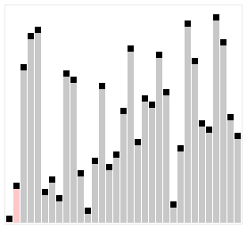

# Algorithms

## 排序算法

| 排序算法   | 平均时间复杂度 | 最好情况    | 最坏情况    | 空间复杂度 | 排序方式 | 稳定性 |
|------------|----------------|-------------|-------------|------------|----------|--------|
| 冒泡排序   | O(n²)          | O(n)        | O(n²)       | O(1)       | 内排序   | 稳定   |
| 选择排序   | O(n²)          | O(n²)       | O(n²)       | O(1)       | 内排序   | 不稳定 |
| 插入排序   | O(n²)          | O(n)        | O(n²)       | O(1)       | 内排序   | 稳定   |
| 希尔排序   | O(n^1.3)       | O(n)        | O(n²)       | O(1)       | 内排序   | 不稳定 |
| 归并排序   | O(n log n)     | O(n log n)  | O(n log n)  | O(n)       | 外排序   | 稳定   |
| 快速排序   | O(n log n)     | O(n log n)  | O(n²)       | O(log n)   | 内排序   | 不稳定 |
| 堆排序     | O(n log n)     | O(n log n)  | O(n log n)  | O(1)       | 内排序   | 不稳定 |
| 计数排序   | O(n + k)       | O(n + k)    | O(n + k)    | O(k)       | 外排序   | 稳定   |
| 桶排序     | O(n + k)       | O(n + k)    | O(n²)       | O(n + k)   | 外排序   | 稳定   |
| 基数排序   | O(n * k)       | O(n * k)    | O(n * k)    | O(n + k)   | 内排序   | 稳定   |

---

### 冒泡排序 Bubble Sort
- Bubble Sort is an algorithm that sorts an array from the lowest value to the highest value.
- 冒泡排序通过多次相邻元素的比较和交换，将未排序部分中的最大或最小值“冒泡”到数组的一端。

    
    ```python
    def bubble_sort(num_list):
        for a in range(len(num_list) - 1):
            # 每次都把最大的推到最前面
            for b in range(len(num_list) - a - 1):
                if num_list[b] > num_list[b+1]:
                    num_list[b], num_list[b+1] = num_list[b+1], num_list[b]
        return num_list
    ```


### 选择排序 Selection Sort
- The Selection Sort algorithm finds the lowest value in an array and moves it to the front of the array.
- 选择排序通过在未排序部分中找到最小或最大的元素，并将其放到排序部分的末尾或开头。

    
    ```python
    def selection_sort(num_list):
        for a in range(len(num_list) - 1):
            min_num = num_list[a]
            idx = a
            # 找到每次迭代中最小的
            for b in range(a + 1, len(num_list)):
                if num_list[b] < min_num:
                    min_num = num_list[b]
                    idx = b
            # 放在这个位置
            num_list[a], num_list[idx] = num_list[idx], num_list[a]
        return num_list
    ```

### 插入排序 Insertion Sort
- The Insertion Sort algorithm uses one part of the array to hold the sorted values, and the other part of the array to hold values that are not sorted yet.

    
    ```python
    def insertion_sort(num_list):
        for a in range(1, len(num_list)):
            for b in range(a, 0, -1):
                if num_list[b] < num_list[b-1]:
                    num_list[b], num_list[b-1] = num_list[b-1], num_list[b]
                else:
                    break
        return num_list
    ```


### 归并算法 Merge Sort
- 分而治之 Divide and Conquer
- Step1: Divide 阶段把划分到最小
- Step2: Conquer 阶段使用 **双指针法** 或 **两路归并算法**
    - 输入：两个已经排序的子数组。
    - 输出：将两个子数组合并成一个排序后的数组。
    - 算法思想：
        - 使用两个指针分别指向两个子数组的起始位置。
        - 比较两个指针所指的元素，将较小的元素加入结果数组，并移动对应指针。
        - 如果其中一个子数组的所有元素都已经被处理完，直接将另一个子数组的剩余部分追加到结果数组。
- Step3: 递归返回Step1


```python
def merge_sort(num_list):
    def conquer(num_list1, num_list2):
        left = 0
        right = 0
        num_list = []
        while left < len(num_list1) and right < len(num_list2):
            if num_list1[left] <= num_list2[right]:
                num_list.append(num_list1[left])
                left += 1
            else:
                num_list.append(num_list2[right])
                right += 1
        if left < len(num_list1):
            num_list += num_list1[left:]
        if right < len(num_list2):
            num_list += num_list2[right:]
        return num_list
    
    def divide(num_list):
        if len(num_list) == 1:
            return num_list
        else:
            return conquer(divide(num_list[:len(num_list)//2]), divide(num_list[len(num_list)//2: len(num_list)]))
    
    return divide(num_list)
```

## 快速排序 Quick Sort


``` python
def quick_sort(num_list):
    if len(num_list) == 0:
        return []
    pivot_num = num_list[len(num_list)//2]
    larger = []
    smaller = []
    pivot = []
    for num in num_list:
        if num > pivot_num:
            larger.append(num)
        elif num < pivot_num:
            smaller.append(num)
        else:
            pivot.append(num)
    return quick_sort(smaller) + pivot + quick_sort(larger)
```


## Python
```python
# 字典：有就返回，没有就是0
dict.get(i,0)
# 经常用
dict[i] = dict.get(i,0) + 1

# 从小到大排序, 时间复杂度O(nlogn)
sorted(list)

# 从大到小排序
sorted(list, reverse=True)

# 把list变成字符串
list = []
str = ''.join(list)
```

## Stack
- **Last In, First Out (LIFO)**
    ```python
    # Last In, First Out (LIFO) 
    stack = []

    # Push elements onto the stack
    stack.append(1)
    stack.append(2)
    stack.append(3)

    print("Stack after pushes:", stack)

    # Pop elements from the stack
    top = stack.pop()
    print("Popped element:", top)
    print("Stack after pop:", stack)

    class Stack:
        def __init__(self):
            self.items = []

        def push(self, item):
            self.items.append(item)

        def pop(self):
            if not self.is_empty():
                return self.items.pop()
            raise IndexError("Pop from an empty stack")

        def peek(self):
            if not self.is_empty():
                return self.items[-1]
            raise IndexError("Peek from an empty stack")

        def is_empty(self):
            return len(self.items) == 0

        def size(self):
            return len(self.items)

    # Example usage
    stack = Stack()
    stack.push(1)
    stack.push(2)
    stack.push(3)

    print("Top element:", stack.peek())
    print("Stack size:", stack.size())

    stack.pop()
    print("Stack after pop:", stack.items)

    ```

## Queue
-  **First In, First Out (FIFO)**
    ```python
    queue = []

    # Enqueue elements
    queue.append(1)
    queue.append(2)
    queue.append(3)

    print("Queue after enqueues:", queue)

    # Dequeue elements
    front = queue.pop(0)
    print("Dequeued element:", front)
    print("Queue after dequeue:", queue)

    class Queue:
        def __init__(self):
            self.items = []

        def enqueue(self, item):
            self.items.append(item)

        def dequeue(self):
            if not self.is_empty():
                return self.items.pop(0)
            raise IndexError("Dequeue from an empty queue")

        def peek(self):
            if not self.is_empty():
                return self.items[0]
            raise IndexError("Peek from an empty queue")

        def is_empty(self):
            return len(self.items) == 0

        def size(self):
            return len(self.items)

    # Example usage
    queue = Queue()
    queue.enqueue(1)
    queue.enqueue(2)
    queue.enqueue(3)

    print("Front element:", queue.peek())
    print("Queue size:", queue.size())

    queue.dequeue()
    print("Queue after dequeue:", queue.items)

    ```


## Is Subsequence (按顺序的子字符串)

Given two strings s and t, return true if s is a subsequence of t, or false otherwise.

A subsequence of a string is a new string that is formed from the original string by deleting some (can be none) of the characters without disturbing the relative positions of the remaining characters. (i.e., "ace" is a subsequence of "abcde" while "aec" is not).


Example 1:

Input: s = "abc", t = "ahbgdc"
Output: true
Example 2:

Input: s = "axc", t = "ahbgdc"
Output: false


## Is Subsequence (不按顺序的子字符串)
本质是两个子字符串的计数问题
- 时间复杂度为：O(m+n)
- 需要用到python的`dict.get(i,1)` 
```python
# 如果存在就+1，如果不存在就是 0 + 1
dict[i] = dict.get(i,0) + 1
```


## 双指针
https://zhuanlan.zhihu.com/p/657981698

## Hash 哈希
- key -> index 
    - index = hash_value % table_size (取模运算，得到余数)
    - 哈希表的大小范围 [0, table_size-1]
    

## 模拟退火
- 基于爬山算法，爬山算法只有是凸函数才有可能找到最优，不然的话会陷入局部最优。
- 而模拟退火在进入某个最优的时候，会有一定概率跳出最优寻找其他点位，从而跳出局部最优。这个概率是衰竭的，在一次一次跳出后，衰竭为0。
