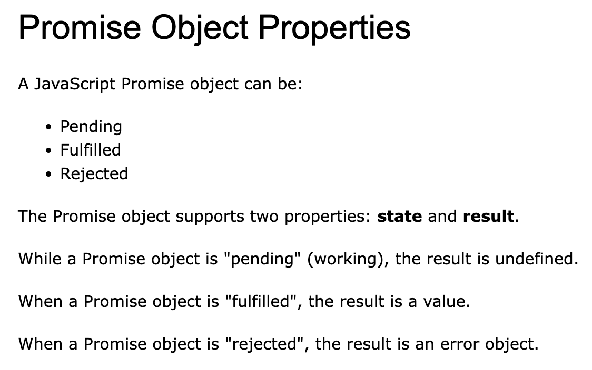

# JavaScript

## 杂项
- JavaScript是大小写敏感的，同一个变量名大小写不一样，代表不同的变量
- 如果引用函数后面不加括号，就会显示定义的公式，而不去执行函数。

## 常量
- Cannot be Reassigned
- 但是对于列表和对象来说是可以改变的
- String Interpolation
    ``` JavaScript
    const name = "Steven";
    console.log(`Hello, ${name}!`); 
    // 输出：Hello, Steven!

    let price = 10;
    let VAT = 0.25;
    let total = `Total: ${(price * (1 + VAT)).toFixed(2)}`;
    ```
- scope
``` JavaScript
{
  let x = 2;
}
// x can NOT be used here

{
  var x = 2;
}
// x CAN be used here
```

- Spread Operator
```JavaScript
const state = {
  name: "Steven",
  age: 25
};

const newState = {
  ...state, // 这里展开 state 对象
  city: "Melbourne"
};

console.log(newState);
// 输出：{ name: "Steven", age: 25, city: "Melbourne" }
```

- Callbacks
    - A callback is a function passed as an argument to another function

``` JavaScript
function myFirst() {
  myDisplayer("Hello");
}

function mySecond() {
  myDisplayer("Goodbye");
}

myFirst();
mySecond();
```

- Promises

    - "Producing code" is code that can take some time
    - "Consuming code" is code that must wait for the result
    - A Promise is an Object that links Producing code and Consuming code
    -  Promise 实例方法：
        - then() - 添加 Promise 成功履行(fulfilled)时的回调
        - catch() - 添加 Promise 被拒绝(rejected)时的回调
        - finally() - 添加无论 Promise 最终状态如何都会执行的回调

    - Promise 静态方法：
        - Promise.resolve() - 创建一个立即解决的 Promise
        - Promise.reject() - 创建一个立即拒绝的 Promise
        - Promise.all() - 等待所有 Promise 都完成（或第一个拒绝） 
        - Promise.race() - 等待第一个完成（或拒绝）的 Promise
        - Promise.allSettled() - 等待所有 Promise 都完成（无论解决还是拒绝）


    

    ``` JavaScript
    function myDisplayer(some) {
      document.getElementById("demo").innerHTML = some;
    }

    let myPromise = new Promise(function(myResolve, myReject) {
      let x = 0;

    // The producing code (this may take some time)

      if (x == 0) {
        myResolve("OK");
      } else {
        myReject("Error");
      }
    });

  myPromise.then(
    function(value) {myDisplayer(value);},
    function(error) {myDisplayer(error);}
  );
  ```
  ``` JavaScript
  async function myFunction() {
    return "Hello";
  }

  function myFunction() {
    return Promise.resolve("Hello");
  }

  function myFunction() {
    return new Promise((resolve) => resolve("Hello"));
  }

  const myPromise = new Promise((resolve, reject) => {
  // 假设这是一个可能失败的操作
  const success = false;
  
    if (success) {
      resolve("操作成功");
    } else {
      reject(new Error("操作失败"));
    }
  });

  // 处理被拒绝的 Promise
  myPromise
    .then(result => console.log(result))
    .catch(error => console.error(error.message)); // 将输出 "操作失败"

  const promise1 = fetch('https://api.example.com/data1').then(res => res.json());
  const promise2 = fetch('https://api.example.com/data2').then(res => res.json());

  // Promise.all 等待所有 Promise 完成
  Promise.all([promise1, promise2])
    .then(([result1, result2]) => {
      console.log('所有请求完成');
      console.log('结果 1:', result1);
      console.log('结果 2:', result2);
    })
    .catch(error => {
      console.error('至少一个请求失败:', error);
    });

  // 等待所有 Promise 完成但不关心是否有失败的
  Promise.allSettled([promise1, promise2])
  .then(results => {
    results.forEach((result, index) => {
      if (result.status === 'fulfilled') {
        console.log(`Promise ${index + 1} 成功:`, result.value);
      } else {
        console.log(`Promise ${index + 1} 失败:`, result.reason);
      }
    });
  });
  ```

- Asynchronous
    - Functions running in parallel with other functions are called asynchronous
    - 异步函数
``` JavaScript
const PI = 3.141592653589793;
PI = 3.14;      // This will give an error
PI = PI + 10;   // This will also give an error

// You can create a constant array:
const cars = ["Saab", "Volvo", "BMW"];
// You can change an element:
cars[0] = "Toyota";
// You can add an element:
cars.push("Audi");

// You can create a const object:
const car = {type:"Fiat", model:"500", color:"white"};
// You can change a property:
car.color = "red";
// You can add a property:
car.owner = "Johnson";
```