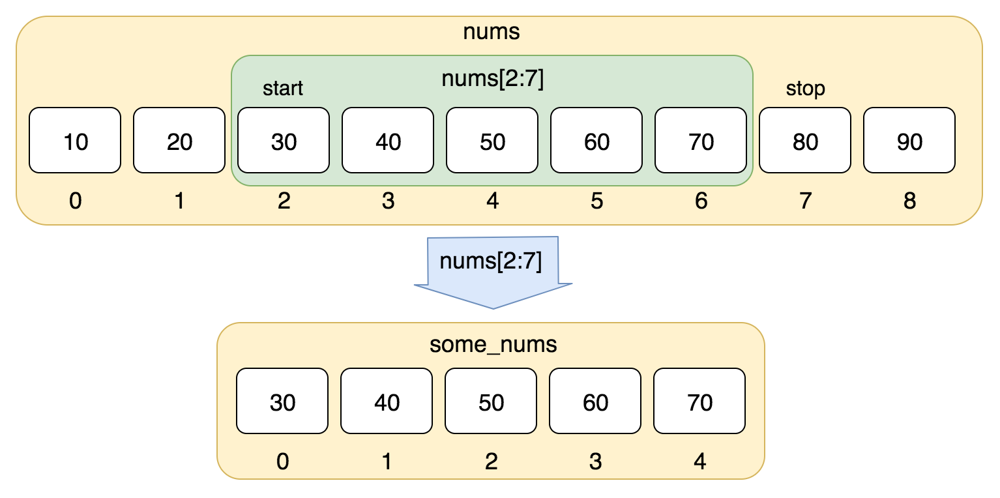
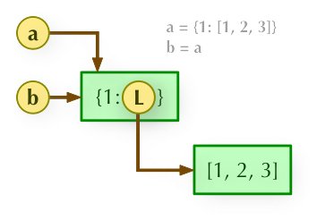
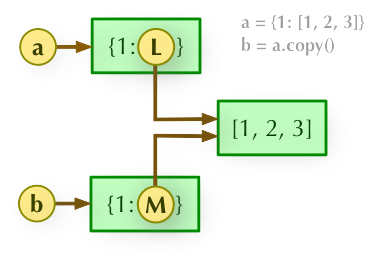
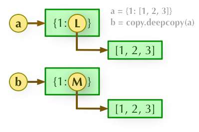

# Python

## General
``` python
# Define your interpreter
#!/usr/bin/python3


# 身份运算符: is 是查看内存地址是否相同
# Output: true
a = 20
b = 20
print(a is b)

# Output: false
a = [1, 2]
b = [1, 2]
print(a is b)


# 字符串 String

# 字符串连接：Join 
# 这样子会报错
a = (1,2)
print("-".join(a))
# 只有这样子才不报错 -- 需要字符串类型
a = ("1","2")
print("-".join(a))

# 字符串分割：Split
s = "apple,banana,orange"
print(s.split(","))  # 输出: ['apple', 'banana', 'orange']


# 列表 List
# Output: 98765432
str='123456789'
print(str[-1:0:-1]) 

# Output: 987654321
print(str[-1::-1])    
print(str.reverse())

# 移除：索引为index的元素
list.pop(index)
# 移除：`元素的值` 为value的元素
list.remove(value)

# 排序：默认升序，reverse是反序
list.sort(reverse=True)

# Append: 添加到新的最后元素中
# 返回 [..., ["a", "b"]]
list.append(["a","b"])

# Extend: 添加所有元素
# 返回[..., "a", "b"]
list.extend(["a","b"])
list = list + ["a","b"]

# 从列表中找出某个值第一个匹配项的索引位置
list.index(obj)
# 将对象插入列表
list.insert(index, obj)
# 统计某个元素在列表中出现的次数
list.count(obj)

# 枚举函数：enumerate() 
a = ["Geeks", "for", "Geeks"]
for i, name in enumerate(a):
    print(f"Index {i}: {name}")

# 迭代器：iter()
# 有内存优势，迭代器提供了一种方式来一次处理一个元素，而不需要一次性将所有数据加载到内存中
list=[1,2,3,4]
it = iter(list)  
for i in it:
    print(i)


# 字典 Dictionary
# 特殊构建方法
dict = dict()
dict = {}
>>> dict([('Runoob', 1), ('Google', 2), ('Taobao', 3)])
{'Runoob': 1, 'Google': 2, 'Taobao': 3}
>>> {x: x**2 for x in (2, 4, 6)}
{2: 4, 4: 16, 6: 36}
>>> dict(Runoob=1, Google=2, Taobao=3)
{'Runoob': 1, 'Google': 2, 'Taobao': 3}

# 删除字典元素
dict.pop(key)
dict.pop(key, default)
del dict[key]

# Get/Set or Default
dict.get(key,default)
dict.set(key,default)

# Items: 返回一个key-value 列表[(key1, value1), (key2, value2), ..]
dict.items()
for key, values in dict.items():
    pass

dict.keys()
dict.values()


# 元组 Tuple (不能修改)
# 元组（tuple）与列表类似，不同之处在于元组的元素 `不能修改`。
tuple = ( 'abcd', 786 , 2.23, 'runoob', 70.2  )
# 删除元组
del tuple

# 集合 Set (无须，可变，且元素唯一)
# Python 中的集合（Set）是一种 `无序、可变 的数据类型，用于存储 `唯一` 的元素。
sites = {'Google', 'Taobao', 'Runoob', 'Facebook', 'Zhihu', 'Baidu'}

# set可以进行集合运算
a = set('abracadabra')
b = set('alacazam')
print(a - b)     # a 和 b 的差集
print(a | b)     # a 和 b 的并集
print(a & b)     # a 和 b 的交集
print(a ^ b)     # a 和 b 中不同时存在的元素

# Python 3.10
# case _ 代表default
match subject:
    case <pattern_1>:
        <action_1>
    case <pattern_2>:
        <action_2>
    case <pattern_3>:
        <action_3>
    case _:
        <action_wildcard>


# do-while 循环的变通实现
while True:
    # 循环体代码
    print("这段代码至少执行一次")
    
    # 条件检查
    if not condition:  # 如果条件不满足，则退出循环
        break

# 列表推导式
[表达式 for 变量 in 列表] 
[out_exp_res for out_exp in input_list]

或者 

[表达式 for 变量 in 列表 if 条件]
[out_exp_res for out_exp in input_list if condition]

# 匿名函数
x = lambda a : a + 10
print(x(5))
x = lambda a, b : a * b
print(x(5, 6)) 

# 装饰器 Decorator: 不修改原始函数代码的情况下增强或修改函数的行为。
# @classmethod 和 @staticmethod 就是装饰器
def log_function_call(func):
    def wrapper(*args, **kwargs):
        print(f"Calling {func.__name__}")
        result = func(*args, **kwargs)
        print(f"Finished {func.__name__}")
        return result
    return wrapper
@log_function_call
def add(a, b):
    return a + b

def memoize(func):
    cache = {}
    def wrapper(*args):
        if args not in cache:
            cache[args] = func(*args)
        return cache[args]
    return wrapper
@memoize
def fibonacci(n):
    if n <= 1:
        return n
    return fibonacci(n-1) + fibonacci(n-2)


# 类变量和实例变量
# 类变量在不同实例中，值是共享的
# 实例变量在不同实例中，值是不共享的
class MyClass:
     # 这是一个类变量
    class_variable = "I am a class variable" 
    
    def __init__(self):
        # 这是一个实例变量
        self.instance_variable = "I am an instance variable"

    # 类方法
    @classmethod
    def update_var(cls, new_value):
        cls.class_var = new_value
    # 静态方法
    @staticmethod

# 相当于Java的函数入口：
public static void main(String[] args){

}
if __name__ == "__main__":
```

### List 的索引
- nums[2:7] 是不包括7号元素的。


### 拷贝 Copy
1) 浅复制：只复制地址

2) 浅复制：深拷贝父对象（一级目录），子对象（二级目录）不拷贝，子对象是引用

3) 深复制： a 和 b 完全拷贝了父对象及其子对象，两者是完全独立的。


## pip
```bash
# 列出所有包
pip list
```

## 异步函数 Async programming
https://blog.csdn.net/qq_43380180/article/details/111573642

## Pandas
Pandas is a package of `Python`.
```python
pd.merge(customers, orders, left_on="id", right_on="customerId", how="left")
DataFrame.join(other, on=None, how='left', lsuffix='', rsuffix='', sort=False, validate=None)
# Inplace的作用是是否就地进行操作的意思
DataFrame.drop_duplicates(subset=['author_id'], inplace=False) 
DataFrame.rename(columns={"name":"Customers"})
DataFrame.sort_values(by="id",ascending=True)
DataFrame["customerId"].isnull()
```