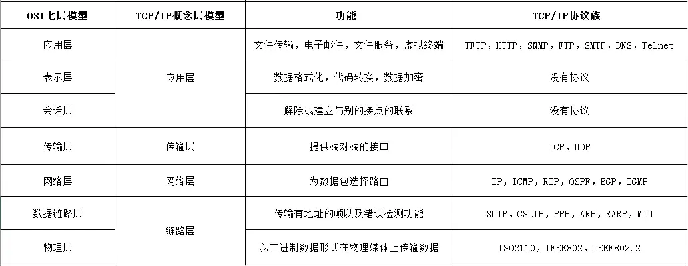

# 计算机基础

- [计算机网络 Internet Technology](#计算机网络)
- [数据库 Database](#数据库-database)
- [操作系统 Operating Systems](#操作系统-operating-systems)

## 计算机网络
参考网站: 
1) https://zhuanlan.zhihu.com/p/147370653
2) https://blog.csdn.net/qq_46101869/article/details/118108697

## OSI (8层)
- **物理层 Physical Layer**
- **数据链路层 Data Link Layer**
- **网络层 Network Layer**
- **传输层 Transport Layer**
- **会话层 Session Layer**
- **表示层 Presentation Layer**
- **应用层 Application Layer**

### 数据链路层 (Data Link Layer)

- 实现相邻（Neighboring）网络实体间的数据传输
- 成帧（Framing）：从物理层的比特流中提取出完整的帧
- 错误检测与纠正：为提供可靠数据通信提供可能
- 物理地址（MAC address）：48位，理论上唯一网络标识，烧录在网卡，不便更改
- 流量控制，避免“淹没”（overwhelming）：当快速的发送端遇上慢速的接收端，接收端缓存溢出
- 共享信道上的访问控制（MAC）：同一个信道，同时传输信号。如同：同一个Wifi热点（AP）连接着多个无线用户（手机），则多个用户同时需要发送数据，如何控制发送顺序？

### 网络层 (Network Layer)

- 将数据包跨越网络从源设备发送到目的设备（host to host）
- 路由（Routing）：在网络中选取从源端到目的端转发路径，常常会根据网络可达性动态选取最佳路径，也可以使用静态路由
- 路由协议：路由器之间交互路由信息所遵循的协议规范，使得单个路由器能够获取网络的可达性等信息
- 服务质量（QoS）控制：处理网络拥塞、负载均衡、准入控制、保障延迟
- 异构网络互联：在异构编址和异构网络中路由寻址和转发

### 传输层 (Transport Layer)

- 将数据从源端口发送到目的端口（进程到进程）
- 网络层定位到一台主机（host），传输层的作用域具体到主机上的某一个进程
- 网络层的控制主要面向运营商，传输层为终端用户提供端到端的数据传输控制
- 两类模式：可靠的传输模式，或不可靠传输模式
  - 可靠传输：可靠的端到端数据传输，适合于对通信质量有要求的应用场景，如文件传输等
  - 不可靠传输：更快捷、更轻量的端到端数据传输，适合于对通信质量要求不高，对通信响应速度要求高的应用场景，如语音对话、视频会议等

### 会话层 (Session Layer)

- 利用传输层提供的服务，在应用程序之间建立和维持会话，并能使会话获得同步

### 表示层（Presentation Layer）

- 关注所传递信息的语法和语义，管理数据的表示方法，传输的数据结构

### 应用层（Application Layer）

- 通过应用层协议，提供应用程序便捷的网络服务调用

## TCP/IP (4层)
- **Datalink Layer 数据链路层:**
    - The datalink layer defines **`how data should be sent`**, handles **`the physical act of sending and receiving data`**, and is responsible for **transmitting data between applications or devices on a network**.
    - MAC address, Error handling
    - Examples: IEEE 802.3 Ethernet, IEEE 802.11 WIFI

- **Internet Layer 网络层:**
    - Responsible for **`sending packets from a network and controlling their movement`** across a network to **`ensure they reach their destination`**.
    - Routing, Load Balance
    - Examples:
      - IP协议（Internet Protocol，因特网互联协议）;
      - ICMP协议（Internet Control Message Protocol，因特网控制报文协议）;
      - ARP协议（Address Resolution Protocol，地址解析协议）;
      - RARP协议（Reverse Address Resolution Protocol，逆地址解析协议）。

- **Transmission Layer 传输层:**
    - Responsible for **p`roviding a solid and reliable data connection`**.
    - Examples: TCP, UDP (User Datagram Protocol)

- **Application Layer 应用层:**
    - The application layer refers to **`programs`** that need TCP/IP to help them communicate with each other. 
    - Examples: HTTP, HTTPS

## IPv4 地址
- IPv4 地址，256:256:256:256，所以总共32个bit，4个字节
- 2^8 (2 to the power of 8) = 256
- 8 bits = 1 Byte
- LAN 局域网 (Local Area Network)

## IPv6 
- 长度为128 bits = 16 bytes
- e.g. 2001:0DA8:0000:0000:200C:0000:0000:00A5

## MAC
设备的唯一ID，MAC地址的获取是通过由ARP（Address Resolution Protocol）协议来实现的。

每个MAC地址都是一个48位的标识符，通常写作六组十六进制数字（例如：8a:3f:80:c9:9a:28）。这些MAC地址是在硬件制造时分配的，目的是确保网络上每个接口都有唯一标识。

### Why Do We Need MAC Addresses?
While it’s true that IP address + Port number can help identify specific services (such as HTTP, FTP) on a host, the MAC address is necessary for local network communication. Here's why:

1. IP Addresses Are Used for Routing (Layer 3)
   - IP addresses work at the Network Layer (Layer 3) of the OSI model. They are used for routing data between different networks, like across the internet or between different subnets in a local network.

   - When a device needs to communicate with another device over long distances (e.g., from one city to another), the IP address is used to determine the path that the data should take.

2. MAC Addresses Are Used for Local Communication (Layer 2)
   - MAC addresses work at the Data Link Layer (Layer 2), which deals with local communication within a network.

   - The MAC address is a unique identifier assigned to each network interface card (NIC). It allows devices to communicate directly with each other over the local link (such as within a LAN).

## Private IP, Public IP
- **私有IP (Private IP)**
    - 私有IP是指在局域网(LAN)内部使用的IP地址
这些地址在RFC 1918中定义，包括:
    - 10.0.0.0 - 10.255.255.255 (10.0.0.0/8)
    - 172.16.0.0 - 172.31.255.255 (172.16.0.0/12)
    - 192.168.0.0 - 192.168.255.255 (192.168.0.0/16)
  - 每个连接到局域网(比如家庭WiFi)的设备都会获得一个唯一的私有IP
这些IP只在局域网内有效，不能直接用于互联网通信

- **公有IP (Public IP)**
    - 公有IP是由互联网服务提供商(ISP)分配的全球唯一的IP地址
    - 用于在全球互联网上识别和定位网络
    - 在家庭或小型办公网络中，通常只有路由器有一个公有IP
    - 多个使用私有IP的设备通过NAT(网络地址转换)共享这一个公有IP

    | 公网IP         | 公网端口 | NAT映射到 | 内部设备IP     | 内部端口 |
    |----------------|----------|-----------|----------------|----------|
    | 203.0.113.5    | 50001    | →         | 192.168.1.10   | 80       |
    | 203.0.113.5    | 50002    | →         | 192.168.1.20   | 80       |

- **NAT (网络地址转换) Network Address Translation**
    - NAT在路由器中实现，维护一个转换表
    - 表中记录了内部私有IP地址、端口和外部连接的对应关系
    - 当数据包离开局域网时，NAT会将源私有IP替换为公有IP，并记录这种映射
    - 当响应返回时，NAT查表将数据正确转发到局域网内的相应设备

## Gateway
### 子网掩码（Subnet Mask）

子网掩码用于划分IP地址的网络部分和主机部分，告诉设备哪些IP地址在同一网段内。
* **格式**：与IP地址相同（如255.255.255.0）
* **作用**：通过将IP地址与子网掩码进行按位AND运算，可以确定网络地址
* **常见表示法**：
   * 255.255.255.0 等同于 /24（表示前24位为网络部分）
   * 255.255.0.0 等同于 /16
   * 255.0.0.0 等同于 /8

### 网段（Network Segment）

网段是IP地址空间中的一个逻辑分区，同一网段内的设备可以直接通信而无需路由器。
* **确定方法**：将IP地址与子网掩码进行按位AND运算得到网络地址
* **例子**：
   * IP地址：192.168.1.100
   * 子网掩码：255.255.255.0（/24）
   * 网络地址：192.168.1.0
   * 该网段范围：192.168.1.0 - 192.168.1.255

### 网关（Gateway）

网关是连接两个不同网络的设备，通常是路由器，负责转发不同网段之间的数据包。
* **默认网关**：当数据包目的地不在本地网段时，设备会将数据包发送到默认网关
* **作用**：相当于城市的出口，是本地网络通往外部网络的"门户"
* **例子**：家庭路由器通常有两个IP地址
   * WAN口IP：由ISP分配，用于连接互联网
   * LAN口IP：通常是192.168.1.1，作为内部设备的默认网关

## Transmission Layer
### TCP and UDP
- TCP (Transmission Control Protocol) provides a `reliable`, `error-checked`, and `connection-oriented communication`.
- UDP (User Datagram Protocol) is `unreliable` (no guarantee of delivery, order, or error correction) but is `faster` and `more efficient` in terms of `latency` and `computational overhead`.

### Three-way Handshake (TCP-Only)
- TCP uses a three-way handshake to `establish a connection` between two devices before data transfer begins.
- The three-way handshake is a process used in TCP/IP networks to establish a reliable connection between two devices (hosts).
- **SYN**: The client sends a SYN (synchronize) packet to the server to request a connection.
- **SYN-ACK**: The server responds with a SYN-ACK (synchronize-acknowledge) packet to acknowledge the request and establish its own connection.
- **ACK**: The client sends an ACK (acknowledge) packet back to the server, confirming the connection.
- **`Main Purpose`**: The main purpose of the three-way handshake is to establish a reliable connection by ensuring that `both client and server are ready to communicate (both sides can send and receive)`.

### Four-way Handshake (TCP-Only)
- TCP uses a four-way handshake to `terminate a connection` between two devices after data transfer ends.
- The four-way handshake ensures that `both sides have finished sending data` and can safely close the connection.
- **FIN (Client → Server)**: The client sends a FIN (finish) packet to the server, indicating it has finished sending data.
- **ACK (Server → Client)**: The server acknowledges the client's FIN with an ACK packet.
- **FIN (Server → Client)**: After the server finishes sending all its data, it sends its own FIN packet to the client.
- **ACK (Client → Server)**: The client acknowledges the server’s FIN with an ACK packet, completing the connection termination.
- **`Main Purpose`**: The main purpose of the four-way handshake is to terminate a TCP connection, ensuring that `both client and server have finished all data transmission and acknowledge each other's termination`.

### Error Control for TCP:
1) Checksum
2) Acknowledgments (ACK)
 - The receiver sends an ACK (acknowledgment) back to the sender when it successfully receives a segment.
 - Each ACK contains `the next expected sequence number` (implying all previous bytes were received correctly).
3) Retransmission
 - If the sender does not receive an ACK for a segment within a certain timeout period (called Retransmission Timeout, RTO), it retransmits that segment.
 - Also, if the sender receives duplicate ACKs (e.g., 3 duplicate ACKs for the same sequence number), it can trigger fast retransmission without waiting for timeout.
4) Sliding Windows 
 - To maximize the efficiency and time for transmission of the data.
 - TCP uses a sliding window mechanism to avoid overwhelming the receiver.
 - The receiver tells the sender how much data it can accept (window size).
 - If too many packets are lost or delayed, TCP shrinks the window to slow down transmission.

## 数据库 Database

### CAP (Consistency, Availability, Partition Tolerance)
- C: All nodes see the same data at the same time.

### Data Structures
- **B+Tree**: Binary Search (More **Compact,** rather than **heavy**)
- Each node contain more data than single Normal B Tree.

### Transaction
**Transaction** is a unit of work (Transaction Logic) in a database. (Updating, Adding data)

### ACID (Atomicity, Consistency, Isolation, Durability)
- **Consistency**: Consistent when it is started and ended.
- Any Data written to the database must be valid according to all the **defined rules**.

### Transaction Types
- **Flat Transaction**: 每个事务都是独⽴的，并具有明确的开始和结束。在扁平事务中，对不同服务器上的数据操作是依次进⾏的，即每个操作完成后才开始下⼀个操作。这种模型确保如果事务的⼀部分失败了，整个事务可以被终⽌，从⽽保持数据库的完整性和⼀致性。 
- **Nested Transaction** (Father - Children): Roll-back depends on the father.
- **Wormhole**: Loop Transaction

### Locks and Deadlocks
- **Deadlock**: XLOCK A is held by T1, XLOCK B is held by T2. They both wait for the XLOCK that the other one held.
- Intention Lock can prevent this.
- **Dekker算法**主要通过使⽤两个标志（通常是布尔变量）和⼀个表示轮到哪个进程进⼊临界区的变量来⼯作。每个进程在尝试进⼊临界区之前，⾸先设置其标志为真（表示它想进⼊临界区），然后检查另⼀个进程的标志

### Lock Types
- **Shared Lock**: i.e. Read Lock, allow read at the same time.
- **Intention Lock**: Intent to have (Between exclusive and shared, avoid deadlock)

### Isolation Issues
- **Phantom Read**: 当一个事务在同一查询中，两次读取返回不同的行集合。**读到了其他事务，未提交的数据。** 原因：其他事务在两次读取之间插入了新行
- **Unrepeatable Read**: 由于其他事务在这期间修改了该数据并提交，导致同一事务内的多次读取返回不同的结果。**读到了其他事务，已经提交的数据**

### Isolation Levels
- **Degree 1: 读未提交（Read Uncommitted）**：可能出现脏读、不可重复读和幻读
- **Degree 2: 读已提交（Read Committed）**：防止脏读，但可能出现不可重复读和幻读
- **Degree 3: 可重复读（Repeatable Read）**：防止脏读和不可重复读，但可能出现幻读
- **可串行化（Serializable）**：防止所有这些问题，但并发性能最低

### Locking Protocols
- **Two-phase Locking**: 在标准的两阶段锁定（**2PL**）协议中，事务分为两个阶段：
  - **扩展阶段（Growing Phase）**：事务开始时，可以获取新的锁，但不释放任何锁。
  - **缩减阶段（Shrinking Phase）**：⼀旦事务获取了所有必需的锁，就进⼊缩减阶段，在此阶段事务可以开始释放锁，但不再获取新的锁。
- **Strict Two-phase Locking**: 没Shrinking Phase
- **Two-version Locking**

## 操作系统 Operating Systems
