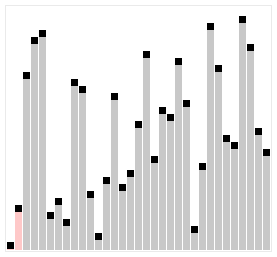
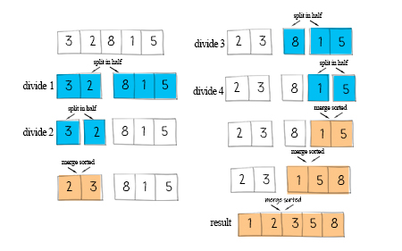
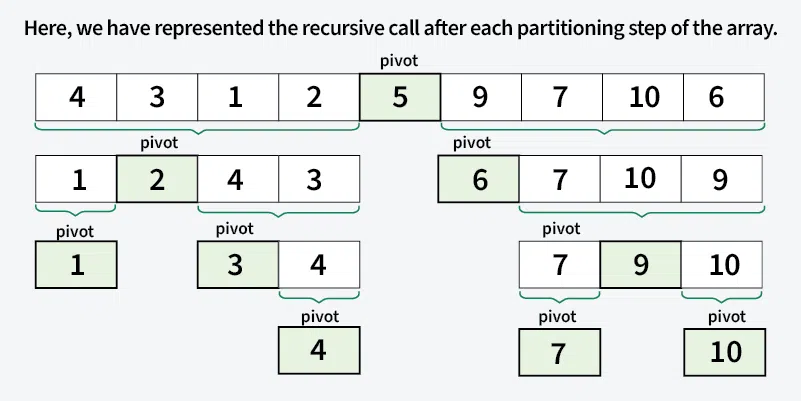

# Algorithms

## Sorting Algorithms

| Sorting Algorithm | Average Time Complexity | Best Case  | Worst Case | Space Complexity | Sorting Type | Stability |
|-------------------|-------------------------|------------|------------|------------------|--------------|-----------|
| Bubble Sort       | O(n²)                   | O(n)       | O(n²)      | O(1)             | In-place     | Stable    |
| Selection Sort    | O(n²)                   | O(n²)      | O(n²)      | O(1)             | In-place     | Unstable  |
| Insertion Sort    | O(n²)                   | O(n)       | O(n²)      | O(1)             | In-place     | Stable    |
| Shell Sort        | O(n^1.3)                | O(n)       | O(n²)      | O(1)             | In-place     | Unstable  |
| Merge Sort        | O(n log n)              | O(n log n) | O(n log n) | O(n)             | External     | Stable    |
| Quick Sort        | O(n log n)              | O(n log n) | O(n²)      | O(log n)         | In-place     | Unstable  |
| Heap Sort         | O(n log n)              | O(n log n) | O(n log n) | O(1)             | In-place     | Unstable  |
| Counting Sort     | O(n + k)                | O(n + k)   | O(n + k)   | O(k)             | External     | Stable    |
| Bucket Sort       | O(n + k)                | O(n + k)   | O(n²)      | O(n + k)         | External     | Stable    |
| Radix Sort        | O(n * k)                | O(n * k)   | O(n * k)   | O(n + k)         | In-place     | Stable    |


### Bubble Sort
- Bubble Sort is an algorithm that sorts an array from the lowest value to the highest value.

    
    ```python
    def bubble_sort(num_list):
        for a in range(len(num_list) - 1):
            # Putting the biggest number up front
            for b in range(len(num_list) - a - 1):
                if num_list[b] > num_list[b+1]:
                    num_list[b], num_list[b+1] = num_list[b+1], num_list[b]
        return num_list
    ```


### Selection Sort
- The Selection Sort algorithm finds the lowest value in an array and moves it to the front of the array.

    
    ```python
    def selection_sort(num_list):
        for a in range(len(num_list) - 1):
            min_num = num_list[a]
            idx = a
            # Find the smallest
            for b in range(a + 1, len(num_list)):
                if num_list[b] < min_num:
                    min_num = num_list[b]
                    idx = b
            # Sort them up front
            num_list[a], num_list[idx] = num_list[idx], num_list[a]
        return num_list
    ```

### Insertion Sort
- The Insertion Sort algorithm uses one part of the array to hold the sorted values, and the other part of the array to hold values that are not sorted yet.

    
    ```python
    def insertion_sort(num_list):
        for a in range(1, len(num_list)):
            for b in range(a, 0, -1):
                if num_list[b] < num_list[b-1]:
                    num_list[b], num_list[b-1] = num_list[b-1], num_list[b]
                else:
                    break
        return num_list
    ```

### Merge Sort
- Divide and Conquer
- **Step 1: Divide Phase** - Break down the problem into the smallest possible subproblems
- **Step 2: Conquer Phase** - Use the **Two-Pointer Method** or **Two-Way Merge Algorithm**
  - Input: Two already sorted subarrays
  - Output: A single sorted array that combines both subarrays
  - Algorithm concept:
    - Use two pointers that point to the beginning of each subarray
    - Compare the elements at both pointers, add the smaller element to the result array, and move the corresponding pointer forward
    - If all elements from one subarray have been processed, directly append the remaining elements from the other subarray to the result
- **Step 3: Combine** - Recursively return to Step 1


```python
def merge_sort(num_list):
    def conquer(num_list1, num_list2):
        left = 0
        right = 0
        num_list = []
        while left < len(num_list1) and right < len(num_list2):
            if num_list1[left] <= num_list2[right]:
                num_list.append(num_list1[left])
                left += 1
            else:
                num_list.append(num_list2[right])
                right += 1
        if left < len(num_list1):
            num_list += num_list1[left:]
        if right < len(num_list2):
            num_list += num_list2[right:]
        return num_list
    
    def divide(num_list):
        if len(num_list) == 1:
            return num_list
        else:
            return conquer(divide(num_list[:len(num_list)//2]), divide(num_list[len(num_list)//2: len(num_list)]))
    
    return divide(num_list)
```

## Quick Sort


- Divide and Conquer
``` python
def quick_sort(num_list):
    if len(num_list) == 0:
        return []
    pivot_num = num_list[len(num_list)//2]
    larger = []
    smaller = []
    pivot = []
    for num in num_list:
        if num > pivot_num:
            larger.append(num)
        elif num < pivot_num:
            smaller.append(num)
        else:
            pivot.append(num)
    return quick_sort(smaller) + pivot + quick_sort(larger)
```

## Stack
- **Last In, First Out (LIFO)**
    ```python
    # Last In, First Out (LIFO) 
    stack = []

    # Push elements onto the stack
    stack.append(1)
    stack.append(2)
    stack.append(3)

    print("Stack after pushes:", stack)

    # Pop elements from the stack
    top = stack.pop()
    print("Popped element:", top)
    print("Stack after pop:", stack)

    class Stack:
        def __init__(self):
            self.items = []

        def push(self, item):
            self.items.append(item)

        def pop(self):
            if not self.is_empty():
                return self.items.pop()
            raise IndexError("Pop from an empty stack")

        def peek(self):
            if not self.is_empty():
                return self.items[-1]
            raise IndexError("Peek from an empty stack")

        def is_empty(self):
            return len(self.items) == 0

        def size(self):
            return len(self.items)

    # Example usage
    stack = Stack()
    stack.push(1)
    stack.push(2)
    stack.push(3)

    print("Top element:", stack.peek())
    print("Stack size:", stack.size())

    stack.pop()
    print("Stack after pop:", stack.items)

    ```

## Queue
-  **First In, First Out (FIFO)**
    ```python
    queue = []

    # Enqueue elements
    queue.append(1)
    queue.append(2)
    queue.append(3)

    print("Queue after enqueues:", queue)

    # Dequeue elements
    front = queue.pop(0)
    print("Dequeued element:", front)
    print("Queue after dequeue:", queue)

    class Queue:
        def __init__(self):
            self.items = []

        def enqueue(self, item):
            self.items.append(item)

        def dequeue(self):
            if not self.is_empty():
                return self.items.pop(0)
            raise IndexError("Dequeue from an empty queue")

        def peek(self):
            if not self.is_empty():
                return self.items[0]
            raise IndexError("Peek from an empty queue")

        def is_empty(self):
            return len(self.items) == 0

        def size(self):
            return len(self.items)

    # Example usage
    queue = Queue()
    queue.enqueue(1)
    queue.enqueue(2)
    queue.enqueue(3)

    print("Front element:", queue.peek())
    print("Queue size:", queue.size())

    queue.dequeue()
    print("Queue after dequeue:", queue.items)

    ```


## Is Subsequence

Given two strings s and t, return true if s is a subsequence of t, or false otherwise.

A subsequence of a string is a new string that is formed from the original string by deleting some (can be none) of the characters without disturbing the relative positions of the remaining characters. (i.e., "ace" is a subsequence of "abcde" while "aec" is not).


Example 1:

Input: s = "abc", t = "ahbgdc"
Output: true
Example 2:

Input: s = "axc", t = "ahbgdc"
Output: false


## Is Subsequence
This is essentially a counting problem between two substrings
- Time complexity: O(m+n)
- Uses Python's `dict.get(i,1)` method
```python
# If the key exists, increment by 1; if it doesn't exist, start with 0 + 1
dict[i] = dict.get(i,0) + 1
```

## Double Pointers
https://zhuanlan.zhihu.com/p/657981698

## Hash
- key -> index 
   - index = hash_value % table_size (modulo operation, giving the remainder)
   - Hash table size range [0, table_size-1]


## Simulated Annealing
- Based on the hill-climbing algorithm, which can only find the optimal solution if the function is convex; otherwise, it may get stuck in a local optimum.
- Simulated annealing, however, has a certain probability of escaping the current optimum to explore other solutions, thus avoiding local optima. This probability gradually decreases until it reaches zero after multiple iterations.
