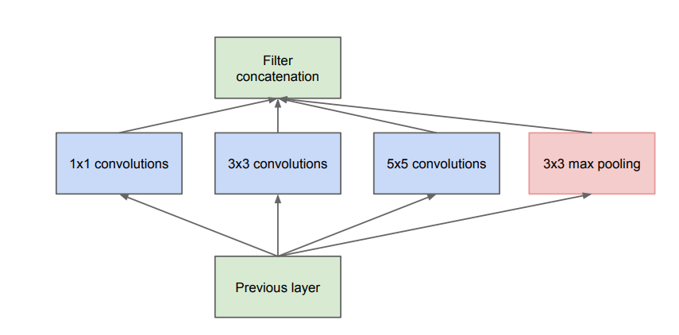

# Computer Vision (CV)
- Most references come from COMP90086 Natural Language Processing(University of Melbourne)
- Some come from Hugging face computer vision course:
https://huggingface.co/learn/computer-vision-course/unit0/welcome/welcome (Not Recomended)
- Others come from Zhihu, CSDN, and other blogs, as well as papers.

## Image Basic
- **Image Formation**
    1) World parameters
        - Light source
        - Surface properties 
    2) Camera parameters
        - Focal length / Angle of view
        - Aperture size / Depth of field
        - Lens distortion
- **Digital Image**
    - Pixel = smallest unit of an image
    -  A tensor (3D dimensional array of values)
        - Width x height x channel
        - 3 channels = RGB colour image (red, green, blue)
        - 1 channel = grayscale image
- **Image Manipulation**
    1) Crop = extract a subset of the image array (doesn’t
require resampling)
    2) Resize = change the dimensions of the image array
(**`requires resampling`**)
- **Resamling Methods**
    1) Nearest-neighbour: closest value to sample point
        - Simple, preserves hard edges
        - Smooth curves may be blocky/distorted 
    2) Bilinear: weighted average of 4 pixels around sample point
        - moother curves, but blurs hard edges
        - Slower to comput

    

## Filter
- **Pixel Operator** computes an output value at each pixel location, based on the **`input pixel value`**
  $$
  g(i, j) = h(f(i, j))
  $$
    - Output of image $g(i, j)$
    - Input of image $f(i, j)$
- **Local Operator** computes an output value at each
pixel location, based on a **`neighbourhood of pixels`**
around the input pixel 
- **Cross-correlation Convolution**
    $$
    g(i, j) = h(u, v) \otimes f(i, j)
    $$

    $$
    g(i, j) = \sum_{u, v} f(i + u, j + v) h(u, v)
    $$
- **Convolution**
    $$
    g(i, j) = h(u, v) * f(i, j)
    $$
    $$
    g(i, j) = \sum_{u, v} f(i - u, j - v) h(u, v)
    $$
    

### Commmon Filters
1. **No change Filter**
    $$
    \begin{bmatrix}
    0 & 0 & 0 \\
    0 & 1 & 0 \\
    0 & 0 & 0
    \end{bmatrix}
    $$
2. **Shift Left by 1 pixel**
    $$
    \begin{bmatrix}
    0 & 0 & 0 \\
    0 & 0 & 1 \\
    0 & 0 & 0
    \end{bmatrix}
    $$
3. **Sharpen**
    $$
    \begin{bmatrix}
    0 & 0 & 0 \\
    0 & 2 & 0 \\
    0 & 0 & 0
    \end{bmatrix}
    -
    \frac{1}{9}
    \begin{bmatrix}
    1 & 1 & 1 \\
    1 & 1 & 1 \\
    1 & 1 & 1
    \end{bmatrix}
    $$
4. **Sobael Filter**
    - Derivative Filter
    - Edge Detection
    1) **Gx**
        $$
        \begin{bmatrix}
        1 & 0 & -1 \\
        2 & 0 & -2 \\
        1 & 0 & -1
        \end{bmatrix}
        $$
        
    2. **Gy**
        $$
        \begin{bmatrix}
        1 & 2 & 1 \\
        0 & 0 & 0 \\
        -1 & -2 & -1
        \end{bmatrix}
        $$
        

5. **Blur Filters**
    - Reduce noise and details
    - **Average Filter**
    $$
    K = \frac{1}{9} 
    \begin{bmatrix}
    1 & 1 & 1 \\
    1 & 1 & 1 \\
    1 & 1 & 1
    \end{bmatrix}
    $$

    - **Guassian Filter**
        - With the highest value in the middle, and lowest in the margin.
            $$
            G_\sigma = \frac{1}{2\pi\sigma^2} e^{-\frac{x^2 + y^2}{2\sigma^2}}
            $$
            

### Border Handling
1) Pad with constant value
2) Wrap Image
3) Clamp / replicate the border value
4) Reflect Image

### Canny Edge Detection
- Defines edges based on image gradient 
- Post-processing of gradient to better localise edges
(non-maximum suppression) and preserve
faint/broken edges (thresholding with hysteresis)

1) **Step 1: Gaussian Smoothing**
    - Reduce noise
2) **Step 2: Gradient Calculation (Using Sobel Filter)**

    
3) **Step 3: Non-Maximum Suppression**
    - If nearby pixels claim to be part of the same edge, only keep the one with maximum gradient
4) **Step 4: Double Thresholding**
    - **Strong edges**: Pixels with gradient magnitudes greater than the high threshold are directly preserved as strong edges.
    - **Weak edges**: Pixels with gradient magnitudes between the high and low thresholds are marked as potential edges (candidates).
    - **Suppressed edges**: Pixels with gradient magnitudes below the low threshold are suppressed and considered non-edges.
5) **Step 5: Edge Tracking by Hysteresis**
    - Connect the Strong edges to the Weak edges
    - Start from the **strong edges** and trace their connectivity to the weak edge candidates.
    - Only weak edges that are connected to strong edges are retained.
6) **Final Result**: The process results in a **clean, continuous, and `strong` edge** map with closed and well-defined edges.

## Image Recognition
- Image recognition as **`category-level`** recognition of the **`whole image`**.
- **Category-level (Group Level) v.s. Instance-level**
- **Whole image**
    - Different from detection = locate object in image
    - Different from segmentation = label individual pixels
- **Examples**
    - Recognize Animal Group (Bird, Duck)
    - Recognize Duck Group (Australian wood duck...)
- **Challenges**
    - Inter-category similarity
    - Illuminatino
    - Scale
    - Viewpoint/pose
    - Background/occlusion
- **Goal**
    - Distingushes different categories
    - but invariant (or tolerant) to variantion within a category
- **ImageNet**
    - Class images collected online, manually cleaned by
    human annotator
- **History**
    - Pre-2010
        - Hand-crafted features
    - Post-2010
        - Deep-learned features

## Corner Detection
- **Harris Corner Detection**

    
    1) **Invariant** to translation, rotation, and changes in lighting.
    2) **Not invariant** to scale

## Convolutional Nuural Network

1) **Convolutional Layer**
    - Each convolutional layer learns a set of **`kernels`** and outputs activation maps (= input convolved with learned kernel)

    - A **kernel**, which is a matrix overlaid on the image and computes an element-wise product with the image pixels.
    - A **stride** which defines how many positions in the image to advance the kernel on each iteration 
        - stride = 1 (means the kernel will operate on every pixel of the image)
    
    - **Its Output**

        

    - **Width and Height**
    1) Without considering stride and padding:

    $$
    \text{Output Width} = \text{Input Width} - \text{Filter Width} + 1
    $$

    2) Considering stride and padding:

    $$
    \text{Output Width} = \frac{\text{Input Width} - \text{Filter Width} + 2 \times \text{Padding}}{\text{Stride}} + 1
    $$

    - **Channels**
        - The `channels` of a convolutional layer are equals to `the number of kernels` in this layer.
        - `The result of each channel` in the output layer is **`the sum` of the convolution results from each channel of the input layer**.
        - Assume the input layer is `24×24×3`, and the convolution kernel is `5×5×3` with `6 convolution kernels` (channels) in total.
            1) Each convolution kernel has a size of 5×5×3, and it convolves with the 3 channels (R, G, B) of the input layer separately. 
            2) Each convolution produces a 2D matrix (e.g., 20×20).
            3) The convolution results from the 3 channels are then **`summed up`** to produce a 2D output for each convolution kernel.
            4) Finally, there are 6 convolution kernels, each generating one 2D matrix, resulting in a final output size of `20×20×6`.

    - **Stride**
        - The number of pixels skipped when the kernel moves during the convolution operation.
        - A method of downsampling - See below **Pooling**

    - **What are convoluational layers doing?**
        - Convolutional layers are designed to **extract and learn features** from input data, such as edges, lines, corners, textures, relative locations, and more complex patterns as the network goes deeper.
        - **`Receptive Field`**
            - The receptive field refers to the size of the region in the input image that corresponds to a single neuron in a specific layer. 
            - The size of the receptive field determines **`how much of the input image the neuron can "see" or capture information from`**.
        - The **`lower convoluational layers`** extract some **`simple, low-level`** features
            - Examples: edges, lines, corners, basic shapes, and simple color patterns.
        - The **`higher convoluational layers`** extract more **`complex, high-level`** features.
            - Examples: textures, object parts (like eyes or wheels), and eventually the whole object or even the context of the scene.

        
    - **Advantages**
        - Efficient – learns to recognize the same features anywhere in the image, with fewer parameters compared to fully-connected layer
        - Preserves spatial relations – output is an image with values indicating where features are present
    - **Disadvantages**
        -  Limited kernel size means model is limited to learning local features

2) **Pooling**
    - **Pooling** is one of the methods of **Downsampling**.
    - **Purposes of Pooling**
        - Reduces output size and number of computations needed in later layers. **(Reduce/Control the size of output)**
        - Also improve tolerance to translation – small changes in input won’t change downsampled output.

    - **Max Pooling**
        - The most usual kind of pooling method.
        - Within a given window in the activation map, **`take the highest value` and discard the rest**

        

    - **Average Pooling**
        - Outputs the average of a window
        - Average pooling **blurs over** features; important features may be lost
        - Max pooling is most likely to preserve the most important features.
    
    - **Strided Convolution**
        - One of the methods of downsampling.
        - The convolution layer with stride is also a kind of pooling.
        - Not as good as max pooling to keep the important features.

3) **Fully Connected Layer**
    - Further reduce the size of the ouput.
    - Regularzation
        - To reduce overfitting
        - L1 or L2 regularzation, Dropout, Early Stopping

4) **Output**
    - Softmax, Sigmoid, ReLu, or other actication functions.

## Data Augmentation
- Data augmentation is a technique used to artificially **`expand the size and diversity of a dataset`**, **`Improving Robustness to Noise and Variations`**, and **`Improving Model Generalization`** by applying transformations to the existing data. Its main purposes include:
- `Common options:`
    - Random crops (e.g., 224 x 224 from 256 x 256 images)
    - Horizontal reflection
    - Small colour/contrast adjustments (to simulate different camera settings or times of day)
- `Less common:`
    - Random rotation (e.g., +/- 15 degrees)
    - Random scale
    - Random occluders

## AlexNet

- **AlexNet innvoations**
    - `ReLU` (Rectified Linear Unit) activation function
        - Faster training 
    - `Training on GPU`
        - Parallelisation allows faster
    training (actually required 2 GPUs at the time!) 
    - `Overlapping max pooling regions`, response
    normalisation after ReLU 
        - Small accuracy increase 
    - `Data augmentation `
        - Reduces overfitting 
    - `Dropout`
        - Reduces overfitting

## VGG

- **VGG innovations**
    - A Deeper Network
    - **Stacked Convolutional Layers**
        - Using smaller kernels (smaller width and height) to achieve a larger receptive field with fewer parameters (smaller model size).
        - For the same input size and the same stride (stride=1), stacking two 3×3 convolutional kernels and using a single 5×5 convolutional kernel will produce the same output size.
        - Smaller in size. (2 x 3 x 3 = 18 parameters, 5 x 5 = 25 parameters.)
        - VGG stacks multiple 3 x 3 convolutional kernels to effectively make larger kernels:
            - Two 3 x 3 conv. layers = effective receptive field of 5 x 5 
            - Three 3 x 3 conv. layers = effective receptive field of 7 x 7

## GoogLeNet/Inception

- Extracts more features in more scales with different kernels.
- The Inception block is a module designed to efficiently **`extract features at multiple scales and levels of abstraction`**.
- The width and depth of the outputs with differnt kernels remain the the same by padding and pooling - then concatenate those outputs into one.
- 1x1 convolutions with smaller channels can conduct `dimensionality reduction` comparing the input size.
    - For example:
        - Feature map: $H \times W \times 256$
        - $1 \times 1$ convolution with $64$ filters (channels).
        - Ouput map: $H \times W \times 64$

## ResNet
- Add “shortcut connections” that skip
some layers
- To avoid `model degrdation`

    As networks become deeper (e.g., exceeding dozens of layers), the performance of the model does not always improve with increased depth. 

    On the contrary, deep networks may encounter issues during training, such as `gradient vanishing/exploding or degradation` problems:

    - **Gradient Vanishing**: Gradients gradually diminish during backpropagation, causing the earlier layers to update very little or not at all.
    - **Degradation Problem**: Even without gradient issues, adding more layers may lead to higher training and testing errors (the network fails to optimize properly).

    This degradation problem is `not caused by overfitting` but by the increased difficulty in optimizing deeper networks.

## MobileNets

- **Sacrifice some performance and reduce the amount of computation and the number of parameters.**
- Using **`pointwide and depthwise separable convolution`**ß to achieve fewer parameters.

### Parameter Calculation for Standard Convolution
Assume the input feature map has dimensions $ H \times W $ (height × width), with $ C_{\text{in}} $ input channels, 
a kernel size of $ k \times k $, and $ C_{\text{out}} $ output channels.

The parameter count for standard convolution is calculated as:

$$
\text{Number of parameters} = k \cdot k \cdot C_{\text{in}} \cdot C_{\text{out}}
$$

---

### Parameter Calculation for Depthwise Separable Convolution
Depthwise Separable Convolution consists of two steps:

1. **Depthwise Convolution**:
   - Performs a $ k \times k $ convolution independently for each input channel.
   - Parameter count:
     $$
     \text{Number of parameters} = k \cdot k \cdot C_{\text{in}}
     $$

2. **Pointwise Convolution**:
   - Uses a $ 1 \times 1 $ convolution to map the $ C_{\text{in}} $ input channels to $ C_{\text{out}} $ output channels.
   - Parameter count:
     $$
     \text{Number of parameters} = C_{\text{in}} \cdot C_{\text{out}}
     $$

### Total Parameter Count for Depthwise Separable Convolution
The total parameter count is the sum of the parameters for both steps:

$$
\text{Number of parameters} = k \cdot k \cdot C_{\text{in}} + C_{\text{in}} \cdot C_{\text{out}}
$$

## Vision Transformer (ViT)

- See `Transformer` in [Machine Learning Fundamentals](Machine%20Learning.md) or [Natural Language Processing](NLP.md)
- **Linear Projection of Flattened Patches**
    - **`transform three dimension image (width, height, channels) into two dimension (flatten, channels)`**
    - Use a `convolutional layer` to achieve this.
    - **Step1:** For example, we have a picture of [224, 224, 3] applying a convolutional kernel with size 16 x 16 and stride 16, and we can have an output of [14, 14, 768].
    - **Step2:** Flatten the [14, 14, 768] into [14 x 14, 768] = [196, 768].
    - **Step3:** Add a [class] token into the front ([0,*]) in the image, and finally with a shape of [196 + 1, 768] = [197, 768]
    - **Step4:** Positional Embedding (Similar to normal Transformer)
- Others remains similar compared to normal Transformer. 

## Image Segmentation

**Image Segmentation** is a fundamental task in computer vision that involves dividing an image into distinct parts or regions. Each region corresponds to a particular object, structure, or feature in the image. 
### Pixel Clustering
- K-means
    - Need to choose K
- Gaussian Mixture Model
    - Need to choose K
- Mean Shift
    - Kernel Density Estimation (KDE)
        - Common Kernel: Gaussian
    - Need to choose bandwidth (width)

### Superpixels
- **Oversegmentation** methods segment image into
regions that are smaller than objects

### U-Net

## Object Detection
**Object Detection** is a computer vision task that involves **identifying** and **locating** objects within an image or a video. 

### Sliding Window Approach
- **Applies image classfication model into sliding windows.**
- **Free parameters:**
    - Stride
    - Scale (size of window)
    - Shape (aspect ratio) 
- **Problems:**
    - Very large number of possible windows (slow, increases
probability of false detections)
    - Overall evaluation of images with multiple targets can
be complicated (multiple targets, multiple detection
windows, different IoUs)

### R-CNN

- R-CNN = Region-based Convolutional Neural Network
- **Two separate things:**
    1) One algorithm for finding ROI
    2) The other algorithm for image classification, and the prediction of bounding box transform.
- R-CNN uses Selective Search to generate ROI (regions of interest)
- **Step 1:** Oversegment image into superpixels
- **Step 2:** Iteratively combine adjacent superpixels based on similarity in colour + texture, size, and compactness (Createa ROI)
- **Step 3:** Image Classification based on ROI.
- **Advantages**
    - Much more efficient than classifying every window 
- **Disadvantages**
    - Still requires classifying many windows (e.g., 2000)
    - Region proposal step could miss some objects

### Fast R-CNN

- **Still two separate things:**
    1) One algorithm for finding ROI
    2) The other algorithm for image classification, and the prediction of bounding box transform.
- **Differences with R-CNN**
    - **`Run whole image through Convnet`** (Not image classifcation per ROI but image classification per image)
    - Put the ROI in the middle of ConvNet, and run the same ConvNet for each ROI.

- **Advantages:**
    - Faster than R-CNN (~9x faster training, ~140x faster test) 
    - Slightly more accurate than R-CNN
- **Disadvantage:**
    - ROIs aren’t learned; region proposal step could miss
some object

### Faster R-CNN

- **Major change:** network learns region proposals,
instead of using Selective Search.
- ROI is learned form a reigion proposal network.
- ROI and Image Classfication still shared part of the networks.

### YOLO

- 5 parameters: (x,y) coordinates, (width, height) bbox, classification probability.
- n Bounding Box System: v1 choose 2. (So 2 x 5 = 10 parameters in total.)
    - Some bounding box system may have a larger width and height;
    - Some may have a smaller width and height.
- Main idea: instead of going through multiple steps
(region proposals, region classification), just predict
a heatmap for each class directly in **`one CNN`**.

## Generative Adversarial Networks (GANs)
### Autoencoder

### VAE