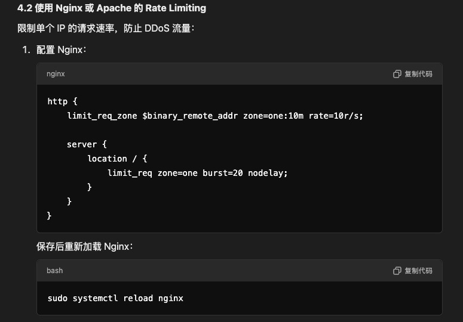

# Full-Stack Enginnering

## Frontend

### npm
```bash
# Install all dependencies from package.json
npm i
# The two commands below are equivalent
npm install

# Install React Router
npm install react-router-dom

# Install Material UI
npm install @mui/material @mui/icons-material @emotion/react @emotion/styled
```

### 1) Vue
```bash
# Crate
vue create <filename>
# run
npm run serve
# Compile
npm rum build
```

### 2) React
```bash
# Recommend: vit 
npm create vite@latest my-react-app
# npm install 
cd my-react-app
npm install

# Create app
npx create-react-app <my-app>
# Run
npm run dev
# Compile
npm rum build
```

## Backend

### 1) Node.js
``` JavaScript
// Init
npm init -y
// Install Express
npm install express
```

### 2) Django
https://blog.csdn.net/Ans_min/article/details/123146335

- #### **Migrate Database**
    ```bash

    python manage.py dbshell
    DROP TABLE blogs;
    .exit

    python manage.py makemigrations blogs
    python manage.py migrate blogs

    To delete all the contents of the folder "blogs/migrations/"
    python manage.py migrate --fake blogs zero
    python manage.py migrate blogs

    ```

- #### **Build Project**
    ``` bash
    django-admin startproject <myproject_name>
    cd myproject
    python manage.py startapp <myapp_name>
    ```
- #### **Build App**
    ``` bash
    Step 1:
    python manage.py startapp <app_name>

    Step 2:
    Register <app_name>/apps.py's config in the main settings.py.
    For example, in rfp_llm/apps.py, if it contains RfpLlmConfig, then add "rfp_llm.apps.RfpLlmConfig" to the INSTALL_APPS in the main settings.py.

    ```

- #### **Build API**
    ``` bash
    register views functions in urls.py
    ```

- #### **Run**
    ``` bash
    python manage.py runserver
    ```

- #### **Layout**
    ```bash
    django_study_demo
    │─ manage.py            【Project management script, do not modify, e.g., start, create app, database management, etc.】
    └─ django_study_demo    【Folder with the same name as the project】
        │─ asgi.py           【Receives network requests along with wsgi.py】【Do not modify】【Django for async requests】
        │─ settings.py       【Project configuration file, e.g., database connection information, registering apps, etc.】【Commonly modified】
        │─ urls.py           【Mapping of all URLs to functions】【Commonly modified】
        │─ wsgi.py           【Receives network requests along with asgi.py】【Do not modify】【Django for sync requests】
        │─ __init__.py
    ```

- #### Database's create, read, update, and delete (CRUD) 

    In Django, you can simplify SQL queries and easily manipulate data in database tables by working with objects. Here are basic examples for creating, deleting, updating, and querying data:

    - `Add Data`
        - Syntax: `ClassName.objects.create()`
        ```python
        # Insert data into the index_studentinfo table
        StudentInfo.objects.create(title="zm")
        # Insert data into the index_userinfo table
        UserInfo.objects.create(name="gzh", password="123", age=18)
        ```

    - `Delete Data`
        - Syntax 1: `ClassName.objects.filter().delete()` — Filter data first, then delete
        - Syntax 2: `ClassName.objects.all().delete()` — Delete all data in the table
        ```python
        # Delete data with id 2 from the UserInfo table
        UserInfo.objects.filter(id=2).delete()
        # Delete all data from the StudentInfo table
        StudentInfo.objects.all().delete()
        ```

    - `Update Data`
        - Syntax 1: `ClassName.objects.all().update()` — Update all data
        - Syntax 2: `ClassName.objects.filter().update()` — Filter data first, then update
        ```python
        # Update the password of all records in the UserInfo table to "123"
        UserInfo.objects.all().update(password="123")
        # Update the password of the record with id 2 in the UserInfo table to "1"
        UserInfo.objects.filter(id=2).update(password="1")
        ```

    - `Query Data`
        - Syntax 1: `ClassName.objects.all()` — Query all data in the table
        - Syntax 2: `ClassName.objects.filter()` — Filter specific data
        - The returned data is of type QuerySet, which can be understood as a list, but each element is an object.
            ```python
            # Query all data from the UserInfo table
            all_data = UserInfo.objects.all()
            for obj in all_data:
                print(obj.id, obj.name, obj.password, obj.age)

            # Query data with id 1 from the UserInfo table
            # The result is a QuerySet list, and you can use first() to get the first single element
            data = UserInfo.objects.filter(id=1).first()
            print(data.id, data.name, data.password, data.age)
            ```


- #### Cross-Origin Resource Sharing (CORS)
    - Step 1 
        - `pip install django-cors-headers`
    - Step 2: Configure in settings.py
        ```python
        # settings.py

        # Add 'corsheaders' to installed apps
        INSTALLED_APPS = [
            ...,
            'corsheaders',
            ...,
        ]

        # Add 'corsheaders.middleware.CorsMiddleware' to the top of middleware
        MIDDLEWARE = [
            'corsheaders.middleware.CorsMiddleware',  # Place it at the top of middleware
            ...,
        ]

        # Set allowed cross-origin sources
        CORS_ALLOW_ALL_ORIGINS = True  # Allow all origins to access
        # Alternatively, specify allowed origins
        # CORS_ALLOWED_ORIGINS = [
        #     "http://localhost:8080",  # Your frontend application URL
        # ]
        ```

- #### Database
    ```python
    from django.db import models

    class User(models.Model):
        username = models.CharField(max_length=150, unique=True)  # Username, unique
        password = models.CharField(max_length=128)  # Password
        email = models.EmailField(unique=True)  # Email, unique

        def __str__(self):
            return self.username
    ```

    ```bash
    # Generate migration files
    python manage.py makemigrations

    # Apply migration to the database
    python manage.py migrate
    ```

    ```python
    # Add data to the database
    user = User.objects.create(username=username, password=password, email=email)
    ```


### 3) .Net

- #### Create and Run
    ```bash
    # Create a project
    dotnet new web -n <MyApp Name>
    dotnet new console -o <MyApp Name>

    # Run .Net application
    cd <MyApp Name>
    dotnet run
    ```
- ### Dependency Injection
| Lifetime    | Instance Creation        | Scope               | Best For                                 |
|-------------|--------------------------|---------------------|------------------------------------------|
| Singleton   | Once per application     | Entire application  | Stateless, shared resources, caching     |
| Scoped      | Once per HTTP request    | Current HTTP request| Per-request state, DbContext             |
| Transient   | Every time requested     | Only when used      | Lightweight, stateless services          |
| Hosted      | Once at application start| Runs independently  | Background processing                    |

### 4) Node.js
[https://blog.csdn.net/m0_67844671/article/details/133278228](https://blog.csdn.net/m0_67844671/article/details/133278228)

- #### Initialize
    ```bash
    # Initialize the project -y option creates a package.json file with default configuration
    npm init -y 

    # Create index.js file
    touch index.js

    # Install express
    npm install express
    ```

- #### Run
    ```bash
    node index.js
    node <.js>
    ```

## Nginx
https://blog.csdn.net/weixin_50003028/article/details/132567183

## MongoDB
```bash
# macOS Installation
brew tap mongodb/brew
brew install mongodb-community@8.0
# Start MongoDB
brew services start mongodb/brew/mongodb-community
```

## Delpoyment
```bash
Amazon Linux: yum
Ubuntu: apt
# Security Group SSH22 Server Port
    Type: Custom SSH
    Protocol: TCP
    Port Range: 22
    Source: 0.0.0.0/0

# Update
sudo apt update

# Install pkexec (for backup)
sudo apt install pkexec

# Install git
sudo apt install git -y

# Install git package
git clone "url"

# Install python
sudo yum install python3 -y
sudo apt install python3

# Install pip
sudo yum install python3-pip -y
sudo apt install python3-pip

# Install virtual environment
sudo apt install python3-venv
python3 -m venv venv

# Enter the virtual environment every time (run this command in the directory where the previous command was executed)
source venv/bin/activate

# Install dependencies (optional)
# If langchain is used, manually install it
pip install -r requirements.txt

# Django Deployment
# Modify settings.py in Django, add the server's public IP to ALLOWED_HOSTS
ALLOWED_HOSTS = ['your-ec2-public-ip', 'localhost']
ALLOWED_HOSTS = ["*"]
# Set security group
    Type: Custom TCP
    Protocol: TCP
    Port Range: 8000
    Source: 0.0.0.0/0

# Run Django
python3 django_back/manage.py runserver 0.0.0.0:8000

# Apache Web Server
# Install Apache2 package
sudo apt install apache2

# Check if apache2 is running properly
sudo systemctl status apache2

# Install npm
sudo apt install npm
# Install Vue CLI
sudo npm install -g @vue/cli

# Move content from `./dist/` folder to `/var/www/html`
# Remember to change the axios request IP to http://<Public-IP>:8000 to integrate with Django
# **Important**: Modify Permissions
sudo chown -R ubuntu:ubuntu /var/
sudo chown -R ubuntu:ubuntu /var/www/

# Copy files from server (inside the server)
sudo cp -r /home/ubuntu/Learning-Notes/dist/* /var/www/html/
# Copy files from external machine to server
scp -i /path/to/your-key.pem -r /path/to/your/project/dist/* ubuntu@your-ec2-ip:/var/www/html/

# Configure Security Group for HTTPS and HTTP
    Type: Http, Http
    Protocol: TCP
    Port Range: 80, 443
    Source: 0.0.0.0/0, :/0 (include both ipv4 and ipv6)
```

## Ngix Installing
``` bash
# Install
sudo apt install nginx

# Run
sudo systemctl start nginx
sudo systemctl enable nginx

# Auth
sudo chown -R ubuntu:ubuntu /etc/nginx

# Create "/etc/nginx/sites-available/example"
server {
    listen 80;
    server_name example.com;

    root /var/www/example;
    index index.html index.htm index.php;

    location / {
        try_files $uri $uri/ =404;
    }

    location ~ \.php$ {
        include snippets/fastcgi-php.conf;
        fastcgi_pass unix:/var/run/php/php7.4-fpm.sock; # 根据你的 PHP 版本调整
    }

    location ~ /\.ht {
        deny all;
    }
}

# Link
sudo ln -s /etc/nginx/sites-available/example /etc/nginx/sites-enabled/

# Check and test
sudo nginx -t
sudo systemctl reload nginx

# Going back to deployment, and copy react build to /var/html
```

## Background Running
```bash
# Remember to activate the environment
source venv/bin/activate

# Run code in the background
nohup python3 django_back/manage.py runserver 0.0.0.0:8000 &
nohup python3 manage.py runserver 0.0.0.0:8000 &
nohup python3 manage.py runserver_plus 0.0.0.0:8000 --cert-file /etc/letsencrypt/live/xiluo.net/fullchain.pem --key-file /etc/letsencrypt/live/xiluo.net/privkey.pem

# Check background running processes (go to the directory of the file)
ps aux | grep django_back/manage.py
ps aux | grep manage.py

# If you see output like:
ubuntu 457123 ...
ubuntu 457124 ...
# Then terminate the processes
kill 457123 457124
```

## HTTPS SSL Certificate Installation
```bash
# Install SSL certificate (Apache, nginx)
sudo apt install certbot python3-certbot-apache -y
sudo apt install certbot python3-certbot-nginx

# Configure certbot
sudo certbot --apache
sudo certbot --nginx
```

## SSL Nginx
```bash
# /etc/nginx/sites-available/xiluo.net
server {
    listen 80;
    server_name xiluo.net www.xiluo.net;

    # Redirect all HTTP traffic to HTTPS
    return 301 https://$host$request_uri;
}

server {
    listen 443 ssl;
    server_name xiluo.net www.xiluo.net;

    root /var/www/html;
    index index.html;

    # Placeholder SSL config (to be replaced by Certbot)
    ssl_certificate /etc/ssl/certs/placeholder-cert.pem;
    ssl_certificate_key /etc/ssl/private/placeholder-key.pem;

    location / {
        try_files $uri /index.html;
    }
}

# Link two folders
sudo ln -s /etc/nginx/sites-available/xiluo.net /etc/nginx/sites-enabled/

# This may needs to delete some files
sudo rm /etc/nginx/sites-enabled/default
sudo rm /etc/nginx/sites-enabled/example

# Certbot
sudo apt install certbot

# 还需要把/etc/nginx/sites-available/xiluo.net的
把listen 443 ssl; 修改为 listen 443;

ssl_certificate /etc/letsencrypt/live/xiluo.net/fullchain.pem;
ssl_certificate_key /etc/letsencrypt/live/xiluo.net/privkey.pem;
# 注释掉

# Restart
sudo nginx -t

# 配置certbot
sudo certbot certonly --nginx -d xiluo.net -d www.xiluo.net

# Restart
sudo nginx -t
sudo systemctl reload nginx


# 自动续期
sudo certbot renew --dry-run
```


## Configure www (Apache 2)
- First, configure Type A, Host: www and @, and Value as your IP address.
- Create`xiluo.net.conf`
    ```bash
    sudo nano /etc/apache2/sites-available/xiluo.net.conf
    ```
- Add the following (make sure to add a new line after):
    ```apache
    <VirtualHost *:80>
        ServerName xiluo.net
        ServerAlias www.xiluo.net
        DocumentRoot /var/www/html
    </VirtualHost>
    ```
- Run the following system commands
    ```bash
    sudo a2ensite xiluo.net
    sudo systemctl reload apache2
    ```
- Install HTTPS-SSL certificate (ensure HTTP is already set up for the regular website)
    ```bash
    # Execute based on the command line (be sure to read carefully)
    sudo certbot --apache
    # Restart apache2
    sudo systemctl reload apache2
    ```

## Configure Routes
- Get file modification permissions
    ```bash
    sudo chown ubuntu:ubuntu /etc/apache2/sites-available/
    ```
- !Important: Ensure other `.conf` files (except xiluo.net.conf) are deleted
-  Modify the `/etc/apache2/sites-available/xiluo.net.conf` file:
    ```apache
    <VirtualHost *:80>
        ServerName xiluo.net
        ServerAlias www.xiluo.net
        DocumentRoot /var/www/html

        # Redirect HTTP to HTTPS
        RewriteEngine On
        RewriteCond %{SERVER_NAME} =xiluo.net [OR]
        RewriteCond %{SERVER_NAME} =www.xiluo.net
        RewriteRule ^ https://%{SERVER_NAME}%{REQUEST_URI} [END,NE,R=permanent]
    </VirtualHost>

    <VirtualHost *:443>
        ServerName xiluo.net
        ServerAlias www.xiluo.net
        DocumentRoot /var/www/html

        # Enable SSL
        SSLEngine On
        SSLCertificateFile /etc/letsencrypt/live/xiluo.net/fullchain.pem
        SSLCertificateKeyFile /etc/letsencrypt/live/xiluo.net/privkey.pem
        Include /etc/letsencrypt/options-ssl-apache.conf

        # Allow React's front-end routing
        <Directory /var/www/html>
            Options Indexes FollowSymLinks
            AllowOverride All
            Require all granted

            # Redirect all unknown routes to index.html
            RewriteEngine On
            RewriteCond %{REQUEST_FILENAME} !-f
            RewriteCond %{REQUEST_FILENAME} !-d
            RewriteRule ^ /index.html [L]
        </Directory>

        # Optional: Cache static files for performance
        <IfModule mod_headers.c>
            <FilesMatch "\.(js|css|html|png|jpg|jpeg|gif|ico|svg|woff|woff2|ttf|eot|json)$">
                Header set Cache-Control "max-age=31536000, public"
            </FilesMatch>
        </IfModule>
    </VirtualHost>

    ```
- !Important: Ensure other .conf files (except xiluo.net.conf) are deleted
- https django
    ```bash
    pip install django-extensions
    pip install Werkzeug
    pip install pyOpenSSL

    # Set settings.py
    INSTALLED_APPS = [
    'corsheaders',
    'django_extensions',
    ...
    ]

    # Change permissions for these PEM files first
    sudo chown root:ubuntu /etc/letsencrypt/live/xiluo.net/privkey.pem
    sudo chmod 640 /etc/letsencrypt/live/xiluo.net/privkey.pem

    sudo chown root:ubuntu /etc/letsencrypt/live/xiluo.net/fullchain.pem
    sudo chmod 640 /etc/letsencrypt/live/xiluo.net/fullchain.pem

    python3 manage.py runserver_plus 0.0.0.0:8000 --cert-file /etc/letsencrypt/live/xiluo.net/fullchain.pem --key-file /etc/letsencrypt/live/xiluo.net/privkey.pem

    # Finally, use nohup
    nohup python3 manage.py runserver_plus 0.0.0.0:8000 --cert-file /etc/letsencrypt/live/xiluo.net/fullchain.pem --key-file /etc/letsencrypt/live/xiluo.net/privkey.pem

    # Check who is using port 8000
    lsof -i :8000
    ```

## Network Security
- Consider Cloudflare

