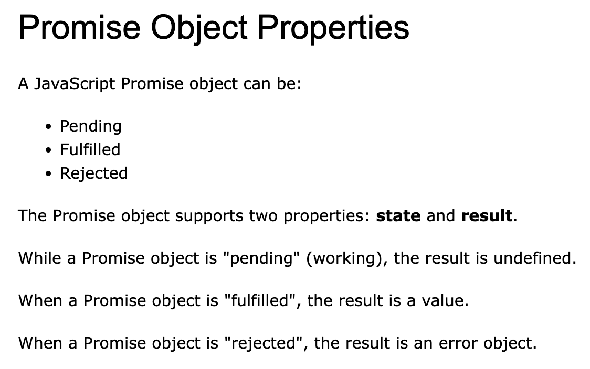

# JavaScript

## Miscellaneous
- JavaScript is case-sensitive, the same variable name with different case represents different variables
- If you reference a function without adding parentheses, it will show the defined formula rather than executing the function.

## Constants
- Cannot be Reassigned
- But for lists and objects, they can be changed
- String Interpolation
   ``` JavaScript
   const name = "Steven";
   console.log(`Hello, ${name}!`); 
   // Output: Hello, Steven!

   let price = 10;
   let VAT = 0.25;
   let total = `Total: ${(price * (1 + VAT)).toFixed(2)}`;
   ```
- scope
    ``` JavaScript
    {
    let x = 2;
    }
    // x can NOT be used here

    {
    var x = 2;
    }
    // x CAN be used here
    ```
- Spread Operator
    ``` JavaScript
    const state = {
        name: "Steven",
        age: 25
    };

    const newState = {
        ...state, // This expands the state object
        city: "Melbourne"
    };

    console.log(newState);
    // Output: { name: "Steven", age: 25, city: "Melbourne" }
    ```
- Callbacks
    - A callback is a function passed as an argument to another function
    ``` JavaScript
    function myFirst() {
        myDisplayer("Hello");
    }

    function mySecond() {
        myDisplayer("Goodbye");
    }

    myFirst();
    mySecond();
    ```

- Promises
    - "Producing code" is code that can take some time
    - "Consuming code" is code that must wait for the result
    - A Promise is an Object that links Producing code and Consuming code
    - Promise instance methods:
        - then() - Add a callback for when the Promise is fulfilled
        - catch() - Add a callback for when the Promise is rejected
        - finally() - Add a callback that executes regardless of the Promise's final state
    - Promise static methods:
        - Promise.resolve() - Create an immediately resolved Promise
        - Promise.reject() - Create an immediately rejected Promise
        - Promise.all() - Wait for all Promises to complete (or the first rejection)
        - Promise.race() - Wait for the first Promise to complete (or reject)
        - Promise.allSettled() - Wait for all Promises to complete (regardless of resolution or rejection)



``` JavaScript
function myDisplayer(some) {
  document.getElementById("demo").innerHTML = some;
}

let myPromise = new Promise(function(myResolve, myReject) {
  let x = 0;

// The producing code (this may take some time)

  if (x == 0) {
    myResolve("OK");
  } else {
    myReject("Error");
  }
});

myPromise.then(
function(value) {myDisplayer(value);},
function(error) {myDisplayer(error);}
);
```

``` JavaScript
async function myFunction() {
  return "Hello";
}

function myFunction() {
  return Promise.resolve("Hello");
}

function myFunction() {
  return new Promise((resolve) => resolve("Hello"));
}

const myPromise = new Promise((resolve, reject) => {
// Assume this is an operation that might fail
const success = false;

  if (success) {
    resolve("Operation successful");
  } else {
    reject(new Error("Operation failed"));
  }
});

// Handling a rejected Promise
myPromise
  .then(result => console.log(result))
  .catch(error => console.error(error.message)); // Will output "Operation failed"

const promise1 = fetch('https://api.example.com/data1').then(res => res.json());
const promise2 = fetch('https://api.example.com/data2').then(res => res.json());

// Promise.all waits for all Promises to complete
Promise.all([promise1, promise2])
  .then(([result1, result2]) => {
    console.log('All requests completed');
    console.log('Result 1:', result1);
    console.log('Result 2:', result2);
  })
  .catch(error => {
    console.error('At least one request failed:', error);
  });

// Wait for all Promises to complete regardless of failures
Promise.allSettled([promise1, promise2])
.then(results => {
  results.forEach((result, index) => {
    if (result.status === 'fulfilled') {
      console.log(`Promise ${index + 1} succeeded:`, result.value);
    } else {
      console.log(`Promise ${index + 1} failed:`, result.reason);
    }
  });
});
```

- Asynchronous
    - Functions running in parallel with other functions are called asynchronous
    - Asynchronous functions
    ```JavaScript
    const PI = 3.141592653589793;
    PI = 3.14;      // This will give an error
    PI = PI + 10;   // This will also give an error

    // You can create a constant array:
    const cars = ["Saab", "Volvo", "BMW"];
    // You can change an element:
    cars[0] = "Toyota";
    // You can add an element:
    cars.push("Audi");

    // You can create a const object:
    const car = {type:"Fiat", model:"500", color:"white"};
    // You can change a property:
    car.color = "red";
    // You can add a property:
    car.owner = "Johnson";
    ```