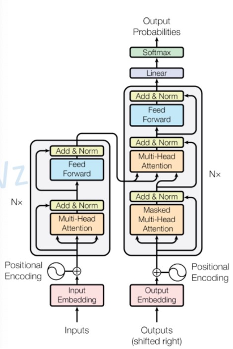

# Machine Learning

Based on COMP90051 Statistical Machine Learning, COMP90086 Computer Vision, COMP90042 Natural Language Processing, Zhihua Zhou's "Machine Learning", CSDN, Zhihu, and other sources.

## Introduction
When we talk about machine learning, almost 99% of it is based on probability to generate answers. That is, as long as I have enough training data and a sufficiently complex model (i.e., a sufficiently large decision space), my model can produce an answer that represents the majority. My favorite is reinforcement learning because it closely mimics human thinking (gradually approaching the goal, optimizing based on feedback and strategy), rather than directly minimizing the loss function (through loss function optimization, where the training process often involves using training data to compute).

## Table of Contents
- `Foundations:`
    - [Classification](#classification)
    - [Metrics](#metrics)
    - [Schools](#schools)
    - [Discriminative vs Generative Models](#discriminative-vs-generative-models)
    - [Parametric/Non-Parametric Models](#parametricnon-parametric-models)
    - [Batch Size](#batch-size)
    - [Unbalanced Classes](#unbalanced-classes)
    - [Regularization](#regularization)
    - [Loss Functions](#loss-functions)
    - [Activation Functions](#activation-functions)
- `How to get parameters:`
    - [Newton-Raphson Method](#newton-raphson-irls-method)
    - [Why Gradient Descent?](#why-do-we-need-gradient-descent)
    - [How to Avoid Local Optimum?](#how-to-avoid-getting-stuck-in-local-optima)
- `Models:`
    - [Naive Bayes](#naive-bayes)
    - [K-Nearest Neighbors (KNN)](#k-nearest-neighbors-knn)
    - [Logistic Regression](#logistic-regression)
    - [Linear Discriminant Analysis (LDA)](#linear-discriminant-analysis-lda)
    - [Hidden Markov Models (HMM)](#hidden-markov-model-hmm)
    - [Principal Component Analysis (PCA)](#principal-component-analysis-pca)
    - [Decision Tree](#decision-tree)
    - [Ensemble Learning](#ensemble-learning)
    - [Random Forest](#random-forest)
    - [Support Vector Machine (SVM)](#support-vector-machine-svm)
    - [Perceptron](#perceptron)
    - [Neural Network](#neural-network)
    - [Convolutional Neural Network (CNN)](#convolutional-neural-networks-cnn)
    - [Recurrent Neural Network (RNN)](#recurrent-neural-networks-rnn)
    - [Long Short-Term Memory (LSTM)](#long-short-term-memory-lstm)
    - [Gated Recurrent Unit (GRU)](#gated-recurrent-unit-gru)
    - [Attention Mechanism](#attention-mechanism)
    - [Self-Attention](#self-attention)
    - [Transformer](#transformer)
    - [BERT](#bert-bidirectional-encoder-representations-from-transformers)

## Classification

1) **Supervised Learning**: Learning with labeled data, typically used for classification and regression tasks.

2) **Unsupervised Learning**: The model learns patterns in the data through clustering, where the machine determines labels for the data on its own.

3) **Self-Supervised Learning**: Training by generating new data, e.g., masking parts of text or rotating images.

4) **Semi-Supervised Learning**: Combines a large amount of unlabeled data with a small amount of labeled data for training.

## Metrics

1. **Recall (True Positive Rate)** = $ TP / (TP + FN)$
2. **Precision (Positive Predictive Value)** = $TP / (TP + FP)$
3. **F1 Score** = $2 * P * R / (P + R)$
   - The F1 score is the harmonic mean of precision and recall.

## Generalization Error
Generalization error = Bias + Variance + Noise
- A complex model may overfit, having a small training error but large generalization error.
- A simple model may underfit, having both large training and generalization errors.
- The ideal case is having a small training error and small generalization error.

## Schools:
1. **Frequentist School**: Maximum Likelihood Estimation (biased estimation), choosing parameters $P(X|θ)$ that maximize the likelihood of the data.
2. **Bayesian School**: Maximum A Posteriori Estimation (unbiased estimation), choosing parameters $P(θ|X)$ that make the data most likely.
3. **Empirical Risk Minimization (ERM)**: Fitting the model using a loss function.
   - ERM introduces L1 regularization for Laplace distribution and L2 regularization for Gaussian distribution.

### Bayes' Theorem
- $P(θ|X) = P(X|θ) P(θ) / P(X)$
- Posterior probability = Likelihood * Prior / Marginal Probability

### Log Trick
1. Transforming a product into a sum.
2. A monotonic transformation that does not change the original monotonicity.

## Discriminative vs Generative Models
1. **Discriminative Model**: $P(Y|X)$, the conditional probability distribution.
2. **Generative Model**: $P(X, Y)$, the joint distribution.

## Parametric/Non-Parametric Models
1. **Parametric Models**: Models with fixed parameters (e.g., Neural Networks, Logistic Regression).
2. **Non-Parametric Models**: Models without fixed parameters (e.g., K-Means, Kernel Density Estimation - KDE).
   - **Kernel Density Estimation (KDE)**: Used to estimate the probability density function of data.

## Batch Size
- **BGD**: The gradient for each epoch is the average gradient over the entire dataset, resulting in smoother updates but requiring more computational resources, especially with large datasets, and more epochs to reach the optimum.
- **Mini-BGD**: A compromise between BGD and SGD.
- **SGD**: The gradient for each epoch is based on a single sample, requiring fewer resources but more epochs to converge.

## Unbalanced Classes
1) **Oversampling**
2) **Undersampling**
3) **Threshold-moving**:
   - In binary classification, such as logistic regression, the model outputs a probability between 0 and 1. A threshold (usually 0.5) is selected to decide the class. If the predicted probability is greater than the threshold, the sample is classified as positive; otherwise, it is classified as negative.

## Regularization
**Why use Regularization?**
- To address multicollinearity (which can lead to non-unique solutions).
- To prevent overfitting (by adding perturbation terms, increasing robustness against noise).
- Regularization is equivalent to adding prior knowledge, transforming ERM into MAP (Maximum A Posteriori).
   - For example, in linear regression, adding perturbation terms leads to Ridge regression (L2 regularization) and Lasso regression (L1 regularization).

1) L1 Regularization (Ridge Regression)
```math
J(w_1, w_2, b) = \frac{1}{n} \sum_{i=1}^{n} (y_i - \hat{y}_i)^2 + \lambda \ast (|w_1| + |w_2|)
```
2) L2 Regularization (Lasso Regression)
```math
J(w_1, w_2, b) = \frac{1}{n} \sum_{i=1}^{n} (y_i - \hat{y}_i)^2 + \lambda \ast (w_1^2 + w_2^2))
```

3) **Dropout Regularization**
   - Prevents over-reliance on a single neuron.
   - Introduces noise into the model.
   - Reduces overfitting by randomly "dropping" (setting to zero) a fraction of neurons during training.

## Loss Functions

There are various types of loss functions, such as 0-1 loss, absolute loss, squared loss, etc.

### 1) **Binary Cross-Entropy (BCE)**
   - Commonly used for binary classification problems.
   $$
   L(y, \hat{y}) = - \frac{1}{N} \sum_{i=1}^{N} \left[ y_i \log(\hat{y_i}) + (1 - y_i) \log(1 - \hat{y_i}) \right]
   $$

### 2) **Categorical Cross-Entropy**
   - Commonly used for multi-class classification problems.
   $$
   L(y, \hat{y}) = - \sum_{i=1}^{N} \sum_{j=1}^{C} y_{ij} \log(\hat{y_{ij}})
   $$  


## Activation Functions

### 1. **Sigmoid Function**
   - Used for binary classification problems.
   - The output range is from 0 to 1.
   ```math
   \sigma(z) = \frac{1}{1 + e^{-z}}
   ```

### 2. **Hyperbolic Tangent Function (tanh)**
```math
\tanh(x) = \frac{e^x - e^{-x}}{e^x + e^{-x}}
```
- Solves the issue of Sigmoid's output not being centered around zero, but still suffers from the vanishing gradient problem and issues with exponentiation.
- The output range is from -1 to 1.

### 3. **ReLU Function (Rectified Linear Unit)**
```math
f(x) = \max(0, x)
```
- When $x > 0$, $y = x$
- When $x \leq 0$, $y = 0$

## Newton-Raphson (IRLS) Method

Apart from gradient descent, Newton-Raphson is a second-order derivative iterative method for updating $θ$. Its characteristics include:

1. **No Learning Rate**: Unlike gradient descent, Newton-Raphson does not require a learning rate.
2. **Fewer Iterations**: It generally requires fewer iterations than gradient descent.
3. **Computational Complexity**:
   - Let $n$ be the number of features, the computational cost of the Newton-Raphson method is higher as it involves calculating the second-order derivative.
   - The complexity of Newton-Raphson is $O(n^3)$, primarily due to the need to compute the Hessian matrix (i.e., the matrix of second-order partial derivatives). In contrast, the complexity of gradient descent is $O(n)$, so Newton-Raphson is more practical when the number of features is small.
4. **Hessian Matrix**: This is the matrix of second-order partial derivatives, which needs to be computed and inverted at each iteration. 
    - **Hessian Matrix**: In Newton's method, each iteration requires calculating the first derivative (gradient) and the second derivative (Hessian matrix), and inverting this matrix.
    - **Assume $n$ features**: The Hessian matrix is an $n × n$ matrix, where calculating the Hessian has a time complexity of $O(n^2)$, and inverting it has a time complexity of $O(n^3)$. Therefore, the overall complexity is $O(n^3)$, which is computationally expensive in high-dimensional spaces.
5. **Basic Principle**
    - **Principle of Newton's Method**

        Newton's method is an iterative numerical approach. Each step in the direction of the solution follows the descent direction of the function value at the current point.

        The goal is to find the extreme value of a function $ f(x) $. If the first derivative of the function $ f'(x) = 0 $, we apply the following approximation:

        $$
        f(x) = f(x_k) + f'(x_k)(x - x_k) + \frac{1}{2}f''(x_k)(x - x_k)^2
        $$

        To find the point where the derivative equals zero, we solve for:

        $$
        f'(x_k) + f''(x_k)(x - x_k) = 0
        $$

        Solving for $ x $, we get:

        $$
        x = x_k - \frac{f'(x_k)}{f''(x_k)}
        $$

        This is the updated Newton's method formula.

        ---

    - **Steps of Newton's Method**

        1. Set the final error tolerance $ 0 \leq \epsilon \leq 1 $, initial point $ x_0 \in \mathbb{R}^n $, and $ k = 0 $.
        2. Compute $ g_k = \nabla f(x_k) $. If $ \|g_k\| \leq \epsilon $, stop and output $ x^* \approx x_k $.
        3. Compute $ G_k = \nabla^2 f(x_k) $ and solve for the direction $ d_k $ in the linear system $ G_k d_k = -g_k $.
        4. Update the solution: $ x_{k+1} = x_k + d_k $, set $ k = k + 1 $, and repeat.


6. **Example**

    Suppose we need to solve the equation $ f(x) = x^2 - 2 = 0 $ (i.e., $ x = \sqrt{2} $).

    1. Start with the initial point $ x_0 = 1 $.
    2. The derivative is $ f'(x) = 2x $, and applying the Newton's update formula:

    $$
    x_{n+1} = x_n - \frac{f(x_n)}{f'(x_n)} = x_n - \frac{x_n^2 - 2}{2x_n}
    $$

    3. By iteration, we approach the approximation $ x = \sqrt{2} $.

## Why Do We Need Gradient Descent?
To calculate the optimal parameters. However, not all models have a closed-form solution, which is why gradient descent is required.

- **Closed-form solution** means that the solution can be represented exactly with a finite number of basic operations (like addition, subtraction, multiplication, division, exponentiation, logarithms, trigonometric functions, etc.). It can be written directly through a clear mathematical expression.
- **Open-form solution** (or numerical solution) refers to solutions that cannot be represented by a simple mathematical formula but can still be approximated iteratively through numerical methods. Although there is no explicit analytical formula, algorithms can be used to get an approximate solution.
- This does not imply that there is no solution.

## How to Avoid Getting Stuck in Local Optima?
1) Use SGD and Mini-Batch methods to introduce randomness into the gradient, so the direction is not exactly the global gradient. This can help the model escape local optima.
2) Add noise to the gradients.
3) Add momentum to smooth out the optimization.
4) Other strategies...

## Naive Bayes
```math
\arg\max_{c_n} p(c_n | f_1 \dots f_m) = \prod_{i=1}^{m} p(f_i | c_n) p(c_n)
```
- [Naive Bayes on Zhihu](https://zhuanlan.zhihu.com/p/518118474)
- Naive Bayes assumes that features are **independent** of each other.

### **Advantages**:
1) If the independence assumption holds, it is the best model.
2) Fast to train, robust, and has low variance.

### **Disadvantages**:
1) The independence assumption is rarely true.
2) The accuracy is generally lower compared to other methods.
3) Requires smoothing for unseen instances.

---

### 1) **Categorical Naive Bayes (CNB)**
   - Assumes a categorical distribution.
   - Typically used for handling discrete features, especially when the features are categorical data.
   - In multinomial Naive Bayes, we assume that the features come from a categorical distribution, known as the **Multinomial Naive Bayes (CNB)**. The typical example of this distribution is the bag-of-words model, where each word is assumed to be chosen independently from the others. The probability of a word given a class is modeled as: 

- In the categorical distribution, let the random variable $ X $ take on multiple discrete values, denoted as $ X \sim \text{Categorical}(p) $, where $ p = (p_1, p_2, \dots, p_k) $, and $ X = k $ has probability $ p_k $ (where $ 0 \leq p_k \leq 1 $). Furthermore, we have:
   
   $$
   p_1 + p_2 + \dots + p_k = 1
   $$
   Thus, the probability mass function $ f(x; p) $ is:

   $$
   f(x; p) = \prod_{k=1}^{K} p_k^{I(x = k)} \quad \text{(1.1)}
   $$

   Where $ I(\cdot) $ is the indicator function, which is 1 if the condition inside is true, and 0 otherwise.

### 2) **Multinomial Naive Bayes (MNB)**
- Assumes a multinomial distribution.
- In Multinomial Naive Bayes (MNB), we assume that the features come from a multinomial distribution. A typical example of this distribution is multiple draws from a category. A single draw follows a categorical distribution, while multiple draws follow a multinomial distribution.

- In the multinomial distribution, the random variable $ X $ describes $ n $ trials, each having $ K $ outcomes. Let the outcome of the $ k $-th trial occur $ n_k $ times, and we denote $ X \sim \text{Multinomial}(p, n) $, where $ p = (p_1, p_2, \dots, p_K) $ is the probability vector, with $ 0 \leq p_k \leq 1 $. Additionally, we have:

$$
p_1 + p_2 + \dots + p_K = 1, \quad n_1 + n_2 + \dots + n_K = n
$$

The probability mass function of $ X $ is:

$$
f(n_1, n_2, \dots, n_K | p, n) = \frac{n!}{n_1! n_2! \dots n_K!} p_1^{n_1} p_2^{n_2} \dots p_K^{n_K} = n! \prod_{k=1}^{K} \frac{p_k^{n_k}}{n_k!} \quad \text{(1.2)}
$$

**Note**: The multinomial distribution requires a specific understanding of how the parameters work.

### 3) **Gaussian Naive Bayes (GNB)**
- Assumes a Gaussian distribution for the features.
- In Gaussian Naive Bayes, we assume that the features come from a Gaussian distribution, which is widely present in the natural world. The Gaussian distribution has two parameters: the mean $ \mu $ and variance $ \sigma^2 $. The random variable $ X $ can take any real value, and we represent it as $ X \sim N(\mu, \sigma^2) $. The probability density function is given by:

$$
f(x|\mu, \sigma^2) = \frac{1}{\sqrt{2\pi \sigma^2}} e^{-\frac{(x - \mu)^2}{2\sigma^2}} \quad \text{(1.3)}
$$


## K-Nearest Neighbors (KNN)

- KNN is a non-parametric method, meaning it does not require training.

### Advantages:
1) Simple and effective.
2) No training required.
3) If there is an infinite amount of data, this is the best method.

### Disadvantages:
1) Requires selection of the parameter `k` (the number of neighbors).
2) Difficult to handle imbalanced data.
3) Slow output (since it requires a lot of distance calculations).

## Logistic Regression

Logistic Regression is a linear model used for binary classification.

- The reason why we do not use $(y - \hat{y})$ as a loss function is that it is not convex.
- The cost/loss function of Logistic Regression is the **Binary Cross-Entropy Loss**.

### Advantages:
1) Simple and easy to understand.
2) Strong interpretability (outputs can be interpreted as probabilities).

### Disadvantages:
1) Linear model (assumes the data is linearly separable).
2) It does not perform as well compared to deep learning models when the feature space is large.
3) For multi-class problems, multiple logistic regression models are needed.
4) Features need to be normalized.

- Logistic Regression performs a linear combination of features, then maps it to a probability.

### Model Assumptions:
- Linear Model Assumption: $p(y | x)$ follows $Normal(x^T w, \sigma)$, i.e., it follows a normal distribution.
- Logistic Regression Assumption: $p(y | x)$ follows $Bernoulli(Logistic(x^T w))$, i.e., it follows a Bernoulli distribution.


## Linear Discriminant Analysis (LDA)

- LDA projects the samples onto a line that maximizes the between-class variance and minimizes the within-class variance.


## Hidden Markov Model (HMM)


**Two assumptions:**
1) **Output Assumption**: The observed event (word) depends only on the hidden state (tag).
2) **Markov Assumption**: The current state (tag) depends only on the previous state.


## Principal Component Analysis (PCA)

- A widely used dimensionality reduction technique that aims to map high-dimensional data to a lower-dimensional space while retaining as much variance from the original data as possible.


## Decision Tree

### Divide-and-Conquer
**Information Gain**: Decision trees transform unordered data into ordered data through splitting. As the splitting continues, the samples at the branch nodes tend to belong to the same class, and the "purity" of the nodes increases.

- **Metrics:**
    1. **ID3 Information Gain**
    2. **C4.5 Information Gain Ratio**: Why use information gain ratio? For example, using unique identifiers as features to split results in each branch having only one node, which maximizes the information gain.
    3. **CART Gini Index**: For classification problems, the leaf nodes of a CART tree contain an actual score, not a determined class, which helps implement efficient optimization algorithms.

- **Pruning**
    - **Pre-pruning**: Use the validation set to verify the accuracy before and after pruning to decide if pruning is necessary.
    - **Post-pruning**: After pruning, use the validation set to verify accuracy.

- **Advantages:**
    - No need for feature scaling.
    - Performs well with non-linear data.
    - Works well for smaller datasets.

- **Disadvantages:**
    - Prone to overfitting (requires pruning).

## Ensemble Learning

### 1) **Bagging**
   - For a dataset, we can sample `T` training sets with `m` samples each, train a base learner on each sample, and then combine the predictions. For classification, Bagging typically uses simple voting; for regression, it uses simple averaging.
   - **Classification**: Voting
   - **Regression**: Averaging

### 2) **Boosting**
   - Boosting is a serial process:
     1) After training the first classifier, predictions are made, and the incorrectly classified data is fed into the second model.
     2) Then new data is generated and fed into the third model. Models are sequential.

- **AdaBoost**
   - AdaBoost adjusts the weights of misclassified samples, giving them higher importance in subsequent models to correct the errors of previous learners.

- **Gradient Boosting**
   - Gradient Boosting optimizes the model by calculating the gradient to enhance performance.

### 3) **Stacking**
   - Stacking involves learning multiple weak learners and then using a final learner (e.g., MLP) to summarize the results.


## Random Forest

- Random Forest is based on decision trees. An instance is passed through multiple decision trees, and the label that appears most frequently becomes the final prediction.
- **Randomness:**
    1) Random sampling with replacement.
    2) Random feature selection.
  
- **Advantages:**
    1. Can handle high-dimensional data.
    2. Can handle non-linear data.
    3. High parallel efficiency and fast training speed.
    4. With ensemble learning, the accuracy is higher than most single-model algorithms.

- **Disadvantages:**
    - Can overfit.

## Support Vector Machine (SVM)

**SVM** finds a hyperplane with the largest margin that separates the two classes. Its objective is to **maximize the margin** between the two classes of training data.

- **Loss Function**: The distance of each sample from the hyperplane.
- **Kernel Function**: SVM uses **kernel functions** to enable non-linear separation by mapping data into higher dimensions.

- **Advantages:**
    1. Kernel functions enable non-linear separation.
    2. Works well for large datasets.

- **Disadvantages:**
    1. Requires multiple SVM models for multi-class classification.
    2. Poor interpretability.
    3. Requires large datasets.

### Multi-class Models (OvO and OvR)
- The classic splitting strategies include:
    1) "One vs. One" (OvO)
    2) "One vs. Rest" (OvR)
    3) "Many vs. Many" (MvM)


## Perceptron
   - The loss function is based on whether the classification is correct.


## Neural Network
   - A neural network consists of multiple perceptron models to classify data in a higher-dimensional space.
   - The loss function is based on whether the classification is correct.

## Convolutional Neural Networks (CNN)

- Mostly used in Computer Vision (CV), but also used in some Natural Language Processing (NLP) tasks.
- Sliding window over sequences for calculations (sliding window over the sequence).


## Recurrent Neural Networks (RNN)


- Useful for variable-length inputs, making them effective for processing textual data.
- **Training Method**: Backpropagation Through Time (BPTT)
    - First, the model computes all outputs, then the gradients are backpropagated.
    - The "backpropagation" involves not just through the network layers but also between time steps.
    - When computing gradients for Loss and weights, the gradients of previous hidden layers depend on the gradients of the next hidden layer.

- **Features:**
    1) Hidden layers are usually represented by `h`, referred to as the hidden state.
    2) RNNs share parameters between each unit.
    3) The output layer can be changed to Softmax, producing the probability of each word.
    4) The loss is summed across all outputs.

- **Disadvantage**: Vanishing gradients problem.

## Long Short-Term Memory (LSTM)

- **A memory cell in LSTM includes:**
    - Forget Gate
    - Input Gate
    - Output Gate

- **Advantages:**
    1) Can capture long-term dependencies in sequences.
    2) Flexible like Feed-Forward Neural Networks, making them adaptable for various tasks.

- **Disadvantages:**
    1) Computationally complex and slow.
    2) Difficult to capture long-range dependencies in practice.

## LSTM 公式

```math
f_t = \sigma(W_f \cdot [h_{t-1}, x_t] + b_f)\\

i_t = \sigma(W_i \cdot [h_{t-1}, x_t] + b_i)\\

o_t = \sigma(W_o \cdot [h_{t-1}, x_t] + b_o)\\

\tilde{C}_t = \tanh(W_C \cdot [h_{t-1}, x_t] + b_C\\

C_t = f_t \circ C_{t-1} + i_t \circ \tilde{C}_t\\

h_t = o_t \circ \tanh(C_t)\\
```

## Forget Gate, Input Gate, Output Gate

**Formulas:**
- The first formula is for the **Forget Gate**.
- The second, fourth, and fifth formulas are for the **Input Gate**.
- The third and last formulas are for the **Output Gate**.

**Explanation:**
- **Gating Vector**: Pair-wise multiplying vectors (also known as the Hadamard product), where $h$ represents the hidden state and $C$ represents the cell state (or memory cell) that stores important information.
  
- **Concatenate**: $A \oplus B$ is the matrix concatenation operation.
- **Hadamard Product**: $A \circ B$ is also called element-wise product, where matrix elements are multiplied pair-wise.

### Gates:
1) **Forget Gate**:
   - Controls what information to forget from the previous cell state $C^{t-1}$, and the result is a weight $f^{t}$.
   
2) **Input Gate**:
   - Inputs new information into the memory cell, forming $C^t$.

3) **Output Gate**:
   - Computes the new hidden state.

## Gated Recurrent Unit (GRU)

- A simplified variant with only 2 gates and no memory cell.
- **Update Gate** and **Reset Gate**.

## Attention Mechanism

Attention allows the model to dynamically focus on different parts of the input sequence when generating an output.

### Attention Mechanism
- The contextual representation of a target word is the weighted sum of the value vectors of the context words and the target word.
  
$$
A(Q, K, V) = \text{softmax} \left( \frac{QK^T}{\sqrt{d_k}} \right) V
$$

where:
- $Q$ is the query matrix,
- $K$ is the key matrix,
- $V$ is the value matrix,
- $d_k$ is the dimension of query and key vectors.

**Method**:  
First, calculate the similarity between $Q$ and $K$, which gives a similarity weight, and then apply this weight to $V$. This allows the model to focus on where $Q$ and $K$ are most similar.

**Example**:  
For translation tasks, $Q$ represents the translated word, and $K$ represents all the words in the target language. The similarity between $Q$ and $K$ is calculated, and this similarity is used to weight $V$, producing an attention value (context vector).

**Characteristics**:  
For models like RNNs and LSTMs, the output of the next hidden layer depends on the previous hidden layer, making it difficult to capture information from the earlier part of long texts.
- **Advantages**: 
    1) Faster (due to parallel computation).
    2) More effective (focuses on key information).
- **Disadvantages**:  
For Sequence-to-Sequence tasks, the Attention mechanism's Encoder still depends on the previous step's calculation.


## Self-Attention

Self-Attention allows the model to simultaneously consider other parts of the sequence while processing a given part, focusing on relationships between elements within the input sequence (the sequence compares itself).

**Characteristics**:
1) **Captures Long-Distance Dependencies**:  
   In a long sentence, words at the beginning may influence the understanding and translation of words at the end.
2) **Parallelized Computation**:  
   Unlike RNNs and LSTMs, which process sequences serially, Self-Attention allows simultaneous computation of all elements of the sequence, greatly improving computational efficiency.
3) **Flexibility**:  
   Self-Attention provides a flexible way to capture information within a sequence, allowing the model to automatically learn which parts of the sequence are more important.


## Transformer



- **Original Transformer**: Both the Encoder and Decoder blocks have 6 layers each.
- **Positional Encoding**: Uses Trigonometric functions. Unlike BERT’s position embeddings, which are trainable, Transformer’s position encoding is fixed during training.
- **Input Embeddings** are transformed into Query, Key, and Value through a linear transformation.
- **GPT** is Decoder-only.
- **BERT** is Encoder-only.

### Transformer Training Process:
For training, both the raw input and the correct answer are fed into the model. During training, **Teacher Forcing** is used, and for the correct answer input, **Masking** is applied to prevent the model from seeing information beyond the current word, which allows parallel processing.


### Scaled Dot-Product Attention


This figure illustrates the formula $A(Q,K,V)$, where MatMul refers to Matrix Multiplication.

---

### Multi-Head Attention

- Extracts multiple features, with the number of heads set to 8.
- Can be understood as CNN extracting different feature maps, here it extracts different semantics, which are then concatenated and passed through a fully connected layer.
- Self-Attention uses a single set of QKV weights, whereas Multi-Head Attention uses multiple sets of weights.


- $h$ represents the number of heads in Multi-Head Attention.

- **Add&Norm**:
    - LayerNorm$(X + \text{Multi-Head Attention}(X))$
    - LayerNorm$(X + \text{FeedForward}(X))$
    - **Add**: Residual structure to prevent vanishing or exploding gradients during training.
    - **Norm**: Layer Normalization.

---

### Decoder (Masked Multi-Head Attention)

- **Mask**: Masks certain values so that they have no effect on the parameter updates.


## Normalization: Effects on Model Fitting

1) **Different scales of data features** may lead to large differences in magnitude, and large-scale features can slow down gradient efficiency. Normalization speeds up model learning. When features are on similar scales, parameter updates become more balanced and stable.
   - For example, the "height" dimension may range from 150-180 cm, and the "money" dimension may range from 0 to 100 billion. Without normalization, the "money" dimension would initially have a large impact on the loss function.

2) **Reduces overfitting**:
   Normalization mainly improves the stability of the optimization and training process, indirectly mitigating overfitting.

## Normalization Types:
1) Batch Norm (CNN, Linear)
2) Layer Norm (RNN)
3) Instance Norm
4) Group Norm

### Batch Norm:
Batch Normalization computes the mean and variance of each feature across all samples in the batch. However, for text tasks, where sentence lengths vary, Batch Norm cannot be applied to sequences.

### Layer Norm:
Transformer uses **LayerNorm**, which computes the mean and variance for all features of the same sample.

- **Example**:
    ```
    Given a sentence: [[1, 2, 3], [4, 5, 6]]
    where [1, 2, 3] is the word vector for one word.  
    The mean and standard deviation of 1, 2, 3, 4, 5, 6 are 3.5 and 1.7078, respectively. After normalization:
    [[-1.4638, -0.8783, -0.2928], [0.2928, 0.8783, 1.4638]]
    ```

--- 
### 1) Batch Normalization:
    - It removes the scale relationship between different features but retains the scale relationship between different samples, so it is commonly used in **Computer Vision (CV)**.

### 2) Layer Normalization:
    - It removes the scale relationship between different samples but retains the scale relationship between different features within a sample, making it more commonly used in **Natural Language Processing (NLP)**.

---

### ELMO vs. GPT
- **ELMO**:
    - Uses **two LSTM networks**: one for forward output and one for backward output.
- **GPT**:
    - Uses a **unidirectional Encoder**.

## BERT (Bidirectional Encoder Representations from Transformers)
BERT uses a **bidirectional Encoder-only** model to better understand the contextual meaning of language.

### BERT Architecture
- **BERT-BASE**: 12 layers of Transformer Encoder, hidden layer size of 768, 12 attention heads.
- **BERT-LARGE**: 24 layers of Transformer Encoder, hidden layer size of 1024, 16 attention heads.

### How is BERT trained?
- **Corpus**: Wikipedia + BookCorpus
1) **Masked Language Model (MLM)**:
   Randomly selects 15% of tokens to mask, and these tokens are replaced with a special `[MASK]` token.
   Similar to CROW.
2) **Next Sentence Prediction (NSP)**:
   The model receives a pair of sentences as input, with half of the pairs being consecutive and the other half randomly chosen from the corpus. The model must predict whether the second sentence is the logical continuation of the first.

### BERT Tokenization

BERT uses **WordPiece** tokenization, which is a variant of **Byte Pair Encoding (BPE)**.

### Tokenization vs. Byte Pair Encoding (BPE)

#### Tokenization vs. Byte Pair Encoding (BPE) Comparison
- Traditional word-based tokenization methods do not handle unknown or rare words well.
- Traditional tokenization methods also struggle to model relationships between word parts (morphemes).
    - For example, the model might learn the relationships between "old", "older", and "oldest", but fail to generalize to "smart", "smarter", and "smartest".

#### Byte Pair Encoding (BPE)
**BPE** (Byte Pair Encoding) is a simple data compression technique where the most common pair of adjacent characters is replaced by a character that does not appear in the data. It uses a replacement table to rebuild the original data. OpenAI's GPT-2 and Facebook's RoBERTa both use this method to construct subword vectors.

- **Advantages**:
    - Effectively balances vocabulary size and the number of tokens needed for encoding sentences.
- **Disadvantages**:
    - BPE is greedy and deterministic in symbol replacement, so it does not provide multiple fragment results with probabilities.

### Tokenizer Output:
1. **Token IDs**:
    - `[CLS]`: 101
    - `[PAD]`: 0
    - `[SEP]`: 102
2. **Attention Mask**:
    - Positions of special tokens `[CLS]` and text tokens are set to 1.
    - `[PAD]` positions are set to 0.

### Special Tokens
- `[CLS] + Sentence content + [SEP]`
    - `[CLS]`: Represents aggregate information of the entire input sequence.
    - `[SEP]`: Represents the end of the sentence and is used to separate sentences.

### BERT Input (After Tokenization):
1. **Token Embedding**:
    - Encodes both semantic and contextual information of the token.
2. **Segment Embedding**:
    - Distinguishes different parts of the input data (e.g., different sentences). In the NSP task, it helps distinguish sentences.
    - Tokens from the same sentence have the same Segment Embedding.
3. **Position Embedding**:
    - Learns a unique embedding vector for each position in the sequence, allowing the model to capture the order of tokens.
    - Unlike the fixed positional encoding in Transformers, BERT’s Position Embedding is trainable.


### Word Embeddings
- Vocabulary size: 28,996 (simplified version)
- Embedding size: 768
- BERT-Base vocabulary size: 30,522
- Positional Embedding: Maximum sequence length of 512, embedding size of 768
- Segment Embedding: Also called token_type_embedding

### BERT Output:
1. **Dimension**: 768 (for BERT-BASE)
2. **Pooler Output**:
    - The output for the `[CLS]` token is passed through an additional fully connected layer and an activation function (typically Tanh).
    - **Shape**: `(batch_size, 768)`
3. **Last Hidden State**:
    - Vector representation for each input token (i.e., embeddings for each token).
    - **Shape**: `(batch_size, number_of_tokens, 768)`
4. **Hidden States** (Optional output, configurable):
    - Vector representations of each input token at 13 layers (the 0th layer is word embeddings, and the remaining 12 are from Transformer encoder layers).
    - **Shape**: `(batch_size, number_of_tokens, 768)`
5. **Attentions** (Optional output, configurable):
    - **Shape**: `(batch_size, number_of_heads=12, number_of_tokens, number_of_tokens)`

To enable `hidden_states` and `attentions`, use the following code:
```python
BertModel.from_pretrained(model_name, output_hidden_states=True, output_attentions=True)
```

## Calculating the Number of Parameters in BERT-BASE

### BERT-BASE Definition:
- Hidden layer size (hidden_size): 768
- Number of attention heads (num_heads): 12
- Maximum sequence length (max_sequence_length): 512
- Dimensionality per attention head: 768 / 12 = 64

### Step-by-step Breakdown:

#### 1. Input Token IDs
BERT takes in a one-dimensional vector with a size of `512 × 1`, which corresponds to a maximum sequence length of 512 token IDs.

#### 2. Embedding Transformation
For BERT-BASE, the vocabulary size (`vocab_size`) is 30,522, and the hidden layer size is 768. Therefore, the word embedding matrix has the following dimensions:
- **Word embedding matrix parameter count** = `vocab_size × hidden_size` = 30,522 × 768 = **23,408,256 parameters**

Additionally, there are **position embeddings** and **segment embeddings**:
- **Position embedding matrix dimensions**: 512 × 768 = **393,216 parameters**
- **Segment embedding matrix dimensions**: 2 × 768 = **1,536 parameters**

#### 3. Transforming Q, K, V Matrices
BERT transforms the input `(512 × 768)` matrix into three matrices: $Q$, $K$, and $V$. These are computed as:
- $Q = XW_Q, K = XW_K, V = XW_V$, where $W_Q$, $W_K$, and $W_V$ are the weight matrices.

Since each head has a dimensionality of 64 and there are 12 attention heads, the weight matrix for each head's $Q$, $K$, and $V$ is of size `768 × 64`. Therefore:
- The total parameter count for $Q$, $K$, and $V$ matrices is: `3 × (768 × 64) × 12` = **147,456 parameters** (the Q, K, V matrices are shared across all heads).

#### 4. Calculating $QK^T$ and Multiplying by $V$
The attention mechanism computes:
$$
A(Q, K, V) = \text{softmax} \left( \frac{QK^T}{\sqrt{d_k}} \right) V
$$
- $QK^T$ = `(512 × 64) × (64 × 512)` = `512 × 512`
- Then $QK^T$ is multiplied by the $V$ matrix: `(512 × 512) × (512 × 64)` = `512 × 64`

#### 5. Multi-Head Attention
The results of the 12 attention heads are concatenated to form a matrix of size `512 × 768`. The total number of parameters remains the same.

#### 6. Linear Layer
This `512 × 768` matrix is passed through a linear layer with a weight matrix of size `768 × 768`. Therefore:
- **Parameter count for the linear layer** = `768 × 768` = **589,824 parameters**

#### 7. Feed-Forward Network
After each layer, the matrix goes through a feed-forward network (FFN). The FFN first expands the input to a size of 3,072 and then reduces it back to 768:
- **FFN parameter count** = `768 × 3072` + `3072 × 768` = **4,722,432 parameters**

#### 8. Total for 12 Layers
BERT-BASE has 12 Transformer encoder layers, each containing multi-head self-attention and feed-forward networks. Therefore:
- **Total parameter count for the attention part** = `12 × (147,456 + 589,824 + 4,722,432)` = **65,104,512 parameters**

#### 9. Total Parameters
Adding the parameters for the word embeddings, position embeddings, and segment embeddings:
- **Total parameter count** = 23,408,256 (word embeddings) + 393,216 (position embeddings) + 1,536 (segment embeddings) + 65,104,512 (multi-layer encoder) = **88,907,520 parameters**

Thus, the total number of parameters for the BERT-BASE model is approximately **88M**.
