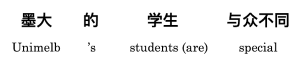
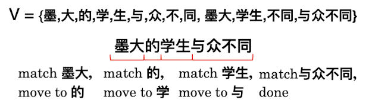
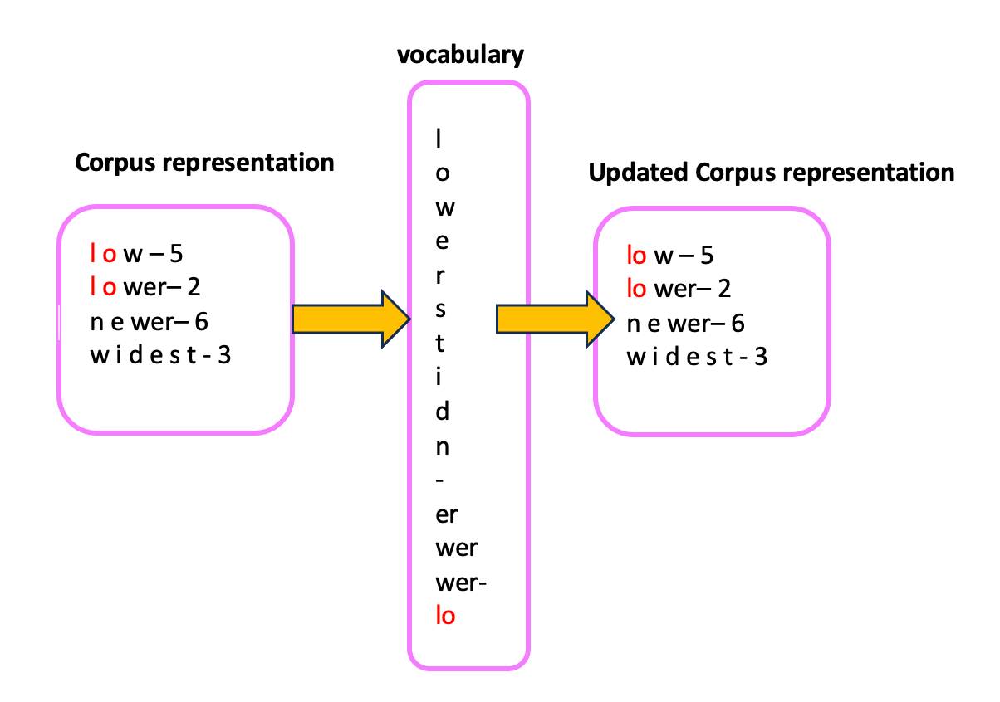

## Natural Language Processing (NLP)

## 1. Preprocessing

1. **Remove unwanted formatting** (e.g. HTML)  
   - Example: Remove `<div>`, `<br>` tags from HTML documents.  
     Input: `<div>Hello <b>World</b></div>`  
     Output: `Hello World`

2. **Sentence segmentation**: break documents into sentences  
   - Example: Split a paragraph into sentences.  
     Input: `This is a sentence. This is another one.`  
     Output: `["This is a sentence.", "This is another one."]`

3. **Word tokenisation**: break sentences into words  
   - Example: Split sentences into individual words.  
     Input: `This is a sentence.`  
     Output: `["This", "is", "a", "sentence"]`

4. **Word normalisation**: transform words into canonical forms  
   - Example: Convert words to their base forms.  
     Input: `running`, `ran`, `runner`  
     Output: `run`

5. **Stopword removal**: delete unwanted words  
   - Example: Remove common stopwords like "is", "a", "the".  
     Input: `This is a sentence.`  
     Output: `["This", "sentence"]`

### Sentence Segmentation
- **`Naïve approach`**: break on sentence punctuation ([.?!])
- Use **`regex`** to require capital ([.?!] [A-Z])
    - Abbreviations often followed by names (Mr. Brown)
- State-of-the-art uses **`machine learning`**, not rules
    - Looks at every “.” and decides whether it is the end of a sentence.
    - Features: 
        - Look at the words before and after “.”
        - Word shapes:
            - Uppercase, lowercase, ALL_CAPS, number
            - Character length
        -  Part-of-speech tags
            -  Determiners tend to start a sentence

### Word Tokenisation
- Naïve approach: separate out alphabetic strings (based on space) (\w+) 
-  Some Asian languages are written without spaces
between words. (For example, Chinese)

- **`MaxMatch`**: Greedily match longest word in the vocabulary 


### Subword Tokenisation
- Tokenize a word into smaller pieces (e.g. happily -> happy ily, ideas -> idea s)
- **`Byte-pair encoding (BPE)`**
    - Core idea: iteratively merge frequent pairs of
characters 
    - Advantages:
        - Data-informed tokenisatio
        - Works for different languages 
        - **Deals better with unknown words**
    - Most frequent words will be represented as full
words 
    - Rarer words will be broken into subwords 
    -  In the worst case, unknown words in test data will
be broken into individual letter


### Word Normalisation
- Lower casing (Australia → australia) 
- Removing morphology (cooking → cook) 
- Correcting spelling (definately → definitely) 
- Expanding abbreviations (U.S.A → USA) 
- **`Goal:`**
    1) **Reduce vocabulary**
    2) **Maps words into the same type**

1) **Inflectional Morphology**
-  Inflectional morphology creates **`grammatical variants`** 
    - English inflects nouns, verbs, and adjectives
    - Nouns: number of the noun (-s)
    - Verbs: number of the subject (-s), the aspect (-ing) of the action and the tense (-ed) of the action 
    - Adjectives: comparatives (-er) and superlatives (-est)
- **Lemmatisation**
    - Lemmatisation means **`removing any inflection`** to reach the uninflected form, **the lemma**
    - For example:
        - speaking → speak 
        - stopping → stop (not stopp)
        - watches → watch (not watche)
2) Derivational Morphology
- Derivational morphology creates **`distinct words `**
- English derivational **suffixes** often change the lexical
category
    -  -ly (personal → personally) 
    -  -ise (final → finalise) 
    -  -er (write → writer)
- English derivational **prefixes** often change the meaning
without changing the lexical category
    - write → rewrite
    - healthy → unhealthy
- **Stemming**
    - **`Strips off all suffixes`**, leaving a stem 
    - For exmaple:
        - automate, automatic, automation →
automat 
    - **The Porter Stemmer**: Most popular stemmer for English 

### Stopword Removal
- A list of words to be removed from the
document
    - All closed-class or function words (e.g. the, a, of, for, he, …)
    - Any high frequency words 
    - NLTK, spaCy NLP toolkits


## 2. N-grams
N-grams simplify the chain rule $P(w^t, w^{t-1}, …, w^1)$ by using the information of previous words to predict the next word. It can be tricky when encountering unseen instances, which requires smoothing.

- **Unigram**: $P(w)$
- **Bigram**: $P(w^t| w^{t-1})$
- **Trigram**: $P(w^t| w^{t-1}, w^{t-2})$

## 3. Hidden Markov Model (HMM)

`Two assumptions:`
1) **Output assumption**: The observed event (word) depends only on the hidden state (tag).
2) **Markov assumption**: The current state (tag) depends only on the previous state.

## 4. Sequence Models

### 4.1 Recurrent Neural Networks (RNN)


- RNNs are effective for processing language text because they handle inputs of variable lengths.
- `Training method`: Backpropagation Through Time (BPTT)
    - First, the model calculates all outputs, then backpropagates.
    - However, this "backward" not only happens through the network layers but also between time steps.
    - When calculating the loss and the gradient of the weights, not only the current hidden layer is considered but also the next one.
    - The gradient of the previous hidden layer depends on the gradient of the next hidden layer.
    
- `Features:`
    1) The hidden state is typically represented as $h$, which refers to the hidden layer.
    2) RNNs share parameters across units.
    3) The output layer can be modified to a Softmax to output the probability of each word.
    4) The loss for each output is summed.
    
- `Drawbacks:`
    Vanishing Gradient problem.

## 4.2 Long Short-Term Memory (LSTM)
- `A memory cell consists of:`
    - Forget Gate
    - Input Gate
    - Output Gate

- `Advantages:`
    1) Capable of remembering long sequences of information.
    2) Flexible like Feed Forward neural networks (can be used for different tasks).
    
- `Disadvantages:`
    1) Computationally complex and slow.
    2) It is still difficult to record long-range dependencies in practical applications.

### LSTM Formula

```math
f_t = \sigma(W_f \cdot [h_{t-1}, x_t] + b_f)\\

i_t = \sigma(W_i \cdot [h_{t-1}, x_t] + b_i)\\

o_t = \sigma(W_o \cdot [h_{t-1}, x_t] + b_o)\\

\tilde{C}_t = \tanh(W_C \cdot [h_{t-1}, x_t] + b_C\\

C_t = f_t \circ C_{t-1} + i_t \circ \tilde{C}_t\\

h_t = o_t \circ \tanh(C_t)\\
```

`Formulas:`
- The first formula is for the **Forget Gate**.
- The second, fourth, and fifth formulas are for the **Input Gate**.
- The third and last formulas are for the **Output Gate**.

`Explanation:`
- **Gating Vector**: Performs pair-wise multiplication (Hadamard product) on other vectors. Here, $h$ represents the hidden layer, and $C$ represents the Cell State (or Memory Cell), which records important information.

- **Concatenate**: $A \oplus B$ denotes the concatenation of matrices $A$ and $B$.
- **Hadamard Product**: $A \circ B$, also known as the element-wise product, refers to the element-wise multiplication of two matrices.

`Gating Mechanisms:`
1) **Forget Gate**:
    - Controls the information from the previous cell state $C^{t-1}$ that needs to be forgotten, resulting in a weight $f^t$.
2) **Input Gate**:
    - Inputs new information into the cell state to form $C^t$.
3) **Output Gate**:
    - Computes the new hidden state.

## 4.3 Gated Recurrent Unit (GRU)

- A simplified variant with only 2 gates and no memory cell.
- **Update Gate** and **Reset Gate**.

## 5. Distributional Semantics

- **Word Sense**: A single meaning of a word.
- When a word has multiple meanings, it is **Polysemous**.

### 1) Distributional Semantics
The meaning of a word depends on its:
1. **Document Context**
2. **Word Window**

> "You shall know a word by the company it keeps."

- **Term Frequency-Inverse Document Frequency (TF-IDF)**
    Measures the importance of a word in a document (parameters are the word and the document it appears in).

    - $TF$ = Frequency of the word / Total number of words in the document
    - $IDF$ = $\log(\frac{\text{Total number of documents}}{\text{Number of documents containing the word}})$

    $$TF-IDF(t, d) = TF(t, d) \times IDF(t)$$

- **Pointwise Mutual Information (PMI)**
    $$PMI(x, y) = \log\left(\frac{P(x, y)}{P(x) \times P(y)}\right)$$

- **Word Embeddings (Word2Vec)**
    - e.g., Skip-Gram, CBOW
    - "You shall know a word by the company it keeps."
    - Predict a word based on its context.
    - **Skip-Gram**:
        - Given a word, predict its surrounding words.
        - Predict surrounding words of the target word.
        - Fake task: Predict surrounding words.
        - The actual task is to obtain the hidden layer in the middle as the representation.
    - **CBOW**:
        - Use surrounding words to predict the target word.
        - Predict the target word using surrounding words.

## 6. Contextual Semantics

- **RNN**: Unidirectional
    - Only captures context to the left.
- **ELMo**: Bidirectional, i.e., BiLSTM
    
    
    
    - ELMo uses character embeddings to generate word embeddings, allowing it to handle all words, including unseen ones.
    - The final vector for each word in ELMo is formed by concatenating the hidden layers of the bidirectional LSTM and then applying specific weighting with the word vectors. (These weights $s_0, s_1, s_2$ can be fine-tuned based on the task.)
    - **Lower Layer Representation** = captures syntax
        (e.g., syntactic parsing, named entity recognition)
    - **Higher Layer Representation** = captures semantics
        (e.g., sentiment analysis, textual entailment)

## 7. BERT

BERT employs a bidirectional Encoder-Only model to better understand the contextual meaning of language.

### BERT Architecture
- **BERT-BASE**: 12-layer Transformer Encoder, hidden size 768, 12 attention heads.
- **BERT-LARGE**: 24-layer Transformer Encoder, hidden size 1024, 16 attention heads.

### How is BERT Trained?
- **Corpus**: Wikipedia + BookCorpus
1) **Masked Language Model (MLM)**
    Randomly selects 15% of the tokens to be masked, replacing these tokens with a special `[MASK]` token.
    Similar to CROW.

2) **Next Sentence Prediction (NSP)**
    The model receives a pair of sentences as input, with a 50% chance that the second sentence is the logical continuation of the first, and a 50% chance that it is randomly selected from the corpus.
    The model must predict whether the second sentence is the logical continuation of the first.

### BERT's Tokenization Method

BERT uses the **WordPiece** tokenization method, which is a variant of **Byte-Pair Encoding (BPE)**.

### Tokenization vs. Byte Pair Encoding (BPE)

#### Comparison of Tokenization and Byte Pair Encoding (BPE)
- Traditional word representation methods struggle to handle unknown or rare vocabulary effectively.
- Traditional word tokenization methods do not facilitate the model in learning the relationships between affixes.
    - For example, the model learns the relationships between "old", "older", and "oldest" but cannot generalize to "smart", "smarter", and "smartest".

#### Byte Pair Encoding (BPE)
**Byte Pair Encoding (BPE)** or **Byte-Pair Encoding** is a simple form of data compression where the most frequent pair of consecutive bytes is replaced with a byte that does not appear in the data. A replacement table is used to reconstruct the original data. OpenAI's GPT-2 and Facebook's RoBERTa use this method to build subword vectors.

- **Advantages**:
    - Effectively balances vocabulary size and the number of tokens needed to encode sentences.
- **Disadvantages**:
    - Based on greedy and deterministic symbol replacement, it cannot provide multiple fragment results with probabilities.

### Output of the Tokenizer:
1. **Token ID**:
    - `[CLS]`: 101
    - `[PAD]`: 0
    - `[SEP]`: 102
2. **Attention Mask**:
    - Positions corresponding to the special token `[CLS]` and text tokens are set to 1.
    - Positions corresponding to `[PAD]` are set to 0.

### Special Tokens
- `[CLS] + Sentence Content + [SEP]`
    - `[CLS]`: Represents the aggregated information of the entire input sequence.
    - `[SEP]`: Represents the sentence delimiter, used to separate different sentences.

### BERT's Input (After Tokenization):
1. **Token Embedding**:
    - Encodes the semantic and contextual information of tokens.
2. **Segment Embedding**:
    - Used to distinguish different parts of the input data (e.g., different sentences). Used in the NSP (Next Sentence Prediction) training task to differentiate sentences.
    - Tokens from the same sentence share the same Segment Embedding.
3. **Position Embedding**:
    - Learns an embedding vector for each position in the sequence, allowing the model to capture the order of tokens.
    - Unlike the fixed positional encoding in Transformers, BERT's Position Embedding is trainable.


### Word Embeddings
- Vocabulary size: 28,996, embedding dimension: 768 (simplified version)
- BERT-Base vocabulary size: 30,522
- **Positional Embedding**: Maximum sequence length 512, embedding dimension 768
- **Segment Embedding**: Also known as `token_type_embedding`

### BERT's Output:
1. **Dimension**: 768 (BERT-BASE)
2. **pooler_output**:
    - The output corresponding to the `[CLS]` token after passing through an additional fully connected layer and an activation function (usually Tanh).
    - **Shape**: `(batch_size, 768)`
3. **last_hidden_state**:
    - Provides vector representations for each input token (i.e., embeddings for each token).
    - **Shape**: `(batch_size, number_of_tokens, 768)`
4. **hidden_states** (optional output, requires parameter configuration):
    - Vector representations from all 13 layers for each input token (layer 0 is the word embeddings, and the subsequent 12 layers are from the Transformer encoders).
    - **Shape**: `(batch_size, number_of_tokens, 768)`
5. **attentions** (optional output, requires parameter configuration):
    - **Shape**: `(batch_size, number_of_attention_heads=12, number_of_tokens, number_of_tokens)`

To enable hidden_states and attentions, you can use the following code:
```python
BertModel.from_pretrained(model_name, output_hidden_states=True, output_attentions=True)
```

## Calculate the Number of Parameters in BERT-BASE

### BERT-BASE Definition:
- Hidden Layer Size (hidden_size): 768
- Number of Attention Heads (num_heads): 12
- Maximum Sequence Length (max_sequence_length): 512
- Dimension of Each Head: 768 / 12 = 64

### Step-by-Step Breakdown:

#### 1. Input Token ID
BERT receives a one-dimensional vector with a dimension of `512 × 1`, corresponding to the Token ID of the maximum sequence length of 512.

#### 2. Embedding Conversion
For BERT-BASE, the vocabulary size (`vocab_size`) is 30,522, and the hidden layer size is 768. Therefore, the dimension of the word embedding matrix is:
- **Number of parameters in the word embedding matrix** = `vocab_size × hidden_size` = 30,522 × 768 = **23,408,256 parameters**

Additionally, there are **position embeddings** and **type embeddings**:
- **Position embedding matrix dimension**: 512 × 768 = **393,216 parameters**
- **Type embedding matrix dimension**: 2 × 768 = **1,536 parameters**

#### 3. Transformation of $Q, K, V$ Matrices
BERT transforms the input matrix of dimension `(512 × 768)` into three matrices: $Q$, $K$, and $V$:
- $Q = XW_Q, K = XW_K, V = XW_V$, where $W_Q$, $W_K$, $W_V$ are weight matrices.

Each head has a dimension of 64, with 12 heads in total. Thus:
- The weight matrices for $Q$, $K$, and $V$ for each head have dimensions: `768 × 64`.
- Therefore, the number of parameters for the $Q$, $K$, and $V$ matrices is: `3 × (768 × 64) × 12` = **147,456 parameters** (each head shares the $Q$, $K$, and $V$).

#### 4. $QK^T$ and Multiply by $V$
The attention mechanism computation is:
$$
A(Q, K, V) = \text{softmax} \left( \frac{QK^T}{\sqrt{d_k}} \right) V
$$
- $QK^T$ = `(512 × 64) × (64 × 512)` = `512 × 512`
- Then, $QK^T$ multiplied by $V$: `(512 × 512) × (512 × 64)` = `512 × 64`

#### 5. Multi-Head Attention
The results from the 12 heads are concatenated, resulting in a matrix of dimension `512 × 768`, and the total number of parameters remains unchanged.

#### 6. Linear Layer
This `512 × 768` matrix is passed through a linear layer with a weight matrix of dimension `768 × 768`, so:
- **Number of parameters in the linear layer** = `768 × 768` = **589,824 parameters**

#### 7. Feed-Forward Network
After each layer, the matrix passes through a Feed-forward Network. Each feed-forward network first transforms the input to 3,072 dimensions and then back to 768 dimensions:
- **Number of parameters in the feed-forward network** = `768 × 3072` + `3072 × 768` = **4,722,432 parameters**

#### 8. Total of 12 Layers
BERT-BASE has 12 layers of Encoder, each containing multi-head self-attention and a feed-forward network. Therefore:
- **Total number of parameters in the attention part** = `12 × (147,456 + 589,824 + 4,722,432)` = **65,104,512 parameters**

#### 9. Total Parameters
Including the word embeddings, position embeddings, and type embeddings, the total number of parameters is:
- **Total number of parameters** = 23,408,256 (word embeddings) + 393,216 (position embeddings) + 1,536 (type embeddings) + 65,104,512 (multi-layer Encoders) = **88,907,520 parameters**

The total number of parameters in the BERT-BASE model is approximately **88M**.

## 6) Machine Translation
$$argmax(y) : p(x|y) P(y)$$

- **$x$**: Source language
- **$y$**: Target language

- **$p(x|y)$**: Translation model, reflects fidelity
- **$p(y)$**: Language model, reflects fluency

## NLP Pretraining Models

### 1. Auto-Regressive Language Model
Predict the next word based on the previous ones, generating text by learning context.

**Typical Models**: GPT Series (OpenAI GPT, GPT-2, GPT-3)

**Training Objective**: Maximize the probability of the next word given the preceding words.

**Advantages**: Suitable for generation tasks (e.g., conversation generation, text generation).

**Disadvantages**: As a unidirectional model, it cannot effectively capture bidirectional context, which limits its performance on tasks requiring understanding of the entire sentence.

### 2. Auto-Encoding Language Model
Captures bidirectional context by learning to restore the masked or replaced portions of the input (Masked Language Model).

**Typical Model**: BERT

**Training Objective**: Randomly mask some words in the input text, and the model's task is to predict the masked words based on the remaining context.

**Advantages**: Effectively captures global information, suitable for natural language understanding tasks like question answering and text classification.

**Disadvantages**: Not suited for text generation, as it cannot generate complete sentences.

### 3. Sequence-to-Sequence (Seq2Seq) Model
Combines the advantages of both auto-regressive and auto-encoding models, using an encoder-decoder architecture. The encoder transforms the input text into a latent vector, and the decoder generates the output text based on this vector.

**Typical Models**: T5 (Text-to-Text Transfer Transformer), BART (Bidirectional and Auto-Regressive Transformers)

**Training Objective**:
- **T5**: Converts all NLP tasks (such as translation, summarization, question answering) into a text-to-text generation task.
- **BART**: Uses an autoencoder to mask parts of the input and generates output through an auto-regressive decoder.

**Advantages**: Suitable for multiple tasks, balancing both understanding and generation capabilities.

**Disadvantages**: More complex model, higher training and inference time.

### 4. Generative Adversarial Networks (GAN) Models
GAN models are mainly used for text generation, typically involving a generator and a discriminator network. The generator produces text, while the discriminator assesses the authenticity of the generated text. Both networks optimize against each other.

**Typical Models**: TextGAN, SeqGAN

**Training Objective**: The generator creates text close to real data, and the discriminator evaluates the similarity between generated and real text.

**Advantages**: Suitable for text generation tasks, capable of producing more diverse text.

**Disadvantages**: Training instability, prone to mode collapse, and difficult to generate long text.

### 5. Bidirectional Auto-Regressive Model
Combines the benefits of auto-regressive and auto-encoding models by generating text with bidirectional context. It can understand both forward and backward context and generate text accordingly.

**Typical Model**: XLNet

**Training Objective**: Generates multiple word sequence permutations (Permutation Language Modeling) to capture bidirectional context, avoiding the masking mechanism in BERT and the unidirectional nature of GPT.

**Advantages**: Balances both language understanding and generation tasks, suitable for more complex NLP tasks.

**Disadvantages**: Higher training complexity and greater computational resource demands.

### 6. Contrastive Learning Models
Contrastive learning is a self-supervised learning method that trains the model by contrasting similar and dissimilar samples. It typically does not rely on explicit labels and generates positive and negative sample pairs to learn meaningful representations.

**Typical Models**: SimCSE, InfoBERT

**Training Objective**: Introduces noise and contrastive mechanisms to make the model learn more robust representations.

**Advantages**: Effective for tasks with limited labeled data, suitable for representation learning tasks.

**Disadvantages**: Relies on a high-quality contrastive pair generation strategy, which can be difficult to design.

### 7. Multimodal Pretraining Models
Multimodal models perform pretraining not only on text but also integrate other modalities (such as images, videos, audio) to train for multimodal tasks. Applications include image captioning, video subtitle generation, etc.

**Typical Models**: CLIP, DALL·E

**Training Objective**: Learns correlations between different modalities through tasks like image-text alignment or cross-modal alignment.

**Advantages**: Suitable for multimodal tasks, combining text and other modality information to enhance model perception.

**Disadvantages**: Higher model complexity and reliance on more diverse types of data.

## Permutation Language Modeling

- Two issues in BERT pretraining:
    1) Mismatch between upstream and downstream tasks: BERT uses the Masked Language Model (MLM), where the training uses masked tokens, but downstream models do not have these masks. The former introduces noise, while the latter uses clean data.
    2) The relationship between masked words is ignored: In sentences with multiple masked words, each training session focuses on a single masked word, ignoring potential dependencies between the masked words.

- XLNet addresses these issues:
    - The core idea is to predict each word by dynamically generating different word sequence permutations.
    - XLNet avoids masking and learns context by shuffling word order.
    - $X = [x_1, x_2, x_3, x_4]$ generates permutations like $[x_2, x_4, x_1, x_3]$, $[x_3, x_1, x_4, x_2]$, etc.

## Transformer

- See [Machine_Learning.Transformer](Machine%20Learning.md#transformer)

The Transformer architecture includes an encoder and a decoder, with three possible variations:
1. **Encoder-only** structure.
2. **Decoder-only** structure (e.g., GPT).
3. **Full structure** with both encoder and decoder.

GPT uses the **decoder-only** structure.  
The core of Transformer is the **Attention** mechanism, which differs from other NLP models (e.g., RNN, LSTM). Traditional models struggle with long sequences due to limitations in information passing, leading to the loss of earlier information. The **Attention** mechanism allows the model to focus on different parts of the sequence, improving its ability to handle long-range dependencies.

Reference: [Transformer Detailed Explanation](https://zhuanlan.zhihu.com/p/607423406)

## Fine-tuning

**Fine-tuning** refers to training a pre-trained model on a small amount of task-specific data to adapt it to a particular task. Fine-tuning can significantly improve a model's performance on specific tasks.

- A trick for fine-tuning is to use a small learning rate (as learned in last NLP project when fine-tuning BERT).

Reference discussion: [What is Fine-tuning?](https://www.zhihu.com/question/298203515/answer/3355179300)

## Attention Mechanism

**QKV** (Query, Key, Value) is the core concept of the Attention mechanism. By mapping inputs to Q (query), K (key), and V (value), attention weights are calculated to capture the relevance between different parts of the input.

## BERT

BERT is a pre-trained model that returns the contextually inferred meaning of a word based on its surroundings.  
BERT's architecture is similar to the **encoder** part of Transformer, while GPT is similar to the **decoder** part of Transformer.

**Structural Differences**:  
- BERT uses **Multi-Head-Attention**, while GPT uses **Masked Multi-Head-Attention**.

More details: [BERT Model Analysis](https://zhuanlan.zhihu.com/p/607605399)

## T5

The core idea of the T5 (Text-to-Text Transfer Transformer) model is to convert **all NLP tasks into text-to-text** generation tasks. Whether it’s translation, question answering, or text classification, T5 turns inputs into text and outputs as text.

More details: [T5 Model Explanation](https://zhuanlan.zhihu.com/p/88438851)
