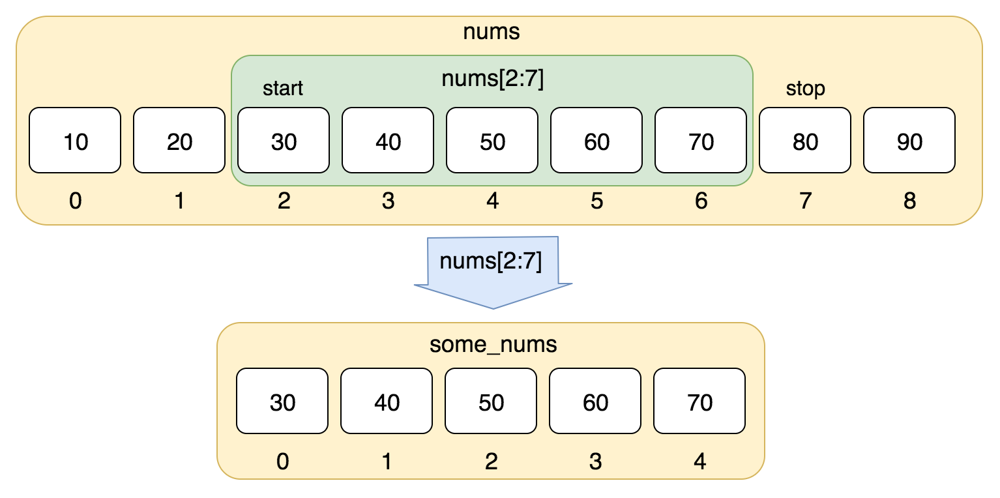
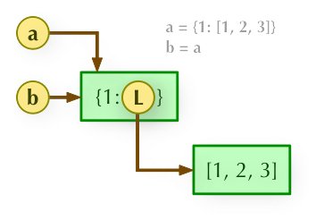
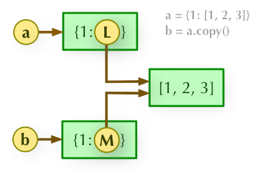
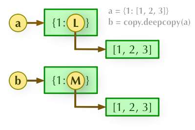

# Python

## General
``` python
# Define your interpreter
#!/usr/bin/python3


# Identity operators: 'is' checks if memory addresses are the same
# Output: true
a = 20
b = 20
print(a is b)

# Output: false
a = [1, 2]
b = [1, 2]
print(a is b)


# String

# String join
# This will result in an error
a = (1,2)
print("-".join(a))
# This works - needs string type
a = ("1","2")
print("-".join(a))

# String split
s = "apple,banana,orange"
print(s.split(","))  # Output: ['apple', 'banana', 'orange']


# List
# Output: 98765432
str='123456789'
print(str[-1:0:-1]) 

# Output: 987654321
print(str[-1::-1])    
print(str.reverse())

# Remove: element at index
list.pop(index)
# Remove: element with value
list.remove(value)

# Sort: default ascending, reverse for descending
list.sort(reverse=True)

# Append: adds as a new last element
# Returns [..., ["a", "b"]]
list.append(["a","b"])

# Extend: adds all elements
# Returns [..., "a", "b"]
list.extend(["a","b"])
list = list + ["a","b"]

# Find index of first matching item in list
list.index(obj)
# Insert object into list
list.insert(index, obj)
# Count occurrences of an element in the list
list.count(obj)

# Enumerate function
a = ["Geeks", "for", "Geeks"]
for i, name in enumerate(a):
   print(f"Index {i}: {name}")

# Iterator: iter()
# Memory advantage - processes one element at a time without loading all data into memory
list=[1,2,3,4]
it = iter(list)  
for i in it:
   print(i)


# Dictionary
# Special construction methods
dict = dict()
dict = {}
>>> dict([('Runoob', 1), ('Google', 2), ('Taobao', 3)])
{'Runoob': 1, 'Google': 2, 'Taobao': 3}
>>> {x: x**2 for x in (2, 4, 6)}
{2: 4, 4: 16, 6: 36}
>>> dict(Runoob=1, Google=2, Taobao=3)
{'Runoob': 1, 'Google': 2, 'Taobao': 3}

# Delete dictionary elements
dict.pop(key)
dict.pop(key, default)
del dict[key]

# Get/Set or Default
dict.get(key,default)
dict.set(key,default)

# Items: returns a list of key-value pairs [(key1, value1), (key2, value2), ..]
dict.items()
for key, values in dict.items():
   pass

dict.keys()
dict.values()


# Tuple (immutable)
# Tuples are similar to lists, but their elements cannot be modified
tuple = ( 'abcd', 786 , 2.23, 'runoob', 70.2  )
# Delete tuple
del tuple

# Set (unordered, mutable, unique elements)
# In Python, Sets are unordered, mutable data types used to store unique elements
sites = {'Google', 'Taobao', 'Runoob', 'Facebook', 'Zhihu', 'Baidu'}

# Set operations
a = set('abracadabra')
b = set('alacazam')
print(a - b)     # Difference between a and b
print(a | b)     # Union of a and b
print(a & b)     # Intersection of a and b
print(a ^ b)     # Elements in a or b but not in both

# Python 3.10
# case _ represents default
match subject:
   case <pattern_1>:
       <action_1>
   case <pattern_2>:
       <action_2>
   case <pattern_3>:
       <action_3>
   case _:
       <action_wildcard>


# do-while loop workaround
while True:
   # Loop body
   print("This code executes at least once")
   
   # Condition check
   if not condition:  # If condition not met, exit loop
       break

# List comprehension
[expression for variable in list] 
[out_exp_res for out_exp in input_list]

or 

[expression for variable in list if condition]
[out_exp_res for out_exp in input_list if condition]

# Anonymous functions
x = lambda a : a + 10
print(x(5))
x = lambda a, b : a * b
print(x(5, 6)) 

# Decorator: enhance or modify function behavior without changing original code
# @classmethod and @staticmethod are decorators
def log_function_call(func):
   def wrapper(*args, **kwargs):
       print(f"Calling {func.__name__}")
       result = func(*args, **kwargs)
       print(f"Finished {func.__name__}")
       return result
   return wrapper
@log_function_call
def add(a, b):
   return a + b

def memoize(func):
   cache = {}
   def wrapper(*args):
       if args not in cache:
           cache[args] = func(*args)
       return cache[args]
   return wrapper
@memoize
def fibonacci(n):
   if n <= 1:
       return n
   return fibonacci(n-1) + fibonacci(n-2)


# Class variables and instance variables
# Class variables are shared among different instances
# Instance variables are not shared among different instances
class MyClass:
    # This is a class variable
   class_variable = "I am a class variable" 
   
   def __init__(self):
       # This is an instance variable
       self.instance_variable = "I am an instance variable"

   # Class method
   @classmethod
   def update_var(cls, new_value):
       cls.class_var = new_value
   # Static method
   @staticmethod

# Equivalent to Java's function entry:
public static void main(String[] args){

}
if __name__ == "__main__":
```

### List indexing
- nums[2:7] does not include the element at index 7.


### Copy
1) Shallow copy: copies only the address

2) Shallow copy: deep copies the parent object (first level), but not child objects (second level), child objects are references

3) Deep copy: a and b completely copy both parent and child objects, they are completely independent



## Package Management with `pip`
```bash
# List all installed packages
pip list
```

## Asynchronous Programming in Python
https://blog.csdn.net/qq_43380180/article/details/111573642

## Pandas
Pandas is a package of Python.
```python
pd.merge(customers, orders, left_on="id", right_on="customerId", how="left")
DataFrame.join(other, on=None, how='left', lsuffix='', rsuffix='', sort=False, validate=None)
# Inplace parameter determines whether to perform the operation in place
DataFrame.drop_duplicates(subset=['author_id'], inplace=False) 
DataFrame.rename(columns={"name":"Customers"})
DataFrame.sort_values(by="id",ascending=True)
DataFrame["customerId"].isnull()
```