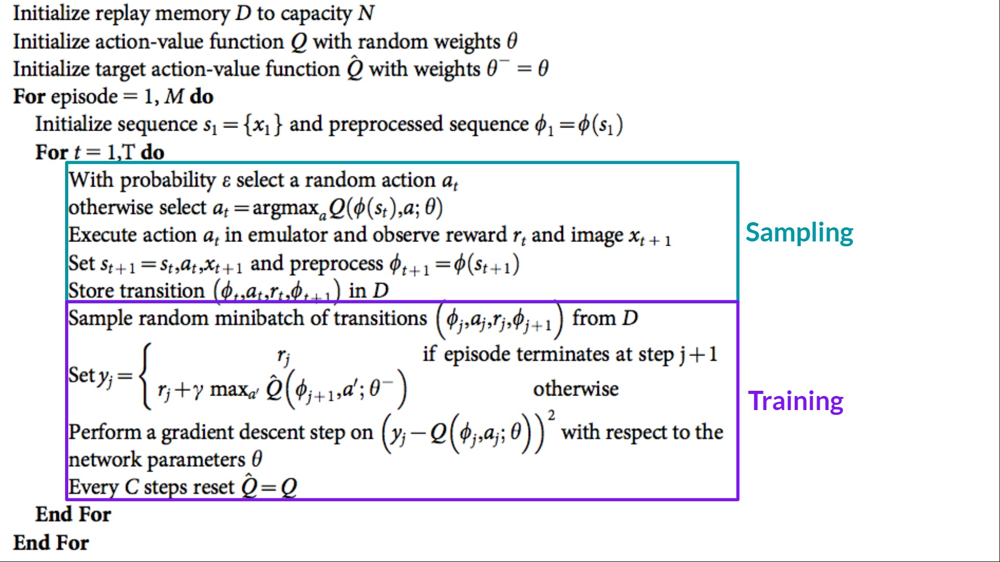

# Reinforcement Learning

Reinforcement Learning is my favorite, but it is also the most difficult to understand compared to CV and NLP. I will skip POMDP for now, and focus on MDP in this note.

- Most references come from COMP90051 AI Planning & Autonomy (University of Melbourne): https://gibberblot.github.io/rl-notes/index.html#
- Some references come from Hugging Face RL Course: https://huggingface.co/learn/deep-rl-course/unit0/introduction
- Starting from Policy Gradient, I recommend reading the classic RL book by Sutton and Barto.
- Also some references from blogs on Zhihu and CSDN.

## Table of Contents
- [Foundations](#foundations)
- [Classification](#classification)
- [Algorithms](#algorithms)
    - [Value Iteration](#1-value-iteration)
    - [Multi-armed Bandit](#2-multi-armed-bandit)
    - [Monte-Carlo Reinforcement Learning](#3-monte-carlo-reinforcement-learning)
    - [Temporal Difference Methods](#4-temporal-difference-methods)
        - [Q-Learning](#)
        - [SARSA](#)
    - [Monte-Carlo Tree Search](#5-monte-carlo-tree-search)
    - [Q-Function Approximation](#6-q-function-approximation)
        - [Deep Q-Learning](#deep-q-learning)
    - [Reward Shaping](#7-reward-shaping)
    - [Policy Iteration](#6-policy-iteration)
    - [Policy Gradient](#7-policy-gradient)
        - [REINFORCE](#reinforce)
        - [Actor Critic](#actor-critic)
    - [Backward Induction (MinMax)](#backward-induction-minmax)

## Foundations
1) **Markov Decision Process (MDP)**

    A **Markov Decision Process** (MDP) is a **fully observable**, **probabilistic** state model. The most common formulation of MDPs is a **Discounted-Reward Markov Decision Process**. A discounted-reward MDP is a tuple $(S, s_0, A, P, r, \gamma)$ containing:
    -   a state space $S$;
    -   an initial state $s_0 \in S$;
    -   actions $A(s) \subseteq A$ applicable in each state $s \in S$ that our agent can execute;
    -   **transition probabilities** $P_a(s' \mid s)$ for $s \in S$ and $a \in A(s)$;
    -   **rewards** $r(s,a,s')$ positive or negative of transitioning from state $s$ to state $s'$ using action $a$; and
    -   a **discount factor** $0 \leq \gamma < 1$.
    - `Why should the discount factor be less than 1?` 
        - To avoid the agent getting stuck in a loop with repeated rewards from the same state.

---
2) **Value Function - V(s)**
   Refers to the Bellman Equation. It gives the maximum expected return (reward) from a given state, assuming the agent follows the optimal policy thereafter.

    - The Bellman Equation has two layers:
        - Traverse all possible actions from the state and then sum up the possible next states (you will see that many of the transition probabilities $P_a(s' \mid s)$ are zero).

$$
V(s) = \max_{a \in A(s)} \sum_{s' \in S} P_a(s' \mid s)\ [r(s,a,s') + \gamma\  V(s')]
$$

$$
V(s) = \overbrace{\max_{a \in A(s)}}^{\text{best action from $s$}} \overbrace{\underbrace{\sum_{s' \in S}}_{\text{for every state}} P_a(s' \mid s) [\underbrace{r(s,a,s')}_{\text{immediate reward}} + \underbrace{\gamma}_{\text{discount factor}} \cdot  \underbrace{V(s')}_{\text{value of } s'}]}^{\text{expected reward of executing action $a$ in state $s$}}
$$

- $V(s)$: The value function for state $s$
- $\max$: Represents selecting the action that maximizes the value among all possible actions $a$
- $a \in A(s)$: The set of actions available in state $s$
- $\sum_{s' \in S}$: Summing over all possible next states $s'$
- $P_a(s' \mid s)$: The probability of transitioning from state $s$ to state $s'$ by taking action $a$
- $r(s, a, s')$: The immediate reward for transitioning from state $s$ to state $s'$ by taking action $a$
- $\gamma$: Discount factor, the degree of decay for future rewards, within the range $[0, 1]$
- $V(s')$: The value function of the next state $s'$

----
3) **Q Function - Q(s, a)**
Represents the expected maximum return achievable from a given state $s$ by taking action $a$ and then following the optimal policy.

$$
Q(s,a) = \sum_{s' \in S} P_a(s' \mid s)\ [r(s,a,s') + \gamma\  V(s') ]
$$

- $Q(s, a)$: The value function of taking action $a$ in state $s$
- $\sum_{s' \in S}$: Summing over all possible next states $s'$
- $P_a(s' \mid s)$: The probability of transitioning from state $s$ to state $s'$ by taking action $a$
- $r(s, a, s')$: The immediate reward for transitioning from state $s$ to state $s'$ by taking action $a$
- $\gamma$: Discount factor, the decay for future rewards, within the range $[0, 1]$
- $V(s')$: The value function of the next state $s'$ 

---
4) **Deterministic Policy - $π(s)$**
    - Given a state $s$, the policy $π(s)$ returns the action that maximizes the expected reward.
>  $π(s)$ returns the best action, $v(s)$ returns the maximum expected value.

5) **Stochastic Policies - $π(s,a)$**
    - This means that for a given state $s$, the policy $π(s,a)$ assigns a probability to each action $a$, indicating how likely the agent is to select each action.

## Classification

### Policy-based Methods
Directly train the policy to learn what action to take in a given state.

### Value-based Methods
Train a value function to learn which states are more valuable, and use this value function to select actions that lead to higher value states.

---
### Model-based Methods
Directly obtain the transition function (matrix) and the reward function. Examples include value iteration and policy iteration.

### Model-free Methods
Obtain the transition function and reward function through experience, by trying actions first. Examples include Q-learning, SARSA, and Monte Carlo methods.

---

### On-policy
Reinforcement learning methods that update the value function or policy based on the current policy, such as SARSA, which updates $V(s)$ based on the current policy or episode.

### Off-policy
Reinforcement learning methods that update the value function based on data or policies different from the current one, such as Q-learning, which updates based on the optimal $V(s)$.

---
### Online Planning
Planning is done before taking an action, based on the most recent information from the current state to calculate the next optimal action. Examples: MCTS, A*.

### Offline Planning
Before taking any action, the agent has already computed the optimal strategy for all possible situations. Examples: value iteration, policy iteration, SARSA, Q-learning.

## Algorithms

### 1) Value Iteration
Traverse all states, try actions for each state, compute $Q(s, a)$, then update $V(s) = \max Q(s, a)$. Through repeated iterations, update $V(s)$ to gradually approach the true value.

```math
\begin{array}{l}
  \textbf{Input:}\ \text{MDP}\ M = \langle S, s_0, A, P_a(s' \mid s), r(s,a,s')\rangle\\
  \textbf{Output:}\ \text{Value function}\ V\\[2mm]
  \text{Set}\ V\ \text{to arbitrary value function; e.g., }\ V(s) = 0\ \text{for all}\ s\\[2mm]
  \textbf{Repeat:} \\
  \quad\quad \Delta \leftarrow 0 \\
  \quad\quad \textbf{For each}\ s \in S \\
  \quad\quad\quad\quad \underbrace{V'(s) \leftarrow \max_{a \in A(s)} \sum_{s' \in S}  P_a(s' \mid s)\ [r(s,a,s') + 
 \gamma\ V(s') ]}_{\text{Bellman equation}} \\
  \quad\quad\quad\quad \Delta \leftarrow \max(\Delta, |V'(s) - V(s)|) \\
  \quad\quad V \leftarrow V' \\
  \textbf{Until:}\ \Delta \leq \theta 
\end{array}
```

### 2) Multi-armed Bandit Algorithm (MAB)
In the MAB problem, typically no complete episodes are involved. Instead, an action is executed, and the expected reward is calculated.

### 3) Monte-Carlo Reinforcement Learning (Updating Q-Function)
Generate episodes using methods like MAB (state-action chains from start to end), then update from the back, using the reward of the episode to update the Q-function. Monte Carlo uses the episode's reward for updates, while Temporal Difference (such as Q-learning, SARSA) uses $V(s')$ for updates.

### 4) Temporal Difference (TD) Methods

$$
Q(s,a) \leftarrow \underbrace{Q(s,a)}_\text{old value} + \overbrace{\alpha}^{\text{learning rate}} \cdot [\underbrace{\overbrace{r}^{\text{reward}} + \overbrace{\gamma}^{\text{discount factor}} \cdot V(s')}_{\text{TD target}} - \overbrace{Q(s,a)}^{\text{do not count extra } Q(s,a)}]
$$
- Unlike Monte Carlo, TD updates $Q(s,a)$ using $V(s')$, not the episode's value.
- **Q-Learning (Off-Policy)**: Generates episodes based on MAB and updates $Q(s,a)$ using $max Q(s', a')$, maximizing future rewards for updates.

- **SARSA (On-Policy)**: Updates $Q(s,a)$ according to the action $a'$ chosen by the current policy.

Summary: SARSA gradually converges to the optimal policy, and MAB updates as it selects actions.

### 5) Monte-Carlo Tree Search (MCTS)
MCTS is a model-based method that can directly observe the transition matrix. It solves problems in four stages:

- **Selection**: Continuously selects children until one is not fully expanded (i.e., not all (state, action) pairs have been explored).
- **Expansion**: Selects an unexplored action, expands to a new state, and creates a new node.
- **Simulation**: From the expanded node, performs a random simulation (e.g., randomly selecting actions until the game ends), estimating the return for the current path.
- **Back-propagation**: Propagates the simulated return back along the path, updating the statistics for each node in the tree.

---

### 6) Q-Function Approximation (Updating Q-Function)
- Q-function approximation estimates the Q-function using function approximation, typically used for large state spaces.
> Guarantees convergence but does not guarantee optimality for non-linear problems.
- Q-values from linear Q-functions
    $$
    \begin{array}{lll}
    Q(s,a) & = & f_1(s,a) \cdot w^a_1 + f_2(s,a)\cdot w^a_2 + \ldots  + f_{n}(s,a) \cdot w^a_n\\
            & = & \sum_{i=0}^{n} f_i(s,a) w^a_i
    \end{array}
    $$

- The loss function aims to minimize the error between the current Q-function estimate and the target Q-value.
    $$ L(w) = \frac{1}{2} \left( r(s, a, s') + \gamma \cdot \max_{a'} Q(s', a'; w') - Q(s, a; w) \right)^2
    $$

    - $f_n(s,a)$ represents the specific value of features.
        - For example, it could be the distance between my car and the one in front of me; it could also be the speed or acceleration of the car in front.
        - It could also be the distance after taking an action.
    - $w^a_n$ represents the coefficients of features.
        - We need to estimate or learn this value.

----
#### Q-function Update
- For initialization, set all weights to 0.
- For updates, use the update rule where $w^a_i$ is initialized to 0 and $\alpha$ is the learning rate.

    $\quad\quad$ For each state-action feature $i$\
    $\quad\quad\quad\quad w^a_i \leftarrow w^a_i + \alpha \cdot \delta \cdot \ f_i(s,a)$
    - **This is essentially the same update rule as for linear regression weights.**

- The $\delta$ for Q-Learning **(actually, $\delta$ is the derivative of the loss function $L(w)$)**
    $$ \delta = r(s, a, s') + \gamma \cdot \max_{a'} Q(s', a') - Q(s, a)$$
- The $\delta$ for SARSA **(also the derivative of the loss function $L(w)$)**
    $$\delta = r(s, a, s') + \gamma \cdot Q(s', a') - Q(s, a)$$
----
#### Deep Q-Learning
Use neural networks for $\theta$ updates:
$$
\theta \leftarrow \theta + \alpha \cdot \delta \cdot \nabla_{\theta} Q(s, a; \theta)
$$
where $\nabla_{\theta} Q(s, a; \theta)$ is the gradient of the Q-function (the partial derivative of the loss function with respect to the features $\theta$).



- How does Deep Q-Learning work? You can think of it as taking the linear combination of $Q(s,a)$ features from linear Q-learning and then passing them through an MLP to output $Q(s,a)$.
- The output layer size is the number of actions for the given state.
- By inserting a non-linear activation function, we can fit a non-linear model!

> Deep Q-learning does not guarantee convergence.

- Advantages (compared to linear Q-function approximation):
    - **Feature selection**: We don't need to manually select features, as the hidden layers of the neural network automatically learn the "features."
    - **Unstructured data**: The state $s$ can be more unstructured, such as images or image sequences (videos).

- Disadvantages:
    - **Convergence**: There is no guarantee of convergence.
    - **Large data requirements**: Deep neural networks require more data because they not only need to learn the "Q-function" but also the features. As a result, learning a good Q-function may be more difficult than using well-chosen features in linear approximations. This usually requires significant computational resources.

----
#### Q-function Approximation Advantages:

- **Memory**: Compared to the Q-table, deep Q-functions have a more efficient representation, as we only need to store the weights/parameters of the Q-function instead of a Q-table of size $|A| \times |S|$.
- **Q-value propagation**: We don't need to perform actions in state $s$ to get the value of $Q(s, a)$, as the Q-function has generalization capabilities.

#### Q-function Approximation Disadvantages:

- **Q-function is only an approximation**: The Q-function is currently just an approximation of the actual Q-function, and states sharing feature values may have the same Q-value according to the Q-function, but their actual Q-values may differ according to the (unknown) optimal Q-function.

----
### 7) Reward Shaping

In the initial state, rewards may be sparse. For example, in chess, you only get a reward when capturing the opponent's king. With sparse rewards, the model may randomly explore actions at the start, making it difficult to find and approach the optimal solution.

- Two methods to optimize sparse environments:
    1. **Reward Shaping**: If rewards are sparse, we can modify/enhance the reward function, rewarding actions we believe will bring the problem closer to the solution.
    - For example, in chess, we might reward 4 points for capturing an opponent's rook and 3 points for capturing a cannon, meaning we use Domain Knowledge for Reward Shaping (essentially adding Heuristics).
    
    2. **Q-value Initialization**: We can "guess" a good Q-function at the start and initialize $Q(s, a)$ with that value, which will guide the learning algorithm.

- Reward Shaping Formula
    $$Q(s,a) \leftarrow Q(s,a) + \alpha [r + \underbrace{F(s,s')}_{\text{additional reward}} + \gamma \max_{a'} Q(s',a') - Q(s,a)]$$
    - $G^{\Phi} = \sum_{i=0}^{\infty} \gamma^i (r_i + F(s_i,s_{i+1}))$ is the shaped reward for the entire episode.
    - $F(s,s')>0$ is a positive reward, encouraging us to exploit an action from $s$ to $s'$.
    - $F(s,s')<0$ is a negative reward, discouraging us from exploiting an action from $s$ to $s'$.

----
#### Potential-based Reward Shaping

Potential-based reward shaping is a particular type of reward shaping with nice theoretical guarantees. In potential-based reward shaping, $F$ is of the form:

$$F(s,s') = \gamma \Phi(s') - \Phi(s)$$

We call $\Phi$ the **potential function** and $\Phi(s)$ is the **potential** of state $s$.

So, instead of defining $F : S \times S \to \mathbb{R}$, we define $\Phi : S \to \mathbb{R}$, which is some heuristic measure of the value of each state $s \in S$. (The space size changes from $S \times S$ to $S$)

**Theoretical guarantee**: This will still converge to the optimal policy under the assumption that all state-action pairs are sampled infinitely often.

`Example:`
$$
\Phi(s) = 1 - \frac{|x(g) - x(s)| + |y(g) - y(s)|}{width + height - 2}
$$
- You need to move towards lower potential, so use $(1 - ..)$.
- $x(g)$ is the $x$ coordinate of the Goal State.
- $y(g)$ is the $y$ coordinate of the Goal State.

Starting at $(1,0)$, Goal State $(3,2)$.
Using Manhattan distance as heuristics, the potential of the start point $(1,0)$ is $1-(|3-1|+|2-0|)/4+3-2 = 4/5$, the potential at $(0,0)$ is 1, and the potential at the Goal State $(3,2)$ is 0.
We want to move towards the lower potential, so reward shaping will guide us from $(1,0)$ towards $(3,2)$, rather than $(0,0)$.

> **Evaluation**: The "Reward Shaping" method heavily relies on "Domain Knowledge," which means we need to select features appropriately.

#### Q-function Initialization
 - Initialize a Q-value to make it close to the optimal Q-value.

----
### 6) Policy Iteration (Direct Policy Update)
 - A policy-based method: directly updates the policy.
 - A model-based method: Can directly observe the Reward and Transition Function.
 - Initially starts with a non-optimal policy (e.g., Random Policy), then gradually updates towards the optimal policy.
 - `Method`: Composed of two parts: Policy Evaluation and Policy Improvement.
 1) **Policy Evaluation:**
    - Traverse all states, updating $V^\pi(s)$ based on the policy's $V^\pi(s')$ and other parameters.
    $$V^\pi(s) =  \sum_{s' \in S} P_{\pi(s)} (s' \mid s)\ [r(s,a,s') +  \gamma\ V^\pi(s') ]$$

 2) **Policy Improvement:**
    - Traverse each state and action, updating the policy by selecting the action with the highest $Q^\pi(s, a)$ based on the policy.
    $$Q^{\pi}(s,a)  =  \sum_{s' \in S} P_a(s' \mid s)\ [r(s,a,s') \, + \,  \gamma\ V^{\pi}(s')]$$
    $$ Update:  \pi(s) \leftarrow \textrm{argmax}_{a \in A(s)}Q^{\pi}(s,a)$$
 3) Perform Policy Evaluation + Policy Improvement until changes are smaller than a threshold or a set number of iterations.

---
### 7) Policy Gradient
 - Model-free method
 - `Two key characteristics:`
    1) The function must be **differentiable**.
    2) Typically, policies are **stochastic**, with $π(s,a)$ returning a probability.

The goal of gradient ascent is to find weights for a policy function $\pi_{\theta}(s, a)$ that maximize the expected return.

The expected value of a policy $\pi_{\theta}$ with parameters $\theta$ is defined as:

$$J(\theta) = V^{\pi_{\theta}}(s_0)$$

- $s_0$ is the starting point.
- The parameter $\theta$ defines $\pi_{\theta}(s, a)$.
- The objective function is to maximize $J(\theta) = V^{\pi_{\theta}}(s_0)$.
- In policy gradient, the optimization goal is to adjust the policy parameters $\theta$ via gradient ascent to maximize the expected cumulative reward starting from the initial state.

----
Given a policy objective function $J(\theta)$, the **policy gradient** with respect to $\theta$, written $\nabla_{\theta}J(\theta)$ is defined as:
$$
\nabla_{\theta}J(\theta) = \begin{pmatrix} \frac{\partial J(\theta)}{\partial \theta_1} \\ \vdots \\ \frac{\partial J(\theta)}{\partial \theta_n} \end{pmatrix}
$$
where $\frac{\partial J(\theta)}{\partial \theta_i}$ is the partial derivative of $J$ with respect to $\theta_i$.

Update Method for $J(\theta)$:
$$\theta \leftarrow \theta + \alpha \nabla J(\theta)$$
where $\alpha$ is the learning rate.

---
The **policy gradient theorem** (see Sutton and Barto, Section 13.2) says that for any differentiable policy $\pi_{\theta}$, state $s$, and action $a$, the gradient $\nabla J(\theta)$ is:

- For continuous action space:
    $$\nabla J(\theta) = \mathbb{E}[(\nabla_{\theta}\ \textrm{ln} \pi_{\theta}(s, a)  Q(s,a))]$$

- For discrete action space:
    $$
    \nabla J(\theta) = \sum_s d^{\pi}(s) \sum_a \pi_{\theta}(s, a) \nabla_{\theta} \ln \pi_{\theta}(s, a) Q(s, a)
    $$

    where $d^{\pi}(s)$ is the steady-state distribution of state $s$, representing the probability of the agent being in state $s$ under policy $\pi_{\theta}$.

The expression $\ln \pi_{\theta}(s, a)$ tells us how to adjust the weights $\theta$: if the Q-value for selecting action $a$ in state $s$ is positive, we increase the probability of selecting that action; otherwise, we decrease it. Therefore, it represents the expected return for taking action $\pi_{\theta}(s, a)$ multiplied by the gradient.

Since we estimate probabilities with our policy, we use the expected value $\mathbb{E}$ for the Q-value.

---
Assuming we have two actions $a_0$ and $a_1$ at state $s$, we can use logistic regression to compute their probabilities (simplified here, multiple actions would use Softmax):
$$
\begin{aligned}
        \pi_{\theta}(s, a_0) &= \frac{1}{1 + e^{-\theta \cdot s}}\\[1mm]
        \pi_{\theta}(s, a_1) &= 1 - \pi_{\theta}(s, a_0) 
\end{aligned}
$$

These formulas allow us to compute $\nabla \ln \pi_{\theta}(s, a)$ for $\theta$:
$$
\begin{aligned}
  \nabla \ln \pi_{\theta}(s, a_0) &= s - s\cdot \pi_{\theta}(s, a_0)\\[1mm]
  \nabla \ln \pi_{\theta}(s, a_1) &= -s \cdot \pi_{\theta}(s, a_0)
\end{aligned}
$$

`Key Points:`
- REINFORCE gradient for $\theta$:
    $$
    \nabla_{\theta} J(\theta) = \sum_{t} \nabla_{\theta} \ln \pi_{\theta}(s_t, a_t) G_t
    $$
    - $G_t$ is the total discounted future reward calculated from the episode.
- Actor Critic gradient for $\theta$:
    $$
    \nabla_{\theta} J(\theta) = \sum_{t} \nabla_{\theta} \ln \pi_{\theta}(s_t, a_t) \left( A(s,a) \right)
    $$

    - $A(s,a)=Q(s,a)−V(s)$ is the advantage function, which evaluates whether action $a$ in state $s$ is better and more advantageous than the average.
    - $G_t - V(s_t)$ is the estimate of the advantage function.

----
#### REINFORCE

$$
\begin{array}{l}
\textbf{Input:}\  \text{A differentiable policy}\ \pi_{\theta}(s,a),\\ \text{an MDP}\ M = \langle S, s_0, A, P_a(s' \mid s), r(s,a,s')\rangle\\
\textbf{Output:}\  \text{Policy}\ \pi_{\theta}(s,a)\\\\[2mm]
\text{Initialise parameters}\ \theta\ \text{arbitrarily}\\[2mm]
\textbf{Repeat:}\\
\quad\quad \text{Generate episode}\ (s_0, a_0, r_1, \ldots s_{T-1}, a_{T-1}, r_T)\ \text{by following}\ \pi_{\theta}\\
\quad\quad \textbf{For each}\ (s_t, a_t)\ \text{in the episode:}\\
\quad\quad\quad\quad G \leftarrow \sum_{k=t+1}^{T} \gamma^{k-t-1} r_k\\
\quad\quad\quad\quad \theta \leftarrow \theta + \alpha \gamma^{t} G\ \nabla\ \ln\ \pi_{\theta}(s_t, a_t)\\
\textbf{Until}\ \pi_{\theta}\ \text{converges}
\end{array}
$$

**REINFORCE** algorithm (an on-policy algorithm) generates an entire episode (episode) by following the current policy, and as the policy $\pi$ improves, it generates better and better policies. It then traverses each action in the episode, calculating $G$, the future discounted return for that trajectory. Using this return, it calculates the gradient of the policy and updates it in the direction of $G$.

- **REINFORCE** uses the most recently sampled action and its reward to calculate the gradient and update, similar to Monte-Carlo Reinforcement Learning, but this is for updating the policy function $\pi_{\theta}(s, a)$.
- **Deep REINFORCE** uses deep learning to fit $J(\theta)$.

----
#### Actor Critic

$$
\begin{array}{l}
\textbf{Input:}\ \text{MDP}\ M = \langle S, s_0, A, P_a(s' \mid s), r(s,a,s')\rangle\\
\textbf{Input:}\ \text{A differentiable actor policy}\ \pi_{\theta}(s,a)\\
\textbf{Input:}\ \text{A differentiable critic Q-function}\ Q_w(s,a)\\
\textbf{Output:}\ \text{Policy}\ \pi_{\theta}(s,a) \\[2mm]
\text{Initialise actor parameters}\ \theta\ \text{and critic parameters}\ w\ \text{arbitrarily}\\[2mm]
\textbf{Repeat (for each episode}\ e\text{):}\\
\quad s \leftarrow\ \text{the first state in episode}\ e\\
\quad \text{Select action}\ a \sim \pi_\theta(s, a)\\
\quad \textbf{Repeat (for each step in episode e):}\\
\quad\quad \text{Execute action}\ a\ \text{in state}\ s\\
\quad\quad \text{Observe reward}\ r\ \text{and new state}\ s'\\
\quad\quad \text{Select action}\ a' \sim \pi_\theta(s', a')\\
\quad\quad \delta \leftarrow r + \gamma \cdot  Q_w(s',a') - Q_w(s,a)\\
\quad\quad w  \leftarrow w + \alpha_w \cdot \delta \cdot \nabla Q_w(s,a)\\
\quad\quad \theta \leftarrow \theta + \alpha_{\theta} \cdot \delta \cdot \nabla \ln\ \pi_{\theta}(s,a)\\
\quad\quad s \leftarrow s'; a \leftarrow a'\\
\quad \textbf{Until}\ s\ \text{is the last state of episode}\ e\ \text{(a terminal state)}\\
\textbf{Until}\ \pi_{\theta}\ \text{converges}
\end{array}
$$
- Actor Critic essentially fits two functions, 
one is the Q-function $Q_w(s,a)$, 
the other is the Policy Function $\pi_{\theta}(s,a)$.
It updates the Q-function parameters while also using the fitted Q-value to update the Policy function's parameters via Temporal Difference.
Compared to REINFORCE above, it does not use its own episode value to update the policy function.
- Actor Critic is also an optimization of Monte-Carlo RL compared to Temporal Difference, as it directly updates the Policy function without waiting for the entire episode to complete.

- The reason actor-critic methods work like this is that the actor policy $\pi_{\theta}$ selects actions, while the critic $Q_w(s,a)$ is only used to calculate the temporal difference estimate for the already selected actions.

> Summary: By using Approximation methods, either for the Q-function or the Policy Function, we avoid updating the Q-table (which is impractical for large state or action spaces).

## Backward Induction (MinMax)
Nothing much to explain, it's just backward induction from game theory.
