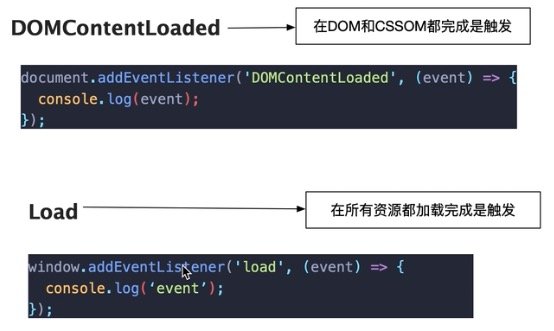
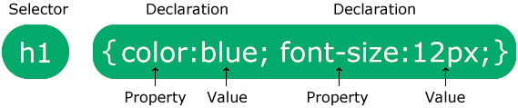

# Web Development

   1. HTML to define the content of web pages
   2. CSS to specify the layout of web pages
   3. JavaScript to program the behavior of web pages

## How to get HTML
1) **URL Analysis**
2) **DNS Analysis**
3) **Establish TCP Connection**
4) **TLS Handshake**
5) **Client: Send HTTP Request**
6) **Server: process HTTP Request**
7) **Server: Produce HTTP Response**
8) **Close Connection or Continue: Depends on the request Headers**

## 注释 Comments
``` bash
// HTML
<!-- abcdefg -->

// CSS
/* abcdefg */
```

## HTTP Request
### 1. 请求行（Request Line）
- HTTP 方法（GET, POST, PUT, DELETE 等）
- 请求 URL 路径
- HTTP 协议版本

### 2. 请求头（Headers）
- **Content-Type**: 内容类型，如 application/json, application/x-www-form-urlencoded
- **Accept**: 客户端能够处理的内容类型
- **Authorization**: 认证信息
- **User-Agent**: 客户端信息
- **Cookie**: 客户端 Cookie
- **Host**: 请求的主机名
- **Referer**: 请求来源页面
- **Content-Length**: 请求体的长度
- **Cache-Control**: 缓存控制

### 3. 请求体（Body）
- 对于 POST/PUT 请求，通常包含要发送的数据
- 可以是 JSON、表单数据、XML 等格式

### 4. URL 参数
- **查询参数（Query parameters）**: 出现在 URL 中 ? 后面的参数
- **路径参数（Path parameters）**: 集成在 URL 路径中的参数

### 5. Cookie
- 浏览器存储的小块数据

## HTML
1) **Element**
    - ID, Class 和 Tag
      - ID 相比于class只有一个
      - Tag 就是 HTML 内置的标签
    - document.getElementsByClassName 随 DOM 变化而变化
    - document.querySelector(selector) 属于一次性查询

  | 方法 | 返回值 | 选择器支持 | 适用场景 |
  |---|---|---|---|
  | `document.querySelector(selector)` | 返回匹配的第一个元素（如果找不到则返回 `null`） | 支持 CSS 选择器（如 `.class`、`#id`、`tag`、`[attribute]` 等） | 适用于 **只需要一个** 元素时 |
  | `document.querySelectorAll(selector)` | 返回所有匹配的元素的 `NodeList`（静态） | 支持 CSS 选择器 | 适用于 **需要多个** 元素，但不需要动态更新 |
  | `document.getElementsByClassName('.myClass')` | 返回所有匹配的元素的 `HTMLCollection`（动态） | 仅支持类名 | 适用于 **获取多个 class 选择的元素，并且希望其动态更新** |
  | `document.getElementsByTagName('span')` | 返回所有匹配的元素的 `HTMLCollection`（动态） | 仅支持标签名 | 适用于 **获取多个同类型标签，并希望其动态更新** |

```javascript
var e = document.getElementsByClassName('myClass');
var e = document.getElementsByID('myId')
var e = document.getElementsByTagName('span')

var e = document.querySelector('.myClass')
var e = document.querySelectorAll('span')

// 节点关系
parentNode: 返回节点的父节点
childNodes: 返回节点的所有子节点列表
firstChild: 返回节点的第一个子节点
lastChild: 返回节点的最后一个子节点
nextSibling: 返回节点后面紧跟的同级节点
previousSibling: 返回节点前面紧跟的同级节点

// 子节点操作
appendChild(node): 在节点的子节点列表末尾添加一个新的子节点
removeChild(node): 从节点的子节点列表中删除一个子节点
replaceChild(newNode, oldNode): 用一个新节点替换节点的子节点列表中的一个子节点

// 属性操作
getAttribute(name): 返回节点指定属性的值
setAttribute(name, value): 设置节点指定属性的值
hasAttribute(name): 检查节点是否具有指定属性
removeAttribute(name): 从节点中删除指定属性

// 文本和节点信息
innerText: 获取或设置元素节点内的文本内容
nodeName: 返回节点的名称
nodeType: 返回节点的类型
nodeValue: 返回节点的值（对于文本节点和注释节点）
```

2) **Critical Rendering Tree 关键渲染路径**
    1) **Step1: DOM tree construction**
        - Using sync() does not block the parsing of DOM tree
    2) **Step2: CSSOM tree construction**
    3) **Step3: Render Tree**
        - Step 3.0: JavaScript Compilation: Execute JavaScript
        - display: none 的元素（不会出现在 Render Tree，但仍在 DOM Tree）
       - meta 标签、script 标签（不会在render tree显示）
    4) **Step4: Layout Calculation**
    5) **Step5: Print Execution**

  

3) **使用React的"update"的Critical Rendering Tree 关键渲染路径**
  1) **Step 1: 生成 Virtual DOM**
  2) **Step 2: 执行 Diff 算法 (Virtual DOM vs 旧 Virtual DOM)**
  3) **Step 3: 计算并且批量更新Batch Update (Real DOM)**
  4) **Step 4: Layout 和 Repaint**

## Web Rendering

1) **Server-side Rendering (SSR) 服务器端渲染**

    - Friendly to Search Engine Optimazation
    - **优点：**
      - SEO 友好：搜索引擎可以直接爬取完整的 HTML 页面。
      - 数据最新：每次请求都会获取最新数据。
      - 首屏加载更快：因为 HTML 是服务器直接渲染的，减少了前端 JavaScript 的工作量。

    - **缺点：**
      - 服务器压力大：每个请求都要重新渲染 HTML，服务器负担较重。
      - 响应速度可能较慢：特别是 API 请求慢时，用户需要等待服务器返回完整 HTML。

2) **Client-side Rendering (CSR) 客户端渲染**
    - Friendly to the resources of server
    - Friendly to a lot of data update
    - Not friendly to Search Engine Optimazation

3) **Static Site Generation (SSG) 预渲染静态页面**
    - **直接预先在构建(Build)的时候生成HTML**
    - **对比 SSR ，在请求后创建 HTML 有所不同**
    - HTML pre-render in the server
    - Friendly to no data update
    - Friendly to the resources of server

4) **Incremental Static Regeneration (ISR) 增量静态再生**
    - 允许 SSG（Static Site Generation）生成的静态页面在后台自动更新，
    从而兼顾 SSG 的高性能和 SSR 的实时性。

## CSS


### CSS Syntax
  1) tag selector
  2) id selector
      ```css
      #para1 {
        text-align: center;
        color: red;
      }
      ```
  3) class selector
      ``` css
      .center {
        text-align: center;
        color: red;
      }
      ```
  4) Other Combinations
      ``` css
      p.uppercase {
        /* 选择 class="uppercase" 的 <p> 标签 */
      }
      .uppercase p{ 
        /* 选择 class="uppercase" 内部的 <p> 子元素 */
      }
      p .uppercase{
        /* 选择 <p> 内部 class="uppercase" 的子元素 */
      }

      p#intro {
        /* 选择特定 id 的 <p> */
      }
      ```

### Position 位置
1) static (by default)

    - Static positioned elements are not affected by the top, bottom, left, and right properties.

2) relative 
    - Positione
    d relative to its normal position

3) fixed
    - It always stays in the same place even if the page is scrolled:

4) absolute

5) sticky


### Overflow 溢出


## UI/UX (User Interface, User Experience)
1) Consistency
2) Clarity
3) Intuitiveness 
4) Feedback
5) Accessability
6) Flexibility
7) Visual Hierarchy
8) Error Prevention


## 架构模式
| **架构模式** | **适用场景** | **关键特点** |
|-------------|------------|------------|
| **MVC** | 传统 Web 应用、后台管理系统 | 结构清晰，前后端分离程度适中 |
| **MVVM（Model-View-ViewModel）** | 前端框架（Vue.js、Angular） | ViewModel 负责数据绑定，减少 DOM 操作 |
| **MVP（Model-View-Presenter）** | 移动应用、桌面应用 | Presenter 替代 Controller，更强的解耦 |
| **三层架构（Controller-Service-DAO）** | 企业级 Web 应用 | 在 MVC 之上增加 Service 层，提升可扩展性 |

## MVC框架
1) **Model（模型）**

    - 负责数据管理，包括数据库操作、业务逻辑、数据处理等。
    - 例如，在用户管理系统中，User 模型可能包含用户的 id、name、email 等信息，并且提供数据的CRUD操作。

2) **View（视图）**

    - 负责界面展示，用户可以通过视图看到数据的可视化结果。
    - 主要涉及 HTML、CSS、JavaScript，可能结合前端框架（如 Vue.js、React）。
    - 例如，在用户管理系统中，一个视图可能是显示用户列表的网页。

3) **Controller（控制器）**

    - 负责处理用户输入，调度 Model 和 View，使其协同工作。
    - Controller 接受用户的请求，调用 Model 获取数据，并将数据传递给 View 进行渲染。
    - 例如，在用户管理系统中，当用户访问 /users，Controller 可能会调用 User 模型获取用户列表，并返回 HTML 页面。

## MVC 工作流程
1. 用户请求 (Request)
    - 用户在浏览器输入 URL（如 www.example.com/users），该请求会发送到服务器。

2. Controller 处理请求
    - Controller 解析请求，并调用相应的 Model 获取数据。

3. Model 处理数据
    - Model 查询数据库或执行业务逻辑，并将结果返回给 Controller。

4. Controller 调用 View
    - Controller 选择适当的 View，并传递 Model 返回的数据。

5. View 渲染页面
    - View 负责显示数据，最终页面返回给用户。

6. 用户看到响应 (Response)
    - 用户在浏览器中看到渲染后的页面。

## 文档对象模型 DOM (Document Object Model)
DOM（文档对象模型，Document Object Model） 是 Web 页面（HTML 或 XML）的编程接口，它将网页的结构表示为树状结构，使 JavaScript 能够动态修改页面内容、结构和样式。

- **传统的 DOM**：当页面发生变化时，浏览器会 **重新渲染整个 DOM**，即使只是修改了其中的一小部分。
- React 和 Vue.js 使用 **Virtual DOM**，并且通过 Diff 算法 计算 **新旧 Virtual DOM** 的差异，仅更新变化的部分，从而提高渲染效率 Optimize the efficiency of rendering the website。

| 特性 | React | Vue.js | Angular |
|------|-------|--------|---------|
| **是否使用 Virtual DOM** | ✅ 是 | ✅ 是 | ❌ 不是 |
| **DOM 更新方式** | Diff 算法找出变化的部分并更新 | Diff 算法 + 响应式数据追踪 | Change Detection + Incremental DOM |
| **数据变化的检测方式** | 状态驱动（`useState`，`setState`） | 响应式（`reactive`，`computed`） | `Zone.js` 监测数据变化 |
| **性能优化方式** | Fiber 机制（异步渲染） | 模板编译优化（跳过不必要的 Diff） | 增量 DOM（仅修改模板变更的部分） |

## React vs Vue.js vs Angular 详细对比

### **1. 核心对比表格**
| **特性** | **React** | **Vue.js** | **Angular** |
|----------|----------|------------|------------|
| **开发范式** | **函数式编程**（组件是纯函数） | **声明式 + 响应式**（数据绑定） | **面向对象**（基于类的组件、模块化） |
| **是否使用 Virtual DOM** | ✅ 是 | ✅ 是 | ❌ 不是（使用 Change Detection + Incremental DOM） |
| **数据绑定** | **单向数据流**（`props` + `state`） | **双向数据绑定（v-model）** | **双向数据绑定**（`[(ngModel)]`） |
| **状态管理** | `useState`、`useReducer`，推荐 Redux、Recoil、Zustand | 内置 `reactive` API，Vuex（Vue 2），Pinia（Vue 3） | 内置 `RxJS` 和 Angular Services |
| **模板语法** | **JSX（JavaScript + HTML 结合）** | **单文件组件（SFC）+ 指令（v-if, v-for）** | **模板 + TypeScript + 指令（*ngIf, *ngFor）** |
| **路由系统** | React Router（第三方） | Vue Router（官方） | Angular Router（官方） |
| **组件通信** | `props`（父 → 子）、`context`（全局）、`redux`（状态管理） | `props`（父 → 子）、`emit`（子 → 父）、`provide/inject` | `@Input()`（父 → 子）、`@Output()`（子 → 父）、`Service`（依赖注入） |
| **性能优化** | Fiber 机制（异步渲染） | 响应式追踪 + 模板编译优化 | **AOT（Ahead-of-Time 编译）** + Change Detection |
| **学习曲线** | ⭐⭐⭐（中等，JSX 需要适应） | ⭐⭐（简单易学，适合新手） | ⭐⭐⭐⭐（较陡，需学习 TypeScript、RxJS、DI） |
| **适用场景** | **组件化 UI**，适用于 **SPA** 和 **前端框架**（Next.js、Remix） | **适合中小型项目**，渐进式引入 | **适用于大型企业级项目**，包含完整解决方案 |
| **文件大小** | 🚀 **小（React + ReactDOM 约 40KB）** | 🚀 **较小（Vue 3 约 20KB）** | 📦 **大（Angular 约 500KB+，含完整框架）** |
| **生态系统** | React + Next.js + React Native | Vue + Nuxt.js | Angular + Ionic |
| **开发成本** | 🟢 **轻量、灵活，适合中小团队** | 🟢 **简洁，适合前端团队快速开发** | 🔴 **学习曲线陡峭，适合大型企业项目** |

### **2. 更深入的对比**
#### **1. 组件开发方式**
- **React**：一切皆是组件，采用 **JSX 语法**（HTML 写在 JavaScript 里）。
- **Vue.js**：**单文件组件（SFC）**，HTML、CSS、JS 分开，易读易维护。
- **Angular**：基于 **类（Class-Based）** 开发，使用 **TypeScript**，强类型约束。

#### **2. 数据管理**
- **React**：`useState`、`useReducer` 本地管理，推荐 Redux、Recoil、Zustand 进行全局管理。
- **Vue.js**：内置 `reactive` 响应式 API，推荐 Pinia 进行全局状态管理。
- **Angular**：默认依赖 **RxJS（响应式流）**，适合处理复杂的数据流场景。

#### **3. 路由系统**
- **React**：`react-router-dom`（第三方库）。
- **Vue.js**：官方 `Vue Router`，深度集成。
- **Angular**：官方 `Angular Router`，基于模块化架构。

#### **4. 开发体验**
- **React**：更灵活，可以自由选择架构，但需要手动管理部分功能（如状态管理、路由）。
- **Vue.js**：上手简单，内置功能较多，适合中小型应用。
- **Angular**：完整生态，适用于大型企业级应用，但学习曲线较陡。

### **3. 如何选择？**
| **适用场景** | **推荐框架** | **原因** |
|--------------|------------|----------|
| **中小型应用，快速开发** | **Vue.js** | 语法简单，官方支持完善，学习成本低 |
| **组件化 UI 设计，大量交互** | **React** | 灵活，可扩展，生态强，适用于 SPA 和前端项目 |
| **大型企业级项目，强架构需求** | **Angular** | 完整的企业级框架，TypeScript + 依赖注入（DI）提高可维护性 |

### **4. 总结**
React、Vue.js 和 Angular **不仅仅是 DOM 机制不同，它们的架构、开发方式、适用场景也大不相同**：
- **React**：JSX 组件化开发，单向数据流，适合 UI 组件和 SPA 应用，适合 **大中型 Web 应用**。
- **Vue.js**：渐进式框架，双向绑定，适合中小型应用，**上手简单**，但在大型应用中需要更复杂的架构设计。
- **Angular**：完整的企业级框架，**TypeScript + 依赖注入（DI）**，适合 **大型团队开发复杂项目**。

### **5. 结论**
如果你的目标是：
- **创业团队、前端开发**：Vue.js（简单、快速）
- **Web 应用、大型 UI 组件库**：React（灵活、生态强）
- **企业级项目、长期维护**：Angular（完整架构）

## PHP (Hypertext Preprocessor)
- PHP：主要用于 服务器端渲染（SSR）Server-Side Rendering，先在服务器上运行，生成完整的 HTML 发送到客户端。
- JavaScript：主要用于 客户端渲染（CSR）Client-Side Rendering，在浏览器中操作 DOM，动态修改页面内容。

## React
https://blog.csdn.net/Aria_Miazzy/article/details/143856623

### Class Components v.s. Functional Components
- Class Components（类组件） - 老版
    - 主要使用 React Hooks（如 useState, useEffect）来管理状态和生命周期。
    - 语法简洁，推荐用于大多数情况。
- Functional Components（函数组件）- 旧版
    - 需要继承 React.Component，并使用 this.state 和 this.setState() 来管理状态。

### 组件的生命周期
1) Mounting
2) Updating
3) Unmounting

### Passing function
``` html
✅
<button onClick={handleClick}>
❌
<button onClick={handleClick()}>
✅
<button onClick={() => alert('...')}>
❌
<button onClick={alert('...')}>
```

### let
- 每次渲染都会重置

### useState
- 每次改变都触发一次渲染
``` JavaScript
import { useState } from "react";

function FavoriteColor() {
  const [color, setColor] = useState("");
}
```

### useContext
- React Context is a way to manage state globally.
- 使用useContext的好处:
    1) 避免 Prop Drilling
        - 不需要手动将 信息逐层传递（Prop Drilling）
        - 简化代码结构，避免多层 props 传递，提高可读性和可维护性。
    2) 状态全局共享 Shared Context
        - 确保 context的数据在整个应用中保持一致性，避免数据冗余和同步问题。
        - 便于全局管理和更新

``` JavaScript
const ThemeContext = createContext({ success: false });
 
function GrandChild() {
  const theme = useContext(ThemeContext);
  return <div>孙子得到的值: {theme.success}</div>;
}
 
function App() {
  const [theme, setTheme] = useState({ success: false });
  return (
    <ThemeContext.Provider value={theme}>
      <GrandChild />
    </ThemeContext.Provider>
  );
}
```
### useEffect
The useEffect Hook allows you to perform side effects in your components.
1) Runs on every render
``` JavaScript
useEffect(() => {
  // Runs on every render
});
```

2) Runs only on the first render
``` JavaScript
useEffect(() => {
  //Runs only on the first render
}, []);
```

3) Runs on the first render & any time any dependency value changes
``` JavaScript
useEffect(() => {
  //Runs on the first render
  //And any time any dependency value changes
}, [prop, state]);

useEffect(() => {
  console.log(`count 发生变化: ${count}`);
}, [count]); // 依赖 count，count 变化时执行
```


### useRef
- Persist useRef values between renders.
- 不触发渲染
- 修改 count.current 来改变 useRef 的值
    ``` JavaScript
    import { useRef } from "react";

    function Counter() {
    const count = useRef(0); // 初始化 count.current = 0

    const increment = () => {
        count.current += 1; // ✅ 直接修改 count.current
        console.log("Current count:", count.current); // 但是不会触发重新渲染
    };

    return (
        <div>
        <p>Count: {count.current} (不会更新 UI)</p>
        <button onClick={increment}>Increase</button>
        </div>
    );
    }

    export default Counter;
    ```

## useReducer
- Complex definition of a state
``` JavaScript
const [state, dispatch] = useReducer(reducer, initialState);

import { useReducer } from "react";

// 定义 reducer 函数
function reducer(state, action) {
  switch (action.type) {
    case "increment":
      return { count: state.count + 1 };
    case "decrement":
      return { count: state.count - 1 };
    case "reset":
      return { count: 0 };
    default:
      return state;
  }
}

function Counter() {
  // 2️⃣ 使用 useReducer
  const [state, dispatch] = useReducer(reducer, { count: 0 });

  return (
    <div>
      <p>Count: {state.count}</p>
      <button onClick={() => dispatch({ type: "increment" })}>+</button>
      <button onClick={() => dispatch({ type: "decrement" })}>-</button>
      <button onClick={() => dispatch({ type: "reset" })}>Reset</button>
    </div>
  );
}

export default Counter;
```

### useCallback
- 用途：useCallback 用于记忆化函数，避免在每次渲染时都创建新的函数引用。这对于优化性能特别有用，尤其是在传递给子组件的函数。
``` JavaScript
function ParentComponent() {
  const [count, setCount] = useState(0);
  const [show, setShow] = useState(true);
 
  const increment = useCallback(() => {
    setCount(count + 1);
  }, [count]);
 
  return (
    <div>
      <button onClick={() => setShow(!show)}>Toggle</button>
      {show && <ChildComponent onIncrement={increment} />}
    </div>
  );
}
 
function ChildComponent({ onIncrement }) {
  useEffect(() => {
    console.log('Child component mounted or updated');
  }, [onIncrement]);
 
  return <button onClick={onIncrement}>Increment</button>;
}
```

### useMemo
``` JavaScript
// ❌ 每次渲染都会执行
function Example({ num }) {
  function slowFunction(n) {
    console.log("Calculating...");
    return n * 2;
  }

  const result = slowFunction(num); 

  return <p>Result: {result}</p>;
}

// ✅ 只有 num 变化时才重新计算
import { useMemo } from "react";

function Example({ num }) {
  const result = useMemo(() => {
    console.log("Calculating...");
    return num * 2;
  }, [num]); /

  return <p>Result: {result}</p>;
}
```

### react-router-dom
```bash
npm install react-router-dom
yarn add react-router-dom
```
``` Javascript
import { Route } from 'react-router-dom';
 
// Route：定义单个路由。
function App() {
  return (
    <Router>
      <Route exact path="/" component={Home} />
      <Route path="/about" component={About} />
      <Route path="/contact" component={Contact} />
      // 动态路由
      <Route path="/article/:id" component={Article} />
    </Router>
  );
}

// Switch：确保只渲染第一个匹配的 Route。
import { Switch } from 'react-router-dom';
 
function App() {
  return (
    <Router>
      <Switch>
        <Route exact path="/" component={Home} />
        <Route path="/about" component={About} />
        <Route path="/contact" component={Contact} />
        <Route path="*" component={NotFound} />
      </Switch>
    </Router>
  );
}
```

### Redux
- Store Global State

## GraphQL 
GrapghQL is similar to database. GraphQL has schema, datatype, and query.
- https://blog.csdn.net/qq_41882147/article/details/82966783
- All-in-one API
- Schema: Define the data desciprtion. Define each dataname stands for.
- DataType, Query


## .NET
``` bash
# Update
sudo apt update

# 这个做个备用
sudo apt install pkexec

# 安装git
sudo apt install git -y

# 安装git的包
git clone "url"

# 安装python
sudo apt install python3

# 安装pip
sudo apt install python3-pip

# 虚拟环境
sudo apt install python3-venv
python3 -m venv venv

# 每次进入都进入虚拟环境(要在运行上面语句的目录下运行下面语句)
source venv/bin/activate

# 安装包(可选)
pip install -r requirements.txt

# 安装mongodb
https://www.mongodb.com/docs/manual/tutorial/install-mongodb-on-ubuntu/

# 安装dotnet
https://learn.microsoft.com/en-us/dotnet/core/install/linux-ubuntu-install?tabs=dotnet8&pivots=os-linux-ubuntu-2404
```

``` bash
sudo apt update
sudo apt install -y nginx

# 确保 Nginx 已启动
sudo systemctl start nginx
sudo systemctl enable nginx

# 创建配置文件
sudo nano /etc/nginx/sites-available/dotnet_back
# dotnet_back 文件中
server {
    listen 80;
    server_name api.xiluo.net;

    location / {
        proxy_pass http://localhost:8000;
        proxy_http_version 1.1;
        proxy_set_header Upgrade $http_upgrade;
        proxy_set_header Connection keep-alive;
        proxy_set_header Host $host;
        proxy_cache_bypass $http_upgrade;
    }
}
# 启用配置
sudo ln -s /etc/nginx/sites-available/dotnet_back /etc/nginx/sites-enabled/

# 配置静态服务器
sudo nano /etc/nginx/sites-available/react_front
# react_front
server {
    listen 80;
    server_name xiluo.net www.xiluo.net;

    root /var/www/xiluo.net;
    index index.html;
    location / {
        try_files $uri /index.html;
    }
}
# 启用
sudo ln -s /etc/nginx/sites-available/react_front /etc/nginx/sites-enabled/

# 配置 https 证书
sudo apt install -y certbot python3-certbot-nginx
sudo certbot --nginx -d xiluo.net -d www.xiluo.net -d api.xiluo.net

sudo nginx -t
sudo systemctl restart nginx

# 测试更新
sudo certbot renew --dry-run

# 添加自动更新任务
sudo crontab -e
# 添加此行
0 3 * * * certbot renew --quiet
```

### 查看
``` bash
# Server
# Virtrual Enviornment
source venv/bin/activate
# See nohup background
ps aux | grep dotnet
# Kill background
kill -9 118590 118683
# Run Background and Log
nohup dotnet run > output.log 2>&1 &
```

## Docker
``` bash
# Docker build
docker build -t <文件名> .
docker build -t xiluo.net .

# 给镜像打标签
docker tag xiluo.net your-dockerhub-username/xiluo.net:latest
docker tag xiluo.net luoxisteven/xiluo.net:latest

# 在服务器pull
docker pull your-dockerhub-username/xiluo.net:latest
docker pull luoxisteven/xiluo.net:latest

# 在服务器运行
docker run -d -p 8000:8000 --name xiluo_net_container xiluo.net

# macOS/Linux
sudo systemctl start docker  # 启动 Docker 服务
```

## Nginx/site-available
1) dotnet_back
    ```bash
    server {
        server_name api.xiluo.net;

        location / {
            proxy_pass http://localhost:8000;
            proxy_http_version 1.1;
            proxy_set_header Upgrade $http_upgrade;
            proxy_set_header Connection keep-alive;
            proxy_set_header Host $host;
            proxy_cache_bypass $http_upgrade;
        }

        listen 443 ssl; # managed by Certbot
        ssl_certificate /etc/letsencrypt/live/xiluo.net/fullchain.pem; # managed by Certbot
        ssl_certificate_key /etc/letsencrypt/live/xiluo.net/privkey.pem; # managed by Certbot
        include /etc/letsencrypt/options-ssl-nginx.conf; # managed by Certbot
        ssl_dhparam /etc/letsencrypt/ssl-dhparams.pem; # managed by Certbot

    }
    server {
        if ($host = api.xiluo.net) {
            return 301 https://$host$request_uri;
        } # managed by Certbot


        listen 80;
        server_name api.xiluo.net;
        return 404; # managed by Certbot


    }
    ```
2) React_front
    ```bash
    server {
        server_name xiluo.net www.xiluo.net;

        root /var/www/xiluo.net;
        index index.html;
        location / {
            try_files $uri /index.html;
        }

        # 确保静态资源正确加载
        location /static/ {
            root /var/www/xiluo.net;
            expires 1y;
            access_log off;
            add_header Cache-Control "public, max-age=31536000, immutable";
        }

        listen 443 ssl; # managed by Certbot
        ssl_certificate /etc/letsencrypt/live/xiluo.net/fullchain.pem; # managed by Certbot
        ssl_certificate_key /etc/letsencrypt/live/xiluo.net/privkey.pem; # managed by Certbot
        include /etc/letsencrypt/options-ssl-nginx.conf; # managed by Certbot
        ssl_dhparam /etc/letsencrypt/ssl-dhparams.pem; # managed by Certbot

    }
    server {
        if ($host = www.xiluo.net) {
            return 301 https://$host$request_uri;
        } # managed by Certbot


        if ($host = xiluo.net) {
            return 301 https://$host$request_uri;
        } # managed by Certbot


        listen 80;
        server_name xiluo.net www.xiluo.net;
        return 404; # managed by Certbot

    }
    ```