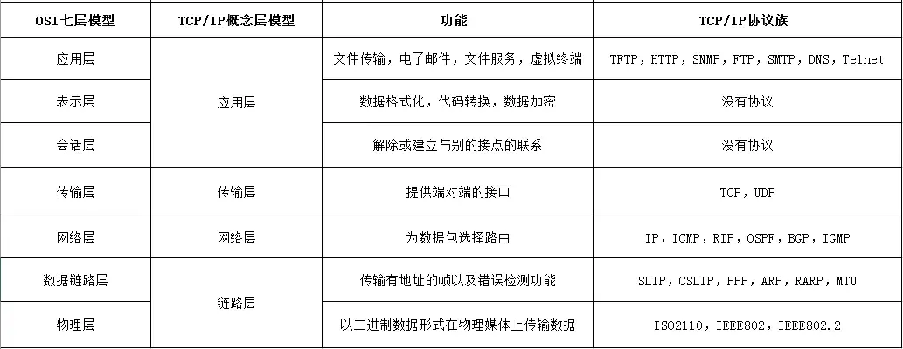

# Computer Science Fundamentals

- [Internet Technology](#internet-technology)
- [Database](#database)
- [Operating Systems](#operating-systems)

## Internet Technology
Refrence Website: 
1) https://zhuanlan.zhihu.com/p/147370653
2) https://blog.csdn.net/qq_46101869/article/details/118108697

## OSI (8 Layer)
- **Physical Layer**
- **Data Link Layer**
- **Network Layer**
- **Transport Layer**
- **Session Layer**
- **Presentation Layer**
- **Application Layer**

### Data Link Layer

- Implements data transfer between neighboring network entities
- Framing: Extracts complete frames from the bitstream of the physical layer
- Error detection and correction: Provides potential for reliable data communication
- Physical address (MAC address): 48 bits, theoretically unique network identifier, hardcoded in the network card, difficult to change
- Flow control, avoiding "overwhelming": When a fast sender meets a slow receiver, the receiver’s buffer may overflow
- Access control on shared channels (MAC): When multiple devices on the same Wi-Fi hotspot (AP) need to transmit data simultaneously, how to control the order of transmission?

### Network Layer

- Transmits data packets across networks from source device to destination device (host to host)
- Routing: Selects the forwarding path from the source to the destination in the network, often dynamically selecting the best path based on network reachability, or using static routing
- Routing protocol: The protocol specification that routers follow to exchange routing information, enabling a single router to obtain network reachability information
- Quality of Service (QoS) control: Manages network congestion, load balancing, admission control, and guarantees delay
- Interconnection of heterogeneous networks: Routing and forwarding across heterogeneous addressing and networks

### Transport Layer

- Sends data from source port to destination port (process to process)
- The network layer locates a host, while the transport layer narrows down to a specific process on that host
- Network layer control is mainly for service providers, while the transport layer provides end-to-end data transmission control for end users
- Two modes: Reliable transmission mode, or unreliable transmission mode
  - Reliable transmission: Ensures end-to-end reliable data transmission, suitable for applications requiring communication quality, such as file transfers
  - Unreliable transmission: Faster and lighter end-to-end data transmission, suitable for applications with less strict communication quality requirements and higher responsiveness, such as voice calls or video conferencing

### Session Layer

- Establishes and maintains sessions between applications using the services provided by the transport layer, and synchronizes the session

### Presentation Layer

- Focuses on the syntax and semantics of the transmitted information, manages data representation methods, and structures the transmitted data

### Application Layer

- Provides convenient network service calls for applications through application layer protocols

## TCP/IP (4 layers)
- **Datalink Layer:**
   - The datalink layer defines **`how data should be sent`**, handles **`the physical act of sending and receiving data`**, and is responsible for **transmitting data between applications or devices on a network**.
   - MAC address, Error handling
   - Examples: IEEE 802.3 Ethernet, IEEE 802.11 WIFI
- **Internet Layer:**
   - Responsible for **`sending packets from a network and controlling their movement`** across a network to **`ensure they reach their destination`**.
   - Routing, Load Balance
   - Examples:
     - IP Protocol (Internet Protocol);
     - ICMP Protocol (Internet Control Message Protocol);
     - ARP Protocol (Address Resolution Protocol);
     - RARP Protocol (Reverse Address Resolution Protocol).

- **Transmission Layer:**
   - Responsible for **`providing a solid and reliable data connection`**.
   - Examples: TCP, UDP (User Datagram Protocol)

- **Application Layer:**
   - The application layer refers to **`programs`** that need TCP/IP to help them communicate with each other. 
   - Examples: HTTP, HTTPS

## IPv4 Address
- IP address, 256:256:256:256, so a total of 32 bits, 4 bytes
- 2^8 (2 to the power of 8) = 256
- 8 bits = 1 Byte
- LAN (Local Area Network)

## IPv6 Address
- 128 bits = 16 bytes
- e.g. 2001:0DA8:0000:0000:200C:0000:0000:00A5

## MAC
The unique ID of a device. MAC address acquisition is implemented through the ARP (Address Resolution Protocol).

Each MAC address is a 48-bit identifier, usually written as six groups of hexadecimal numbers (e.g., 8a:3f:80:c9:9a:28). These MAC addresses are assigned during hardware manufacturing to ensure each interface on the network has a unique identifier.

### Why Do We Need MAC Addresses?
While it’s true that IP address + Port number can help identify specific services (such as HTTP, FTP) on a host, the MAC address is necessary for local network communication. Here's why:

1. IP Addresses Are Used for Routing (Layer 3)
   - IP addresses work at the Network Layer (Layer 3) of the OSI model. They are used for routing data between different networks, like across the internet or between different subnets in a local network.

   - When a device needs to communicate with another device over long distances (e.g., from one city to another), the IP address is used to determine the path that the data should take.

2. MAC Addresses Are Used for Local Communication (Layer 2)
   - MAC addresses work at the Data Link Layer (Layer 2), which deals with local communication within a network.

   - The MAC address is a unique identifier assigned to each network interface card (NIC). It allows devices to communicate directly with each other over the local link (such as within a LAN).

## Private IP, Public IP
- **Private IP**
   - Private IP refers to IP addresses used within a local area network (LAN)
   - These addresses are defined in RFC 1918, including:
   - 10.0.0.0 - 10.255.255.255 (10.0.0.0/8)
   - 172.16.0.0 - 172.31.255.255 (172.16.0.0/12)
   - 192.168.0.0 - 192.168.255.255 (192.168.0.0/16)
 - Each device connected to a LAN (such as home WiFi) receives a unique private IP
 - These IPs are only valid within the LAN and cannot be used directly for Internet communication

- **Public IP**
   - Public IP is a globally unique IP address assigned by an Internet Service Provider (ISP)
   - Used to identify and locate networks on the global Internet
   - In home or small office networks, usually only the router has a public IP
   - Multiple devices using private IPs share this single public IP through NAT

- **NAT (Network Address Translation)**
   - NAT is implemented in routers and maintains a translation table
   - The table records the correspondence between internal private IP addresses, ports, and external connections
   - When data packets leave the LAN, NAT replaces the source private IP with the public IP and records this mapping
   - When a response returns, NAT consults the table to correctly forward the data to the corresponding device within the LAN

   | Public IP      | Public Port | NAT Mapping | Internal Device IP | Internal Port |
   |----------------|-------------|-------------|---------------------|----------------|
   | 203.0.113.5    | 50001       | →           | 192.168.1.10        | 80             |
   | 203.0.113.5    | 50002       | →           | 192.168.1.20        | 80             |

## Gateway
### Subnet Mask

A subnet mask is used to divide the network portion and host portion of an IP address, telling devices which IP addresses are within the same network segment.
* **Format**: Same as IP address (e.g., 255.255.255.0)
* **Function**: By performing a bitwise AND operation between the IP address and subnet mask, the network address can be determined
* **Common notations**:
  * 255.255.255.0 is equivalent to /24 (indicating the first 24 bits are the network portion)
  * 255.255.0.0 is equivalent to /16
  * 255.0.0.0 is equivalent to /8

### Network Segment

A network segment is a logical partition in the IP address space where devices can communicate directly without a router.
* **Determination method**: Perform a bitwise AND operation between the IP address and subnet mask to get the network address
* **Example**:
  * IP address: 192.168.1.100
  * Subnet mask: 255.255.255.0 (/24)
  * Network address: 192.168.1.0
  * Network segment range: 192.168.1.0 - 192.168.1.255

### Gateway

A gateway is a device that connects two different networks, usually a router, responsible for forwarding data packets between different network segments.
* **Default gateway**: When a data packet's destination is not in the local network segment, the device sends the packet to the default gateway
* **Function**: Acts like a city exit, serving as a "portal" from the local network to external networks
* **Example**: Home routers typically have two IP addresses
  * WAN port IP: Assigned by ISP, used to connect to the Internet
  * LAN port IP: Usually 192.168.1.1, serving as the default gateway for internal devices

## Transmission Layer
### TCP and UDP
- TCP (Transmission Control Protocol) provides a `reliable`, `error-checked`, and `connection-oriented communication`.
- UDP (User Datagram Protocol) is `unreliable` (no guarantee of delivery, order, or error correction) but is `faster` and `more efficient` in terms of `latency` and `computational overhead`.

### Three-way Handshake (TCP-Only)
- TCP uses a three-way handshake to `establish a connection` between two devices before data transfer begins.
- The three-way handshake is a process used in TCP/IP networks to establish a reliable connection between two devices (hosts).
- **SYN**: The client sends a SYN (synchronize) packet to the server to request a connection.
- **SYN-ACK**: The server responds with a SYN-ACK (synchronize-acknowledge) packet to acknowledge the request and establish its own connection.
- **ACK**: The client sends an ACK (acknowledge) packet back to the server, confirming the connection.
- **`Main Purpose`**: The main purpose of the three-way handshake is to establish a reliable connection by ensuring that `both client and server are ready to communicate (both sides can send and receive)`.

### Four-way Handshake (TCP-Only)
- TCP uses a four-way handshake to `terminate a connection` between two devices after data transfer ends.
- The four-way handshake ensures that `both sides have finished sending data` and can safely close the connection.
- **FIN (Client → Server)**: The client sends a FIN (finish) packet to the server, indicating it has finished sending data.
- **ACK (Server → Client)**: The server acknowledges the client's FIN with an ACK packet.
- **FIN (Server → Client)**: After the server finishes sending all its data, it sends its own FIN packet to the client.
- **ACK (Client → Server)**: The client acknowledges the server’s FIN with an ACK packet, completing the connection termination.
- **`Main Purpose`**: The main purpose of the four-way handshake is to terminate a TCP connection, ensuring that `both client and server have finished all data transmission and acknowledge each other's termination`.

### Error Control for TCP:
1) Checksum
2) Acknowledgments (ACK)
 - The receiver sends an ACK (acknowledgment) back to the sender when it successfully receives a segment.
 - Each ACK contains `the next expected sequence number` (implying all previous bytes were received correctly).
3) Retransmission
 - If the sender does not receive an ACK for a segment within a certain timeout period (called Retransmission Timeout, RTO), it retransmits that segment.
 - Also, if the sender receives duplicate ACKs (e.g., 3 duplicate ACKs for the same sequence number), it can trigger fast retransmission without waiting for timeout.
4) Sliding Windows 
 - To maximize the efficiency and time for transmission of the data.
 - TCP uses a sliding window mechanism to avoid overwhelming the receiver.
 - The receiver tells the sender how much data it can accept (window size).
 - If too many packets are lost or delayed, TCP shrinks the window to slow down transmission.

## Database

### CAP (Consistency, Availability, Partition Tolerance)
- C: All nodes see the same data at the same time.

### Data Structures
- **B+Tree**: Binary Search (More **Compact,** rather than **heavy**)
- Each node contain more data than single Normal B Tree.

### Transaction
**Transaction** is a unit of work (Transaction Logic) in a database. (Updating, Adding data)

### ACID (Atomicity, Consistency, Isolation, Durability)
- **Consistency**: Consistent when it is started and ended.
- Any Data written to the database must be valid according to all the **defined rules**.

### Transaction Types
- **Flat Transaction**: Each transaction is independent and has a clear beginning and end. In flat transactions, operations on data on different servers are performed sequentially, meaning each operation is completed before the next one begins. This model ensures that if part of a transaction fails, the entire transaction can be terminated, thereby maintaining the integrity and consistency of the database.
- **Nested Transaction** (Father - Children): Roll-back depends on the father.
- **Wormhole**: Loop Transaction

### Locks and Deadlocks
- **Deadlock**: XLOCK A is held by T1, XLOCK B is held by T2. They both wait for the XLOCK that the other one held.
- Intention Lock can prevent this.
- **Dekker's algorithm** primarily works by using two flags (usually boolean variables) and a variable indicating which process's turn it is to enter the critical section. Before attempting to enter the critical section, each process first sets its flag to true (indicating it wants to enter the critical section), then checks the other process's flag

### Lock Types
- **Shared Lock**: i.e. Read Lock, allow read at the same time.
- **Intention Lock**: Intent to have (Between exclusive and shared, avoid deadlock)

### Isolation Issues
- **Phantom Read**: When a transaction, in the same query, returns different sets of rows in two reads. **Reading uncommitted data from other transactions.** Reason: Other transactions inserted new rows between the two reads
- **Unrepeatable Read**: Due to other transactions modifying and committing the data during this period, multiple reads within the same transaction return different results. **Reading committed data from other transactions**

### Isolation Levels
- **Degree 1: Read Uncommitted**: May result in dirty reads, non-repeatable reads, and phantom reads
- **Degree 2: Read Committed**: Prevents dirty reads, but may have non-repeatable reads and phantom reads
- **Degree 3: Repeatable Read**: Prevents dirty reads and non-repeatable reads, but may have phantom reads
- **Serializable**: Prevents all these issues, but has the lowest concurrent performance

### Locking Protocols
- **Two-phase Locking**: In the standard two-phase locking (**2PL**) protocol, transactions are divided into two phases:
 - **Growing Phase**: At the beginning of the transaction, new locks can be acquired, but no locks are released.
 - **Shrinking Phase**: Once the transaction has acquired all necessary locks, it enters the shrinking phase, during which the transaction can begin releasing locks but cannot acquire new locks.
- **Strict Two-phase Locking**: No Shrinking Phase
- **Two-version Locking**

## Operating Systems